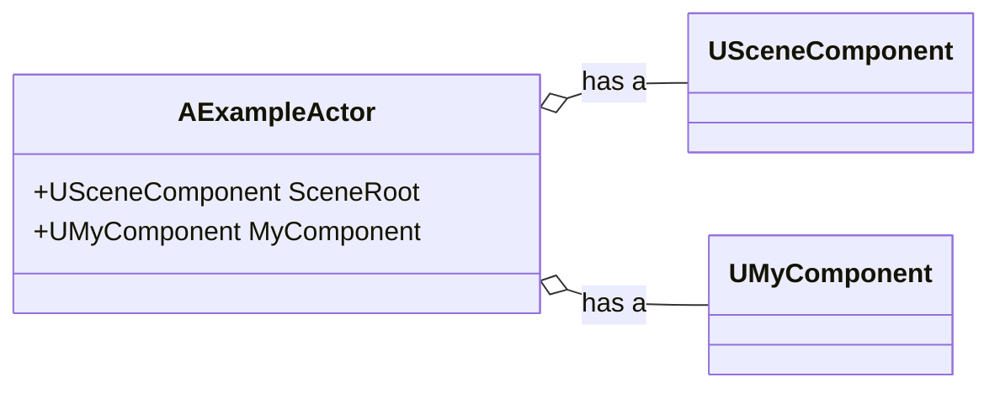
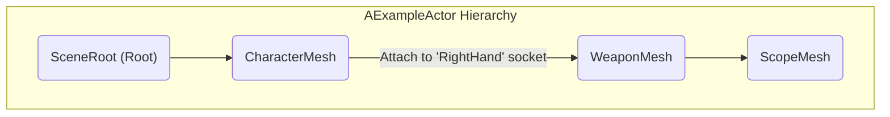
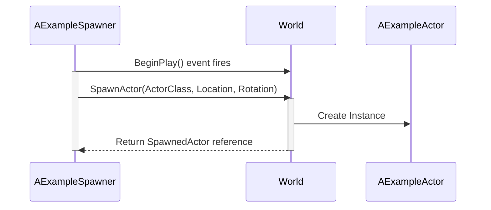
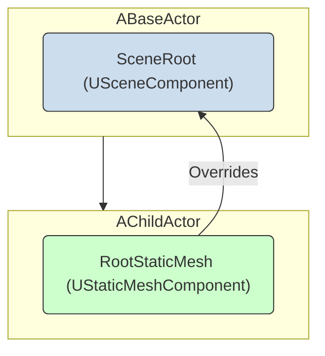

## Actors and Components in Unreal Script

Actors and Components are the fundamental building blocks for creating gameplay in Unreal Engine. This guide explains how to define and work with them in the AngelScript environment.

### 1. Defining Actors and Components

Creating a new Actor or Component is as simple as defining a script class that inherits from a base Actor or Component type.

```cpp
// A new Actor class
class AMyActor : AActor
{
}

// A new Component class
class UMyComponent : UActorComponent
{
}
```
> **Note:** The script plugin automatically configures essential class flags. Using `UCLASS()` is optional and only needed for advanced configuration.

### 2. The Actor-Component Relationship

Actors are containers for Components. You define the default set of components an Actor should have using the `UPROPERTY(DefaultComponent)` specifier. This is the script equivalent of creating default subobjects in a C++ constructor.

This diagram illustrates an `AExampleActor` composed of several different components, forming a single gameplay entity.



Here is the code for the actor shown above:

```cpp
class AExampleActor : AActor
{
    UPROPERTY(DefaultComponent)
    USceneComponent SceneRoot;

    UPROPERTY(DefaultComponent)
    UMyComponent MyComponent;
}
```

### 3. Creating a Component Hierarchy

Components can be attached to one another to form a hierarchy or "tree." This is also done declaratively using `UPROPERTY` specifiers.

- `RootComponent`: Explicitly marks a component as the root of the hierarchy. If omitted, the first component listed becomes the root.
- `Attach = OtherComponentName`: Attaches the component to another component within the same Actor.
- `AttachSocket = SocketName`: Attaches the component to a specific named "socket" on the parent component (often a `USkeletalMeshComponent`).

The following diagram visualizes the attachment hierarchy defined in the code example below.



This hierarchy is created with the following code:

```cpp
class AExampleActor : AActor
{
    // 1. Explicit root component
    UPROPERTY(DefaultComponent, RootComponent)
    USceneComponent SceneRoot;

    // 2. Attached to SceneRoot by default
    UPROPERTY(DefaultComponent)
    USkeletalMeshComponent CharacterMesh;

    // 3. Attached to the CharacterMesh's 'RightHand' socket
    UPROPERTY(DefaultComponent, Attach = CharacterMesh, AttachSocket = RightHand)
    UStaticMeshComponent WeaponMesh;

    // 4. Attached to the WeaponMesh
    UPROPERTY(DefaultComponent, Attach = WeaponMesh)
    UStaticMeshComponent ScopeMesh;
}
```

### 4. Setting Default Component Properties

You can set the default values for properties on your components using `default` statements. This is useful for configuring things like position, collision, or visibility without writing code in a function.

```cpp
class AExampleActor : AActor
{
    UPROPERTY(DefaultComponent, RootComponent)
    USceneComponent SceneRoot;

    UPROPERTY(DefaultComponent)
    USkeletalMeshComponent CharacterMesh;

    // The character mesh is always placed 50 units up
    default CharacterMesh.RelativeLocation = FVector(0.0, 0.0, 50.0);

    UPROPERTY(DefaultComponent)
    UStaticMeshComponent ShieldMesh;

    // The shield mesh is hidden by default and has no collision
    default ShieldMesh.bHiddenInGame = true;
    default ShieldMesh.SetCollisionEnabled(ECollisionEnabled::NoCollision);
}
```

### 5. Working with Actors and Components at Runtime

#### Retrieving and Adding Components

You can dynamically find, create, and add components to an Actor while the game is running.

- `UMyComponentClass::Get(Actor)`: Finds the first component of a given type on an Actor.
- `UMyComponentClass::Get(Actor, Name)`: Finds a component of a given type and name.
- `UMyComponentClass::GetOrCreate(Actor)`: Gets a component or creates and adds it if it doesn't exist.
- `UMyComponentClass::Create(Actor)`: Creates and adds a new component to the Actor.

```cpp
AActor Actor;

// Retrieve the first skeletal mesh component on the actor
USkeletalMeshComponent SkelComp = USkeletalMeshComponent::Get(Actor);

// Find our interaction component, or create it if it doesn't exist
UInteractionComponent InteractComp = UInteractionComponent::GetOrCreate(Actor);

// Create a brand new static mesh component and attach it
UStaticMeshComponent NewComponent = UStaticMeshComponent::Create(Actor);
NewComponent.AttachToComponent(Actor.Mesh);
```

#### Spawning Actors

To create a new Actor and place it in the world, use the global `SpawnActor()` function. This is commonly done from within another Actor's logic, such as in `BeginPlay`.

The following diagram shows the flow for a spawner Actor that spawns another Actor from a Blueprint class reference.



This flow is implemented in the code below, where `TSubclassOf<>` holds a reference to a Blueprint.

```cpp
class AExampleSpawner : AActor
{
    // Which Blueprint to spawn (set in the editor)
    UPROPERTY()
    TSubclassOf<AExampleActor> ActorClass;

    UFUNCTION(BlueprintOverride)
    void BeginPlay()
    {
        FVector SpawnLocation;
        FRotator SpawnRotation;

        // Use the class reference to spawn the actor
        AExampleActor SpawnedActor = SpawnActor(ActorClass, SpawnLocation, Rotation);
    }
}
```

### 6. Advanced Concepts

#### Construction Script

Override the `ConstructionScript()` event to run logic in the editor whenever an Actor is created or modified. This is useful for procedurally generating parts of an Actor that are visible in the level editor.

```cpp
class AExampleActor : AActor
{
    UPROPERTY() int SpawnMeshCount = 5;
    UPROPERTY() UStaticMesh MeshAsset;

    UFUNCTION(BlueprintOverride)
    void ConstructionScript()
    {
        // This loop runs in the editor
        for (int i = 0; i < SpawnMeshCount; ++i)
        {
            UStaticMeshComponent MeshComp = UStaticMeshComponent::Create(this);
            MeshComp.SetStaticMesh(MeshAsset);
        }
    }
}
```

#### Overriding a Parent's Component

A child Actor can replace a component defined in its parent with a different, more specialized one. This is done with the `OverrideComponent` specifier.

The diagram below shows how `AChildActor` replaces the generic `USceneComponent` from its parent with a more specific `UStaticMeshComponent`.



This powerful feature allows you to upgrade a parent's components in child classes.

```cpp
// The parent has a generic Scene Component as its root
class ABaseActor : AActor
{
    UPROPERTY(DefaultComponent, RootComponent)
    USceneComponent SceneRoot;
}

// The child *replaces* SceneRoot with a Static Mesh Component
class AChildActor : ABaseActor
{
    UPROPERTY(OverrideComponent = SceneRoot)
    UStaticMeshComponent RootStaticMesh;
}
```
