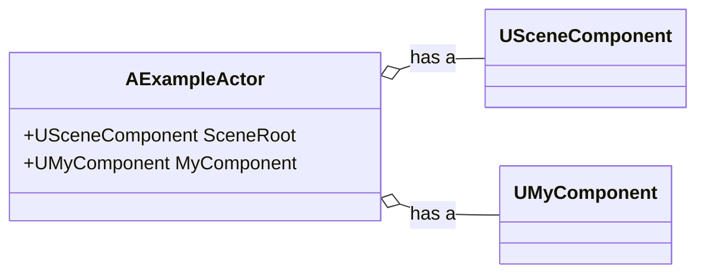
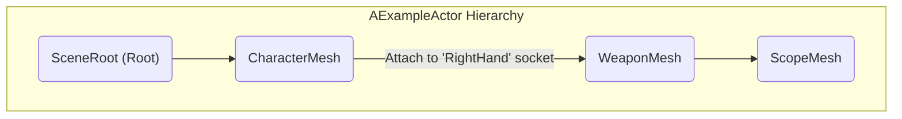
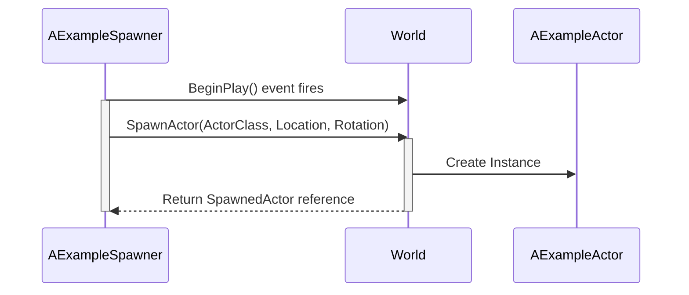
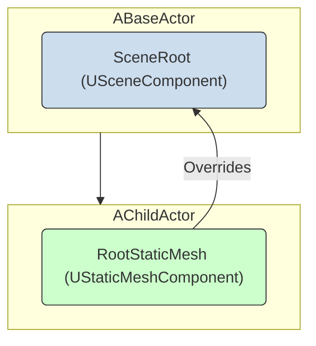

## Unreal脚本中的Actor和Component

Actor和Component是在虚幻引擎中创建游戏玩法的基本构建块。本指南解释了如何在AngelScript环境中定义它们并与之协作。

### 1. 定义Actor和Component

创建一个新的Actor或Component非常简单，只需定义一个继承自基础Actor或Component类型的脚本类即可。

```cpp
//一个新的Actor类
class AMyActor : AActor
{
}

//一个新的Component类
class UMyComponent : UActorComponent
{
}
```
> **注意:** 脚本插件会自动配置必要的类标志。使用`UCLASS()`是可选的，仅在需要高级配置时才需要。

### 2. Actor-Component关系

Actor是Component的容器。您可以使用`UPROPERTY(DefaultComponent)`说明符来定义Actor默认应具有的组件集。这相当于在C++构造函数中创建默认子对象。

此图表展示了一个由几个不同组件组成的`AExampleActor`，形成一个单一的游戏实体。



上面显示的actor的代码如下：

```cpp
class AExampleActor : AActor
{
    UPROPERTY(DefaultComponent)
    USceneComponent SceneRoot;

    UPROPERTY(DefaultComponent)
    UMyComponent MyComponent;
}
```

### 3. 创建Component层级结构

Component可以相互附加，形成一个层级结构或“树”。这也是通过使用`UPROPERTY`说明符以声明方式完成的。

- `RootComponent`: 显式地将一个组件标记为层级结构的根。如果省略，列出的第一个组件将成为根。
- `Attach = OtherComponentName`: 将该组件附加到同一Actor内的另一个组件上。
- `AttachSocket = SocketName`: 将该组件附加到父组件（通常是`USkeletalMeshComponent`）上一个特定的命名“插槽”。

下图可视化了下面代码示例中定义的附件层级结构。



这个层级结构是用以下代码创建的：

```cpp
class AExampleActor : AActor
{
    // 1. 显式根组件
    UPROPERTY(DefaultComponent, RootComponent)
    USceneComponent SceneRoot;

    // 2. 默认附加到SceneRoot
    UPROPERTY(DefaultComponent)
    USkeletalMeshComponent CharacterMesh;

    // 3. 附加到CharacterMesh的'RightHand'插槽
    UPROPERTY(DefaultComponent, Attach = CharacterMesh, AttachSocket = RightHand)
    UStaticMeshComponent WeaponMesh;

    // 4. 附加到WeaponMesh
    UPROPERTY(DefaultComponent, Attach = WeaponMesh)
    UStaticMeshComponent ScopeMesh;
}
```

### 4. 设置默认Component属性

您可以使用`default`语句为组件的属性设置默认值。这对于配置位置、碰撞或可见性等内容非常有用，而无需在函数中编写代码。

```cpp
class AExampleActor : AActor
{
    UPROPERTY(DefaultComponent, RootComponent)
    USceneComponent SceneRoot;

    UPROPERTY(DefaultComponent)
    USkeletalMeshComponent CharacterMesh;

    // 角色网格总是向上放置50个单位
    default CharacterMesh.RelativeLocation = FVector(0.0, 0.0, 50.0);

    UPROPERTY(DefaultComponent)
    UStaticMeshComponent ShieldMesh;

    // 护盾网格默认隐藏且没有碰撞
    default ShieldMesh.bHiddenInGame = true;
    default ShieldMesh.SetCollisionEnabled(ECollisionEnabled::NoCollision);
}
```

### 5. 在运行时使用Actor和Component

#### 检索和添加Component

您可以在游戏运行时动态查找、创建和向Actor添加组件。

- `UMyComponentClass::Get(Actor)`: 在Actor上查找给定类型的第一个组件。
- `UMyComponentClass::Get(Actor, Name)`: 查找给定类型和名称的组件。
- `UMyComponentClass::GetOrCreate(Actor)`: 获取一个组件，如果它不存在，则创建并添加它。
- `UMyComponentClass::Create(Actor)`: 创建并向Actor添加一个新组件。

```cpp
AActor Actor;

// 检索actor上的第一个骨骼网格组件
USkeletalMeshComponent SkelComp = USkeletalMeshComponent::Get(Actor);

// 查找我们的交互组件，如果不存在则创建它
UInteractionComponent InteractComp = UInteractionComponent::GetOrCreate(Actor);

// 创建一个全新的静态网格组件并附加它
UStaticMeshComponent NewComponent = UStaticMeshComponent::Create(Actor);
NewComponent.AttachToComponent(Actor.Mesh);
```

#### 生成Actor

要创建一个新的Actor并将其放置在世界中，请使用全局`SpawnActor()`函数。这通常在另一个Actor的逻辑中完成，例如在`BeginPlay`中。

下图显示了一个spawner Actor从蓝图类引用生成另一个Actor的流程。



此流程在下面的代码中实现，其中`TSubclassOf<>`拥有对蓝图的引用。

```cpp
class AExampleSpawner : AActor
{
    // 要生成的蓝图（在编辑器中设置）
    UPROPERTY()
    TSubclassOf<AExampleActor> ActorClass;

    UFUNCTION(BlueprintOverride)
    void BeginPlay()
    {
        FVector SpawnLocation;
        FRotator SpawnRotation;

        // 使用类引用来生成actor
        AExampleActor SpawnedActor = SpawnActor(ActorClass, SpawnLocation, Rotation);
    }
}
```

### 6. 高级概念

#### 构造脚本

覆盖`ConstructionScript()`事件以在编辑器中每当Actor被创建或修改时运行逻辑。这对于程序化地生成在关卡编辑器中可见的Actor部分非常有用。

```cpp
class AExampleActor : AActor
{
    UPROPERTY() int SpawnMeshCount = 5;
    UPROPERTY() UStaticMesh MeshAsset;

    UFUNCTION(BlueprintOverride)
    void ConstructionScript()
    {
        // 这个循环在编辑器中运行
        for (int i = 0; i < SpawnMeshCount; ++i)
        {
            UStaticMeshComponent MeshComp = UStaticMeshComponent::Create(this);
            MeshComp.SetStaticMesh(MeshAsset);
        }
    }
}
```

#### 覆盖父级的Component

子Actor可以用一个不同的、更专门化的组件替换其父级中定义的组件。这是通过`OverrideComponent`说明符完成的。

下图显示了`AChildActor`如何用一个更具体的`UStaticMeshComponent`替换其父级的通用`USceneComponent`。



这个强大的功能允许您在子类中升级父级的组件。

```cpp
// 父级有一个通用的场景组件作为其根
class ABaseActor : AActor
{
    UPROPERTY(DefaultComponent, RootComponent)
    USceneComponent SceneRoot;
}

// 子级*用*一个静态网格组件替换SceneRoot
class AChildActor : ABaseActor
{
    UPROPERTY(OverrideComponent = SceneRoot)
    UStaticMeshComponent RootStaticMesh;
}
```
