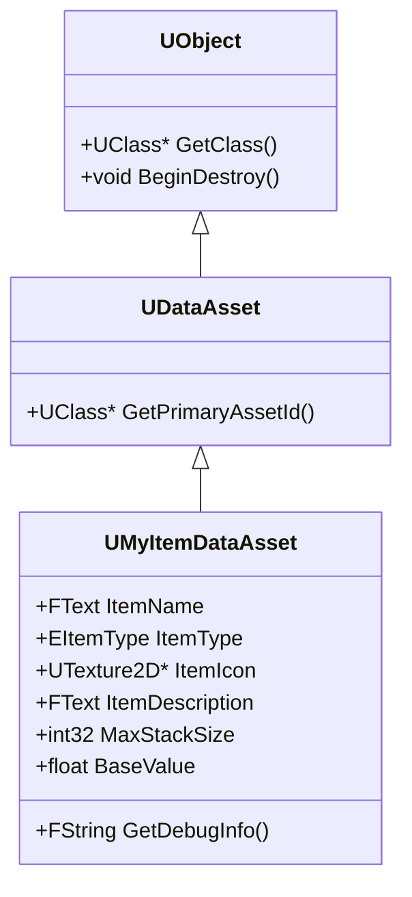
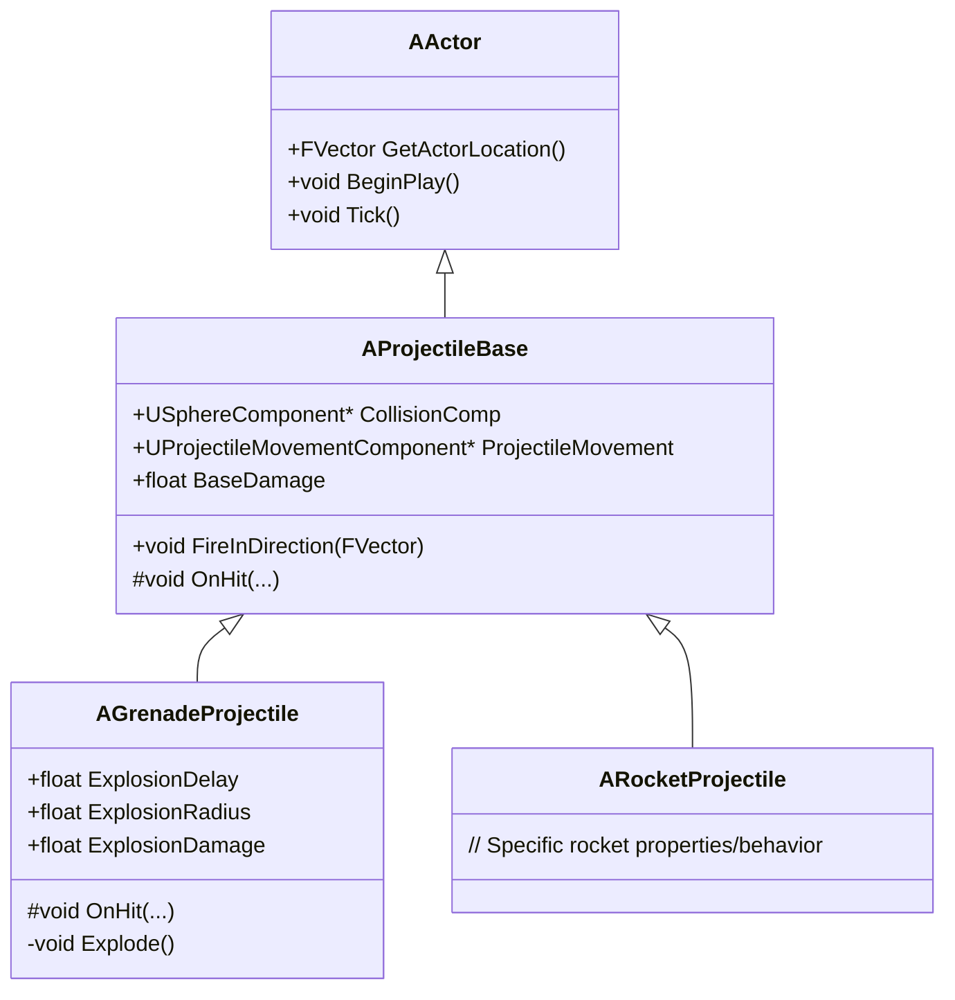
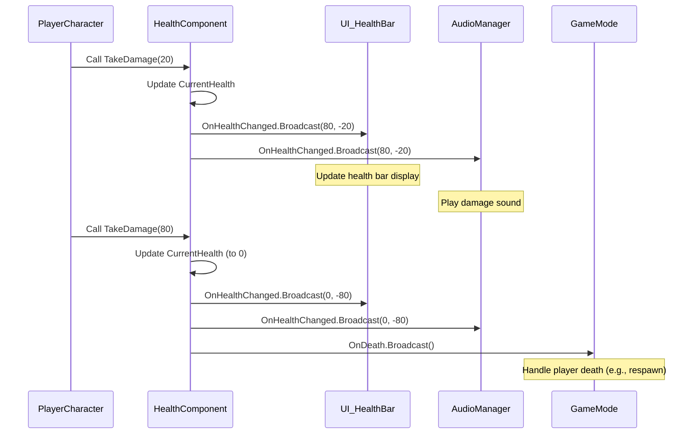

# Advanced C++ Concepts Visualized

This document delves into more advanced C++ concepts within Unreal Engine, focusing on custom `UObject` derivation, complex `AActor` subclassing, and sophisticated `Delegates` and `Events` implementations.

## Table of Contents
- [Advanced UObject Derivation](#advanced-uobject-derivation)
- [Complex AActor Subclassing](#complex-aactor-subclassing)
- [Advanced Delegates and Events](#advanced-delegates-and-events)

## Advanced UObject Derivation

### Concept
While `AActor` and `UActorComponent` are the most common `UObject` subclasses you'll encounter, there are many scenarios where deriving directly from `UObject` (or one of its intermediate subclasses like `UDataAsset`) is more appropriate. This is typically for data-only objects, manager classes, or complex data structures that need Unreal's reflection, garbage collection, and serialization features, but don't need to exist in the world or be attached to an Actor.

**Use Cases:**
*   **Data Assets:** Storing configuration data, item definitions, or character stats that can be easily managed in the editor.
*   **Subsystems:** Global, engine-managed objects that provide services without being tied to a specific Actor.
*   **Complex Data Structures:** Custom classes that need `UPROPERTY` for serialization or `UFUNCTION` for Blueprint exposure.

### Code Example: Custom Data Asset

Let's create a simple `UDataAsset` to define an item in a game.

```cpp
// MyItemDataAsset.h
#pragma once

#include "CoreMinimal.h"
#include "Engine/DataAsset.h"
#include "MyItemDataAsset.generated.h"

UENUM(BlueprintType)
enum class EItemType : uint8
{
    EIT_Weapon UMETA(DisplayName = "Weapon"),
    EIT_Armor UMETA(DisplayName = "Armor"),
    EIT_Consumable UMETA(DisplayName = "Consumable"),
    EIT_QuestItem UMETA(DisplayName = "Quest Item")
};

/**
 * Custom Data Asset for defining game items.
 */
UCLASS(BlueprintType)
class YOURPROJECT_API UMyItemDataAsset : public UDataAsset
{
    GENERATED_BODY()

public:
    UPROPERTY(EditAnywhere, BlueprintReadOnly, Category = "Item")
    FText ItemName;

    UPROPERTY(EditAnywhere, BlueprintReadOnly, Category = "Item")
    EItemType ItemType;

    UPROPERTY(EditAnywhere, BlueprintReadOnly, Category = "Item")
    UTexture2D* ItemIcon;

    UPROPERTY(EditAnywhere, BlueprintReadOnly, Category = "Item", meta = (MultiLine = true))
    FText ItemDescription;

    UPROPERTY(EditAnywhere, BlueprintReadOnly, Category = "Item")
    int32 MaxStackSize;

    UPROPERTY(EditAnywhere, BlueprintReadOnly, Category = "Item")
    float BaseValue;

    UFUNCTION(BlueprintCallable, Category = "Item")
    FString GetDebugInfo() const;
};
```

```cpp
// MyItemDataAsset.cpp
#include "MyItemDataAsset.h"

FString UMyItemDataAsset::GetDebugInfo() const
{
    return FString::Printf(TEXT("Item: %s (Type: %s, Value: %.2f)"),
        *ItemName.ToString(),
        *UEnum::GetValueAsString(ItemType),
        BaseValue);
}
```

### Visualization: UObject Derivation Hierarchy



## Complex AActor Subclassing

### Concept
Building robust gameplay systems often involves creating a hierarchy of `AActor` classes. This allows for code reuse and polymorphism, where a base class defines common behavior, and derived classes implement specific variations. Effective subclassing involves understanding virtual functions, overriding, and proper use of `Super::` calls.

**Example Scenario:** A projectile system where you have a base `AProjectile` and specific types like `AGrenade` (delayed explosion) and `ARocket` (fast, direct damage).

### Code Example: Projectile Hierarchy

```cpp
// ProjectileBase.h
#pragma once

#include "CoreMinimal.h"
#include "GameFramework/Actor.h"
#include "ProjectileBase.generated.h"

class UProjectileMovementComponent;
class USphereComponent;

UCLASS(Abstract) // Abstract class, cannot be spawned directly
class YOURPROJECT_API AProjectileBase : public AActor
{
    GENERATED_BODY()

public:
    AProjectileBase();

    UPROPERTY(VisibleAnywhere, BlueprintReadOnly, Category = "Components")
    USphereComponent* CollisionComp;

    UPROPERTY(VisibleAnywhere, BlueprintReadOnly, Category = "Components")
    UProjectileMovementComponent* ProjectileMovement;

    UPROPERTY(EditDefaultsOnly, Category = "Projectile")
    float BaseDamage;

protected:
    virtual void BeginPlay() override;

    UFUNCTION()
    virtual void OnHit(UPrimitiveComponent* HitComp, AActor* OtherActor, UPrimitiveComponent* OtherComp, FVector NormalImpulse, const FHitResult& Hit);

public:
    void FireInDirection(const FVector& ShootDirection);
};
```

```cpp
// ProjectileBase.cpp
#include "ProjectileBase.h"
#include "Components/SphereComponent.h"
#include "GameFramework/ProjectileMovementComponent.h"
#include "Kismet/GameplayStatics.h"

AProjectileBase::AProjectileBase()
{
    PrimaryActorTick.bCanEverTick = false;

    CollisionComp = CreateDefaultSubobject<USphereComponent>(TEXT("SphereComp"));
    CollisionComp->InitSphereRadius(5.0f);
    CollisionComp->BodyInstance.SetCollisionProfileName("Projectile");
    CollisionComp->OnComponentHit.AddDynamic(this, &AProjectileBase::OnHit);
    RootComponent = CollisionComp;

    ProjectileMovement = CreateDefaultSubobject<UProjectileMovementComponent>(TEXT("ProjectileComp"));
    ProjectileMovement->UpdatedComponent = CollisionComp;
    ProjectileMovement->InitialSpeed = 3000.0f;
    ProjectileMovement->MaxSpeed = 3000.0f;
    ProjectileMovement->bRotationFollowsVelocity = true;
    ProjectileMovement->bShouldBounce = true;
    ProjectileMovement->Bounciness = 0.3f;

    BaseDamage = 10.0f;
}

void AProjectileBase::BeginPlay()
{
    Super::BeginPlay();
}

void AProjectileBase::OnHit(UPrimitiveComponent* HitComp, AActor* OtherActor, UPrimitiveComponent* OtherComp, FVector NormalImpulse, const FHitResult& Hit)
{
    // Base logic: Apply damage (if OtherActor is valid) and destroy self
    if (OtherActor && OtherActor != this && OtherActor->GetClass() != GetClass())
    {
        UGameplayStatics::ApplyDamage(OtherActor, BaseDamage, GetInstigatorController(), this, UDamageType::StaticClass());
    }
    Destroy();
}

void AProjectileBase::FireInDirection(const FVector& ShootDirection)
{
    ProjectileMovement->Velocity = ShootDirection * ProjectileMovement->InitialSpeed;
}
```

```cpp
// GrenadeProjectile.h
#pragma once

#include "CoreMinimal.h"
#include "ProjectileBase.h"
#include "GrenadeProjectile.generated.h"

UCLASS()
class YOURPROJECT_API AGrenadeProjectile : public AProjectileBase
{
    GENERATED_BODY()

public:
    AGrenadeProjectile();

protected:
    UPROPERTY(EditDefaultsOnly, Category = "Grenade")
    float ExplosionDelay;

    UPROPERTY(EditDefaultsOnly, Category = "Grenade")
    float ExplosionRadius;

    UPROPERTY(EditDefaultsOnly, Category = "Grenade")
    float ExplosionDamage;

    virtual void BeginPlay() override;
    virtual void OnHit(UPrimitiveComponent* HitComp, AActor* OtherActor, UPrimitiveComponent* OtherComp, FVector NormalImpulse, const FHitResult& Hit) override;

    void Explode();

private:
    FTimerHandle ExplosionTimerHandle;
};
```

```cpp
// GrenadeProjectile.cpp
#include "GrenadeProjectile.h"
#include "Kismet/GameplayStatics.h"
#include "GameFramework/DamageType.h"

AGrenadeProjectile::AGrenadeProjectile()
{
    ExplosionDelay = 3.0f;
    ExplosionRadius = 300.0f;
    ExplosionDamage = 50.0f;
    BaseDamage = 0.0f; // Grenade doesn't do direct hit damage, only explosion
}

void AGrenadeProjectile::BeginPlay()
{
    Super::BeginPlay();
    // Grenade should not destroy on initial hit, so we detach the OnHit event
    CollisionComp->OnComponentHit.RemoveDynamic(this, &AProjectileBase::OnHit);
}

void AGrenadeProjectile::OnHit(UPrimitiveComponent* HitComp, AActor* OtherActor, UPrimitiveComponent* OtherComp, FVector NormalImpulse, const FHitResult& Hit)
{
    // Grenade hits something, start explosion timer
    ProjectileMovement->StopMovementImmediately();
    SetActorEnableCollision(false); // Disable collision after first hit
    GetWorldTimerManager().SetTimer(ExplosionTimerHandle, this, &AGrenadeProjectile::Explode, ExplosionDelay, false);
}

void AGrenadeProjectile::Explode()
{
    // Apply radial damage
    UGameplayStatics::ApplyRadialDamage(
        GetWorld(),
        ExplosionDamage,
        GetActorLocation(),
        ExplosionRadius,
        UDamageType::StaticClass(),
        TArray<AActor*>(), // Actors to ignore
        this,
        GetInstigatorController(),
        true // Do full damage
    );

    Destroy();
}
```

### Visualization: AActor Subclassing Hierarchy



## Advanced Delegates and Events

### Concept
Delegates in Unreal Engine provide a powerful, type-safe, and flexible way to implement callbacks and event-driven programming. They allow objects to communicate without needing direct references to each other, promoting loose coupling.

**Key Types:**
*   **Single-Cast Delegates:** For 1-to-1 communication.
*   **Multi-Cast Delegates:** For 1-to-many communication, where multiple functions can bind to and be called by a single delegate.
*   **Dynamic Delegates:** A special type of delegate that can be serialized, saved, and exposed to Blueprints. They are slightly slower than non-dynamic delegates but offer greater flexibility.
*   **Events:** A specific pattern using multi-cast delegates where only the class that declares the event can broadcast it, while other classes can only bind to it.

### Code Example: Health Component with Multicast Delegate

Let's create a health component that broadcasts an event when health changes or reaches zero.

```cpp
// HealthComponent.h
#pragma once

#include "CoreMinimal.h"
#include "Components/ActorComponent.h"
#include "HealthComponent.generated.h"

// Declare a dynamic multicast delegate for health changes
DECLARE_DYNAMIC_MULTICAST_DELEGATE_TwoParams(FOnHealthChangedSignature, float, NewHealth, float, HealthDelta);

// Declare a dynamic multicast delegate for when health reaches zero
DECLARE_DYNAMIC_MULTICAST_DELEGATE(FOnDeathSignature);

UCLASS( ClassGroup=(Custom), meta=(BlueprintSpawnableComponent) )
class YOURPROJECT_API UHealthComponent : public UActorComponent
{
    GENERATED_BODY()

public:
    UHealthComponent();

protected:
    virtual void BeginPlay() override;

    UPROPERTY(EditAnywhere, BlueprintReadOnly, Category = "Health")
    float MaxHealth;

    UPROPERTY(VisibleAnywhere, BlueprintReadOnly, Category = "Health")
    float CurrentHealth;

public:
    UFUNCTION(BlueprintCallable, Category = "Health")
    void TakeDamage(float DamageAmount);

    UFUNCTION(BlueprintCallable, Category = "Health")
    void Heal(float HealAmount);

    // Delegates to broadcast health events
    UPROPERTY(BlueprintAssignable, Category = "Health")
    FOnHealthChangedSignature OnHealthChanged;

    UPROPERTY(BlueprintAssignable, Category = "Health")
    FOnDeathSignature OnDeath;
};
```

```cpp
// HealthComponent.cpp
#include "HealthComponent.h"

UHealthComponent::UHealthComponent()
{
    PrimaryComponentTick.bCanEverTick = false;
    MaxHealth = 100.0f;
    CurrentHealth = MaxHealth;
}

void UHealthComponent::BeginPlay()
{
    Super::BeginPlay();
}

void UHealthComponent::TakeDamage(float DamageAmount)
{
    if (DamageAmount <= 0 || CurrentHealth <= 0) return;

    CurrentHealth = FMath::Max(0.0f, CurrentHealth - DamageAmount);
    OnHealthChanged.Broadcast(CurrentHealth, -DamageAmount);

    if (CurrentHealth <= 0)
    {
        OnDeath.Broadcast();
    }
}

void UHealthComponent::Heal(float HealAmount)
{
    if (HealAmount <= 0 || CurrentHealth >= MaxHealth) return;

    CurrentHealth = FMath::Min(MaxHealth, CurrentHealth + HealAmount);
    OnHealthChanged.Broadcast(CurrentHealth, HealAmount);
}
```

### Visualization: Delegate Event Flow


