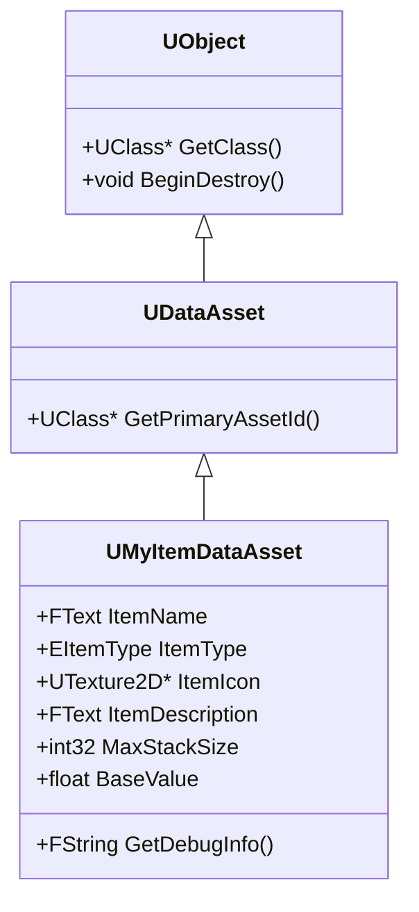
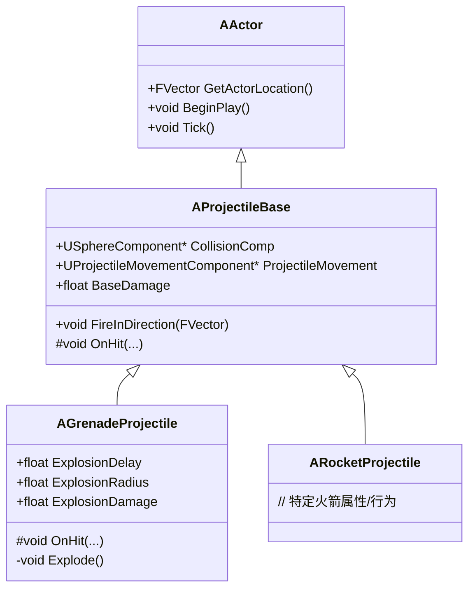
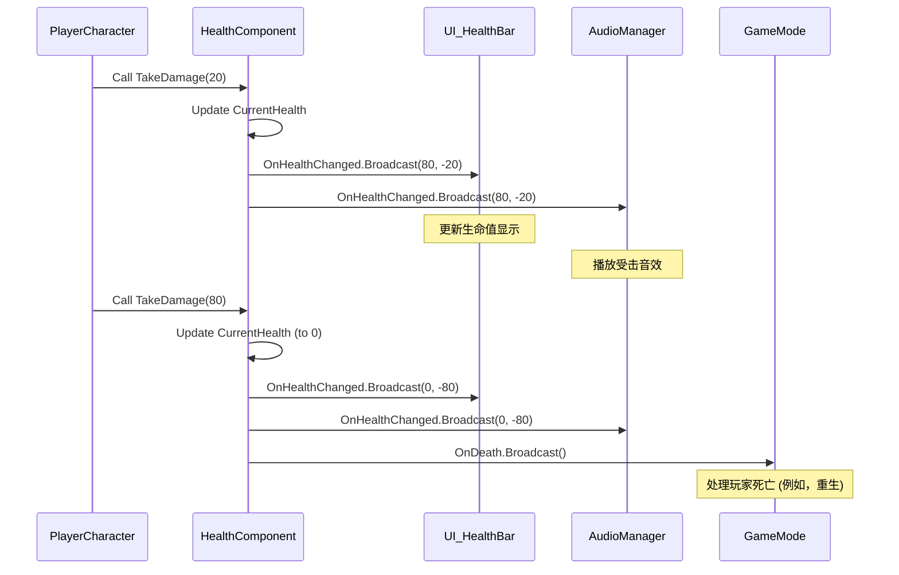

# 高级 C++ 概念可视化

本文深入探讨了 Unreal Engine 中更高级的 C++ 概念，重点关注自定义 `UObject` 派生、复杂 `AActor` 子类化以及高级 `Delegates` 和 `Events` 实现。

## 目录
- [高级 UObject 派生](#高级-uobject-派生)
- [复杂 AActor 子类化](#复杂-aactor-子类化)
- [高级 Delegates 和 Events](#高级-delegates-和-events)

## 高级 UObject 派生

### 概念
尽管 `AActor` 和 `UActorComponent` 是您最常遇到的 `UObject` 子类，但在许多情况下，直接从 `UObject`（或其某个中间子类，如 `UDataAsset`）派生更合适。这通常适用于不需要存在于世界中或附加到 Actor 的数据专用对象、管理器类或需要 Unreal 反射、垃圾回收和序列化功能的复杂数据结构。

**用例：**
*   **数据资产 (Data Assets)：** 存储配置数据、物品定义或角色统计数据，可在编辑器中轻松管理。
*   **子系统 (Subsystems)：** 全局的、由引擎管理的对象，提供服务而无需与特定 Actor 绑定。
*   **复杂数据结构：** 需要 `UPROPERTY` 进行序列化或 `UFUNCTION` 暴露给蓝图的自定义类。

### 代码示例：自定义数据资产

让我们创建一个简单的 `UDataAsset` 来定义游戏中的物品。

```cpp
// MyItemDataAsset.h
#pragma once

#include "CoreMinimal.h"
#include "Engine/DataAsset.h"
#include "MyItemDataAsset.generated.h"

UENUM(BlueprintType)
enum class EItemType : uint8
{
    EIT_Weapon UMETA(DisplayName = "Weapon"),
    EIT_Armor UMETA(DisplayName = "Armor"),
    EIT_Consumable UMETA(DisplayName = "Consumable"),
    EIT_QuestItem UMETA(DisplayName = "Quest Item")
};

/**
 * 用于定义游戏物品的自定义数据资产。
 */
UCLASS(BlueprintType)
class YOURPROJECT_API UMyItemDataAsset : public UDataAsset
{
    GENERATED_BODY()

public:
    UPROPERTY(EditAnywhere, BlueprintReadOnly, Category = "Item")
    FText ItemName;

    UPROPERTY(EditAnywhere, BlueprintReadOnly, Category = "Item")
    EItemType ItemType;

    UPROPERTY(EditAnywhere, BlueprintReadOnly, Category = "Item")
    UTexture2D* ItemIcon;

    UPROPERTY(EditAnywhere, BlueprintReadOnly, Category = "Item", meta = (MultiLine = true))
    FText ItemDescription;

    UPROPERTY(EditAnywhere, BlueprintReadOnly, Category = "Item")
    int32 MaxStackSize;

    UPROPERTY(EditAnywhere, BlueprintReadOnly, Category = "Item")
    float BaseValue;

    UFUNCTION(BlueprintCallable, Category = "Item")
    FString GetDebugInfo() const;
};
```

```cpp
// MyItemDataAsset.cpp
#include "MyItemDataAsset.h"

FString UMyItemDataAsset::GetDebugInfo() const
{
    return FString::Printf(TEXT("Item: %s (Type: %s, Value: %.2f)"),
        *ItemName.ToString(),
        *UEnum::GetValueAsString(ItemType),
        BaseValue);
}
```

### 可视化：UObject 派生层次结构



## 复杂 AActor 子类化

### 概念
构建健壮的游戏系统通常涉及创建 `AActor` 类的层次结构。这允许代码重用和多态性，其中基类定义通用行为，派生类实现特定变体。有效的子类化涉及理解虚函数、重写和正确使用 `Super::` 调用。

**示例场景：** 一个弹丸系统，其中有一个基类 `AProjectile` 和像 `AGrenade`（延迟爆炸）和 `ARocket`（快速、直接伤害）这样的特定类型。

### 代码示例：弹丸层次结构

```cpp
// ProjectileBase.h
#pragma once

#include "CoreMinimal.h"
#include "GameFramework/Actor.h"
#include "ProjectileBase.generated.h"

class UProjectileMovementComponent;
class USphereComponent;

UCLASS(Abstract) // 抽象类，不能直接生成
class YOURPROJECT_API AProjectileBase : public AActor
{
    GENERATED_BODY()

public:
    AProjectileBase();

    UPROPERTY(VisibleAnywhere, BlueprintReadOnly, Category = "Components")
    USphereComponent* CollisionComp;

    UPROPERTY(VisibleAnywhere, BlueprintReadOnly, Category = "Components")
    UProjectileMovementComponent* ProjectileMovement;

    UPROPERTY(EditDefaultsOnly, Category = "Projectile")
    float BaseDamage;

protected:
    virtual void BeginPlay() override;

    UFUNCTION()
    virtual void OnHit(UPrimitiveComponent* HitComp, AActor* OtherActor, UPrimitiveComponent* OtherComp, FVector NormalImpulse, const FHitResult& Hit);

public:
    void FireInDirection(const FVector& ShootDirection);
};
```

```cpp
// ProjectileBase.cpp
#include "ProjectileBase.h"
#include "Components/SphereComponent.h"
#include "GameFramework/ProjectileMovementComponent.h"
#include "Kismet/GameplayStatics.h"

AProjectileBase::AProjectileBase()
{
    PrimaryActorTick.bCanEverTick = false;

    CollisionComp = CreateDefaultSubobject<USphereComponent>(TEXT("SphereComp"));
    CollisionComp->InitSphereRadius(5.0f);
    CollisionComp->BodyInstance.SetCollisionProfileName("Projectile");
    CollisionComp->OnComponentHit.AddDynamic(this, &AProjectileBase::OnHit);
    RootComponent = CollisionComp;

    ProjectileMovement = CreateDefaultSubobject<UProjectileMovementComponent>(TEXT("ProjectileComp"));
    ProjectileMovement->UpdatedComponent = CollisionComp;
    ProjectileMovement->InitialSpeed = 3000.0f;
    ProjectileMovement->MaxSpeed = 3000.0f;
    ProjectileMovement->bRotationFollowsVelocity = true;
    ProjectileMovement->bShouldBounce = true;
    ProjectileMovement->Bounciness = 0.3f;

    BaseDamage = 10.0f;
}

void AProjectileBase::BeginPlay()
{
    Super::BeginPlay();
}

void AProjectileBase::OnHit(UPrimitiveComponent* HitComp, AActor* OtherActor, UPrimitiveComponent* OtherComp, FVector NormalImpulse, const FHitResult& Hit)
{
    // 基础逻辑：应用伤害（如果 OtherActor 有效）并销毁自身
    if (OtherActor && OtherActor != this && OtherActor->GetClass() != GetClass())
    {
        UGameplayStatics::ApplyDamage(OtherActor, BaseDamage, GetInstigatorController(), this, UDamageType::StaticClass());
    }
    Destroy();
}

void AProjectileBase::FireInDirection(const FVector& ShootDirection)
{
    ProjectileMovement->Velocity = ShootDirection * ProjectileMovement->InitialSpeed;
}
```

```cpp
// GrenadeProjectile.h
#pragma once

#include "CoreMinimal.h"
#include "ProjectileBase.h"
#include "GrenadeProjectile.generated.h"

UCLASS()
class YOURPROJECT_API AGrenadeProjectile : public AProjectileBase
{
    GENERATED_BODY()

public:
    AGrenadeProjectile();

protected:
    UPROPERTY(EditDefaultsOnly, Category = "Grenade")
    float ExplosionDelay;

    UPROPERTY(EditDefaultsOnly, Category = "Grenade")
    float ExplosionRadius;

    UPROPERTY(EditDefaultsOnly, Category = "Grenade")
    float ExplosionDamage;

    virtual void BeginPlay() override;
    virtual void OnHit(UPrimitiveComponent* HitComp, AActor* OtherActor, UPrimitiveComponent* OtherComp, FVector NormalImpulse, const FHitResult& Hit) override;

    void Explode();

private:
    FTimerHandle ExplosionTimerHandle;
};
```

```cpp
// GrenadeProjectile.cpp
#include "GrenadeProjectile.h"
#include "Kismet/GameplayStatics.h"
#include "GameFramework/DamageType.h"

AGrenadeProjectile::AGrenadeProjectile()
{
    ExplosionDelay = 3.0f;
    ExplosionRadius = 300.0f;
    ExplosionDamage = 50.0f;
    BaseDamage = 0.0f; // 手榴弹不造成直接命中伤害，只造成爆炸伤害
}

void AGrenadeProjectile::BeginPlay()
{
    Super::BeginPlay();
    // 手榴弹不应在初次命中时销毁，因此我们分离 OnHit 事件
    CollisionComp->OnComponentHit.RemoveDynamic(this, &AProjectileBase::OnHit);
}

void AGrenadeProjectile::OnHit(UPrimitiveComponent* HitComp, AActor* OtherActor, UPrimitiveComponent* OtherComp, FVector NormalImpulse, const FHitResult& Hit)
{
    // 手榴弹命中物体，开始爆炸计时器
    ProjectileMovement->StopMovementImmediately();
    SetActorEnableCollision(false); // 首次命中后禁用碰撞
    GetWorldTimerManager().SetTimer(ExplosionTimerHandle, this, &AGrenadeProjectile::Explode, ExplosionDelay, false);
}

void AGrenadeProjectile::Explode()
{
    // 应用径向伤害
    UGameplayStatics::ApplyRadialDamage(
        GetWorld(),
        ExplosionDamage,
        GetActorLocation(),
        ExplosionRadius,
        UDamageType::StaticClass(),
        TArray<AActor*>(), // 忽略的 Actor
        this,
        GetInstigatorController(),
        true // 造成全额伤害
    );

    Destroy();
}
```

### 可视化：AActor 子类化层次结构



## 高级 Delegates 和 Events

### 概念
Unreal Engine 中的 Delegates 提供了一种强大、类型安全且灵活的方式来实现回调和事件驱动编程。它们允许对象之间进行通信，而无需直接引用彼此，从而促进了松散耦合。

**主要类型：**
*   **单播 Delegates (Single-Cast Delegates)：** 用于 1 对 1 通信。
*   **多播 Delegates (Multi-Cast Delegates)：** 用于 1 对多通信，多个函数可以绑定到同一个 Delegate 并被调用。
*   **动态 Delegates (Dynamic Delegates)：** 一种特殊类型的 Delegate，可以序列化、保存并暴露给蓝图。它们比非动态 Delegate 稍慢，但提供了更大的灵活性。
*   **事件 (Events)：** 一种使用多播 Delegate 的特定模式，其中只有声明事件的类可以广播它，而其他类只能绑定到它。

### 代码示例：带有多播 Delegate 的生命值组件

让我们创建一个生命值组件，当生命值改变或归零时广播一个事件。

```cpp
// HealthComponent.h
#pragma once

#include "CoreMinimal.h"
#include "Components/ActorComponent.h"
#include "HealthComponent.generated.h"

// 声明一个用于生命值改变的动态多播 Delegate
DECLARE_DYNAMIC_MULTICAST_DELEGATE_TwoParams(FOnHealthChangedSignature, float, NewHealth, float, HealthDelta);

// 声明一个用于生命值归零的动态多播 Delegate
DECLARE_DYNAMIC_MULTICAST_DELEGATE(FOnDeathSignature);

UCLASS( ClassGroup=(Custom), meta=(BlueprintSpawnableComponent) )
class YOURPROJECT_API UHealthComponent : public UActorComponent
{
    GENERATED_BODY()

public:
    UHealthComponent();

protected:
    virtual void BeginPlay() override;

    UPROPERTY(EditAnywhere, BlueprintReadOnly, Category = "Health")
    float MaxHealth;

    UPROPERTY(VisibleAnywhere, BlueprintReadOnly, Category = "Health")
    float CurrentHealth;

public:
    UFUNCTION(BlueprintCallable, Category = "Health")
    void TakeDamage(float DamageAmount);

    UFUNCTION(BlueprintCallable, Category = "Health")
    void Heal(float HealAmount);

    // 用于广播生命值事件的 Delegates
    UPROPERTY(BlueprintAssignable, Category = "Health")
    FOnHealthChangedSignature OnHealthChanged;

    UPROPERTY(BlueprintAssignable, Category = "Health")
    FOnDeathSignature OnDeath;
};
```

```cpp
// HealthComponent.cpp
#include "HealthComponent.h"

UHealthComponent::UHealthComponent()
{
    PrimaryComponentTick.bCanEverTick = false;
    MaxHealth = 100.0f;
    CurrentHealth = MaxHealth;
}

void UHealthComponent::BeginPlay()
{
    Super::BeginPlay();
}

void UHealthComponent::TakeDamage(float DamageAmount)
{
    if (DamageAmount <= 0 || CurrentHealth <= 0) return;

    CurrentHealth = FMath::Max(0.0f, CurrentHealth - DamageAmount);
    OnHealthChanged.Broadcast(CurrentHealth, -DamageAmount);

    if (CurrentHealth <= 0)
    {
        OnDeath.Broadcast();
    }
}

void UHealthComponent::Heal(float HealAmount)
{
    if (HealAmount <= 0 || CurrentHealth >= MaxHealth) return;

    CurrentHealth = FMath::Min(MaxHealth, CurrentHealth + HealAmount);
    OnHealthChanged.Broadcast(CurrentHealth, HealAmount);
}
```

### 可视化：Delegate 事件流


