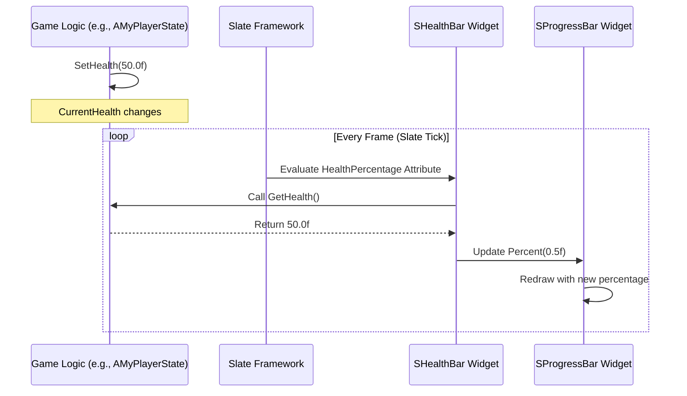

# Advanced Slate UI Visualized

This guide explains how to build custom, performant user interfaces directly in C++ using Unreal Engine's Slate framework. Slate is ideal for complex custom widgets, high-performance UI, and editor tools, offering a level of control beyond what UMG (Unreal Motion Graphics) typically provides.

## Table of Contents
- [Slate's Declarative Syntax](#slates-declarative-syntax)
- [Creating Custom Widgets (SCompoundWidget)](#creating-custom-widgets-scompoundwidget)
- [Reactivity with Attributes (TAttribute)](#reactivity-with-attributes-tattribute)
- [Handling User Input (FReply)](#handling-user-input-freply)

## Slate's Declarative Syntax

### Concept
Slate uses a unique **declarative syntax** to construct UI. Instead of imperatively adding widgets one by one, you declare the entire widget hierarchy and its properties in a single block of code. This makes UI code often more readable and maintainable.

Key elements of the syntax:
-   `SNew(SWidgetType)`: Creates a new instance of a Slate widget.
-   `SAssignNew(WidgetPtr, SWidgetType)`: Creates a new instance and assigns it to a `TSharedPtr` variable.
-   `[]`: Used to define child widgets within a parent widget's slot (e.g., `SVerticalBox` has `SVerticalBox::Slot()`).
-   `.Attribute(Value)`: Used to set properties or bind delegates to a widget (e.g., `.Text(FText::FromString("Hello"))`, `.OnClicked(this, &MyClass::OnButtonClicked)`).

### Code Example: Simple Declarative UI

```cpp
// MyHUD.h
#pragma once

#include "CoreMinimal.h"
#include "GameFramework/HUD.h"
#include "Widgets/SCompoundWidget.h"
#include "MyHUD.generated.h"

// Define a simple Slate widget to be displayed
class SMyWidget : public SCompoundWidget
{
public:
    SLATE_BEGIN_ARGS(SMyWidget) {}
    SLATE_END_ARGS()

    void Construct(const FArguments& InArgs)
    {
        ChildSlot
        [
            SNew(SVerticalBox)
            + SVerticalBox::Slot()
            .HAlign(HAlign_Center)
            .VAlign(VAlign_Center)
            [
                SNew(STextBlock)
                .Text(FText::FromString("Hello Slate!"))
                .Font(FSlateFontInfo(FPaths::EngineContentDir() / TEXT("Slate/Fonts/Roboto-Bold.ttf"), 24))
                .ColorAndOpacity(FLinearColor::Yellow)
            ]
            + SVerticalBox::Slot()
            .HAlign(HAlign_Center)
            .VAlign(VAlign_Center)
            .Padding(FMargin(0, 10))
            [
                SNew(SButton)
                .Text(FText::FromString("Click Me!"))
                .OnClicked(this, &SMyWidget::OnButtonClicked)
            ]
        ];
    }

    FReply OnButtonClicked()
    {
        UE_LOG(LogTemp, Warning, TEXT("Button Clicked!"));
        return FReply::Handled();
    }
};

UCLASS()
class YOURPROJECT_API AMyHUD : public AHUD
{
    GENERATED_BODY()

protected:
    TSharedPtr<SMyWidget> MySlateWidget;

    virtual void BeginPlay() override;
};
```

```cpp
// MyHUD.cpp
#include "MyHUD.h"
#include "Widgets/SBoxPanel.h"
#include "Widgets/Text/STextBlock.h"
#include "Widgets/Input/SButton.h"
#include "Framework/Application/SlateApplication.h"

void AMyHUD::BeginPlay()
{
    Super::BeginPlay();

    if (GEngine && GEngine->GameViewport)
    {
        MySlateWidget = SNew(SMyWidget);

        GEngine->GameViewport->AddViewportWidgetContent(
            SNew(SWeakWidget).PossiblyNullContent(MySlateWidget.ToSharedRef())
        );

        // Optional: Show mouse cursor for UI interaction
        GetOwningPlayerController()->bShowMouseCursor = true;
        GetOwningPlayerController()->SetInputMode(FInputModeUIOnly());
    }
}
```

### Visualization: Declarative UI Hierarchy

```mermaid
graph TD
    A[SNew(SVerticalBox)] --> B[SVerticalBox::Slot()] 
    B --> C[SNew(STextBlock)]
    A --> D[SVerticalBox::Slot()] 
    D --> E[SNew(SButton)]

    style A fill:#f9f,stroke:#333,stroke-width:2px
    style C fill:#f9f,stroke:#333,stroke-width:2px
    style E fill:#f9f,stroke:#333,stroke-width:2px
```

## Creating Custom Widgets (SCompoundWidget)

### Concept
For more complex or reusable UI elements, you'll create your own custom Slate widgets by inheriting from `SCompoundWidget`. This allows you to encapsulate specific UI logic and appearance into a single, manageable class. The core of your custom widget's layout is defined within its `Construct` method.

### Code Example: Custom Health Bar Widget

```cpp
// SHealthBar.h
#pragma once

#include "CoreMinimal.h"
#include "Widgets/SCompoundWidget.h"
#include "Widgets/Layout/SProgressBar.h"

class SHealthBar : public SCompoundWidget
{
public:
    // Define arguments that can be passed to this widget when it's created
    SLATE_BEGIN_ARGS(SHealthBar)
        : _HealthPercentage(1.0f)
    {}

    // Define a float attribute for HealthPercentage
    SLATE_ATTRIBUTE(float, HealthPercentage)

    SLATE_END_ARGS()

    // The Construct method is where you define the widget's internal layout
    void Construct(const FArguments& InArgs);

protected:
    TSharedPtr<SProgressBar> ProgressBarWidget;
};
```

```cpp
// SHealthBar.cpp
#include "SHealthBar.h"

void SHealthBar::Construct(const FArguments& InArgs)
{
    // Store the attribute for later use or direct binding
    // InArgs._HealthPercentage is a TAttribute<float>

    ChildSlot
    [
        SAssignNew(ProgressBarWidget, SProgressBar)
        .Percent(InArgs._HealthPercentage) // Bind the attribute directly
        .FillColorAndOpacity(FLinearColor::Red)
        .BorderPadding(FVector2D(2,2))
    ];
}
```

### Visualization: Custom Widget Composition

```mermaid
graph TD
    A[SHealthBar (Custom Widget)] --> B[SProgressBar (Internal Component)]
    A --> C[STextBlock (Internal Component, e.g., for text overlay)]

    style A fill:#f9f,stroke:#333,stroke-width:2px
    style B fill:#fcf,stroke:#333,stroke-width:2px
    style C fill:#fcf,stroke:#333,stroke-width:2px
```

## Reactivity with Attributes (TAttribute)

### Concept
`TAttribute` is the cornerstone of Slate's reactive design. Instead of constantly polling for data changes or manually updating widgets, you bind a widget's property to a `TAttribute`. This attribute can hold a direct value, or it can be bound to a function (a delegate) that returns the value. When Slate ticks, it re-evaluates these attributes, and if the value has changed, the UI automatically updates.

This pattern significantly reduces boilerplate code and improves performance by only updating what's necessary.

### Code Example: Binding Health to `SHealthBar`

Let's assume we have a `UPlayerState` with a `CurrentHealth` property.

```cpp
// MyPlayerState.h
#pragma once

#include "CoreMinimal.h"
#include "GameFramework/PlayerState.h"
#include "MyPlayerState.generated.h"

UCLASS()
class YOURPROJECT_API AMyPlayerState : public APlayerState
{
    GENERATED_BODY()

public:
    AMyPlayerState();

    UPROPERTY(BlueprintReadOnly, Category = "Health")
    float CurrentHealth;

    UFUNCTION(BlueprintCallable, Category = "Health")
    void SetHealth(float NewHealth);

    UFUNCTION(BlueprintCallable, Category = "Health")
    float GetHealth() const { return CurrentHealth; }
};
```

```cpp
// MyPlayerState.cpp
#include "MyPlayerState.h"

AMyPlayerState::AMyPlayerState()
{
    CurrentHealth = 100.0f;
}

void AMyPlayerState::SetHealth(float NewHealth)
{
    CurrentHealth = FMath::Clamp(NewHealth, 0.0f, 100.0f);
    UE_LOG(LogTemp, Warning, TEXT("Player Health: %f"), CurrentHealth);
}
```

Now, in our `MyHUD` (or any other place where you create the `SHealthBar`):

```cpp
// MyHUD.cpp (Modified BeginPlay)
#include "MyHUD.h"
#include "SHealthBar.h" // Include our custom widget
#include "MyPlayerState.h"
#include "Kismet/GameplayStatics.h"

void AMyHUD::BeginPlay()
{
    Super::BeginPlay();

    if (GEngine && GEngine->GameViewport && GetOwningPlayerController())
    {
        AMyPlayerState* PS = GetOwningPlayerController()->GetPlayerState<AMyPlayerState>();
        if (PS)
        {
            MySlateWidget = SNew(SMyWidget);

            // Create the SHealthBar and bind its HealthPercentage attribute
            TSharedRef<SHealthBar> HealthBarWidget = SNew(SHealthBar)
                .HealthPercentage_UObject(PS, &AMyPlayerState::GetHealth); // Bind to a UObject function
                // Alternatively, if CurrentHealth was public and not a UPROPERTY, you could use:
                // .HealthPercentage_Lambda([PS]() { return PS->CurrentHealth / 100.0f; });

            GEngine->GameViewport->AddViewportWidgetContent(
                SNew(SVerticalBox)
                + SVerticalBox::Slot()
                .HAlign(HAlign_Fill)
                .VAlign(VAlign_Top)
                .Padding(FMargin(10, 10, 10, 0))
                .AutoHeight()
                [
                    HealthBarWidget
                ]
                + SVerticalBox::Slot()
                .HAlign(HAlign_Center)
                .VAlign(VAlign_Center)
                [
                    MySlateWidget.ToSharedRef() // Our original SMyWidget
                ]
            );

            GetOwningPlayerController()->bShowMouseCursor = true;
            GetOwningPlayerController()->SetInputMode(FInputModeUIOnly());
        }
    }
}
```

### Visualization: Reactive UI Flow



## Handling User Input (FReply)

### Concept
Slate widgets can respond to user input through delegates. For example, `SButton` has an `OnClicked` delegate. When you bind a function to this delegate, that function will be called when the button is pressed. The function typically returns an `FReply` struct, which indicates how the event was handled.

-   `FReply::Handled()`: The event was processed by this widget, and no further widgets should process it.
-   `FReply::Unhandled()`: The event was not processed by this widget, and it should continue to propagate to other widgets (e.g., parent widgets).

### Code Example: Button Click Handler

(Referencing the `SMyWidget` from Section 1)

```cpp
// SMyWidget.h (part of the class definition)
class SMyWidget : public SCompoundWidget
{
public:
    // ... (SLATE_BEGIN_ARGS, SLATE_END_ARGS, Construct method)

    FReply OnButtonClicked()
    {
        UE_LOG(LogTemp, Warning, TEXT("Button Clicked! Performing action..."));
        // Perform some game logic here
        return FReply::Handled(); // Indicate that we handled this click event
    }
};
```

### Visualization: Input Handling Flow

```mermaid
flowchart TD
    A[User Clicks SButton] --> B[SButton::OnClicked Delegate Invoked]
    B --> C[Bound Function (e.g., SMyWidget::OnButtonClicked) Executed]
    C --> D{Return FReply::Handled() or FReply::Unhandled() ?}
    D -- Handled --> E[Event Processing Stops]
    D -- Unhandled --> F[Event Propagates to Parent Widgets]
```
