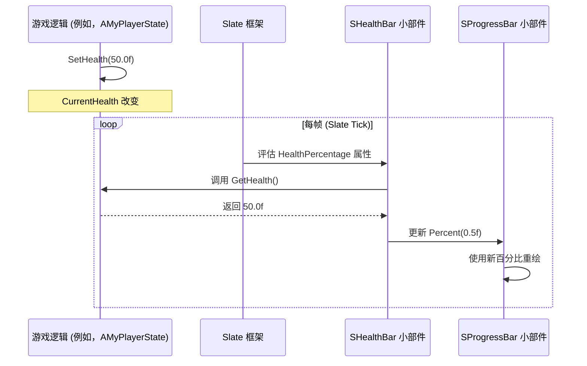

# 高级 Slate UI 可视化

本指南解释了如何使用 Unreal Engine 的 Slate 框架直接在 C++ 中构建自定义、高性能的用户界面。Slate 非常适合复杂的自定义小部件、高性能 UI 和编辑器工具，提供了 UMG（Unreal Motion Graphics）通常无法比拟的控制级别。

## 目录
- [Slate 的声明式语法](#slate-的声明式语法)
- [创建自定义小部件 (SCompoundWidget)](#创建自定义小部件-scompoundwidget)
- [属性的响应性 (TAttribute)](#属性的响应性-tattribute)
- [处理用户输入 (FReply)](#处理用户输入-freply)

## Slate 的声明式语法

### 概念
Slate 使用独特的**声明式语法**来构建 UI。您不是命令式地逐个添加小部件，而是在一个代码块中声明整个小部件层次结构及其属性。这使得 UI 代码通常更具可读性和可维护性。

语法的关键要素：
-   `SNew(SWidgetType)`：创建一个 Slate 小部件的新实例。
-   `SAssignNew(WidgetPtr, SWidgetType)`：创建一个新实例并将其分配给 `TSharedPtr` 变量。
-   `[]`：用于定义父小部件槽中的子小部件（例如，`SVerticalBox` 有 `SVerticalBox::Slot()`）。
-   `.Attribute(Value)`：用于设置属性或将委托绑定到小部件（例如，`.Text(FText::FromString("Hello"))`，`.OnClicked(this, &MyClass::OnButtonClicked)`）。

### 代码示例：简单的声明式 UI

```cpp
// MyHUD.h
#pragma once

#include "CoreMinimal.h"
#include "GameFramework/HUD.h"
#include "Widgets/SCompoundWidget.h"
#include "MyHUD.generated.h"

// 定义一个要显示的简单 Slate 小部件
class SMyWidget : public SCompoundWidget
{
public:
    SLATE_BEGIN_ARGS(SMyWidget) {}
    SLATE_END_ARGS()

    void Construct(const FArguments& InArgs)
    {
        ChildSlot
        [
            SNew(SVerticalBox)
            + SVerticalBox::Slot()
            .HAlign(HAlign_Center)
            .VAlign(VAlign_Center)
            [
                SNew(STextBlock)
                .Text(FText::FromString("Hello Slate!"))
                .Font(FSlateFontInfo(FPaths::EngineContentDir() / TEXT("Slate/Fonts/Roboto-Bold.ttf"), 24))
                .ColorAndOpacity(FLinearColor::Yellow)
            ]
            + SVerticalBox::Slot()
            .HAlign(HAlign_Center)
            .VAlign(VAlign_Center)
            .Padding(FMargin(0, 10))
            [
                SNew(SButton)
                .Text(FText::FromString("Click Me!"))
                .OnClicked(this, &SMyWidget::OnButtonClicked)
            ]
        ];
    }

    FReply OnButtonClicked()
    {
        UE_LOG(LogTemp, Warning, TEXT("Button Clicked!"));
        return FReply::Handled();
    }
};

UCLASS()
class YOURPROJECT_API AMyHUD : public AHUD
{
    GENERATED_BODY()

protected:
    TSharedPtr<SMyWidget> MySlateWidget;

    virtual void BeginPlay() override;
};
```

```cpp
// MyHUD.cpp
#include "MyHUD.h"
#include "Widgets/SBoxPanel.h"
#include "Widgets/Text/STextBlock.h"
#include "Widgets/Input/SButton.h"
#include "Framework/Application/SlateApplication.h"

void AMyHUD::BeginPlay()
{
    Super::BeginPlay();

    if (GEngine && GEngine->GameViewport)
    {
        MySlateWidget = SNew(SMyWidget);

        GEngine->GameViewport->AddViewportWidgetContent(
            SNew(SWeakWidget).PossiblyNullContent(MySlateWidget.ToSharedRef())
        );

        // 可选：显示鼠标光标以进行 UI 交互
        GetOwningPlayerController()->bShowMouseCursor = true;
        GetOwningPlayerController()->SetInputMode(FInputModeUIOnly());
    }
}
```

### 可视化：声明式 UI 层次结构

```mermaid
graph TD
    A[SNew(SVerticalBox)] --> B[SVerticalBox::Slot()] 
    B --> C[SNew(STextBlock)]
    A --> D[SVerticalBox::Slot()] 
    D --> E[SNew(SButton)]

    style A fill:#f9f,stroke:#333,stroke-width:2px
    style C fill:#f9f,stroke:#333,stroke-width:2px
    style E fill:#f9f,stroke:#333,stroke-width:2px
```

## 创建自定义小部件 (SCompoundWidget)

### 概念
对于更复杂或可重用的 UI 元素，您将通过继承 `SCompoundWidget` 来创建自己的自定义 Slate 小部件。这允许您将特定的 UI 逻辑和外观封装到一个单一的、可管理的类中。自定义小部件布局的核心是在其 `Construct` 方法中定义的。

### 代码示例：自定义生命值条小部件

```cpp
// SHealthBar.h
#pragma once

#include "CoreMinimal.h"
#include "Widgets/SCompoundWidget.h"
#include "Widgets/Layout/SProgressBar.h"

class SHealthBar : public SCompoundWidget
{
public:
    // 定义创建此小部件时可以传递的参数
    SLATE_BEGIN_ARGS(SHealthBar)
        : _HealthPercentage(1.0f)
    {}

    // 定义 HealthPercentage 的浮点属性
    SLATE_ATTRIBUTE(float, HealthPercentage)

    SLATE_END_ARGS()

    // Construct 方法是您定义小部件内部布局的地方
    void Construct(const FArguments& InArgs);

protected:
    TSharedPtr<SProgressBar> ProgressBarWidget;
};
```

```cpp
// SHealthBar.cpp
#include "SHealthBar.h"

void SHealthBar::Construct(const FArguments& InArgs)
{
    // 存储属性以供以后使用或直接绑定
    // InArgs._HealthPercentage 是 TAttribute<float>

    ChildSlot
    [
        SAssignNew(ProgressBarWidget, SProgressBar)
        .Percent(InArgs._HealthPercentage) // 直接绑定属性
        .FillColorAndOpacity(FLinearColor::Red)
        .BorderPadding(FVector2D(2,2))
    ];
}
```

### 可视化：自定义小部件组合

```mermaid
graph TD
    A[SHealthBar (自定义小部件)] --> B[SProgressBar (内部组件)]
    A --> C[STextBlock (内部组件，例如用于文本覆盖)]

    style A fill:#f9f,stroke:#333,stroke-width:2px
    style B fill:#fcf,stroke:#333,stroke-width:2px
    style C fill:#fcf,stroke:#333,stroke-width:2px
```

## 属性的响应性 (TAttribute)

### 概念
`TAttribute` 是 Slate 响应式设计的基石。您不是不断轮询数据更改或手动更新小部件，而是将小部件的属性绑定到 `TAttribute`。此属性可以保存直接值，也可以绑定到返回值的函数（委托）。当 Slate 计时时，它会重新评估这些属性，如果值已更改，UI 会自动更新。

这种模式显著减少了样板代码并提高了性能，因为它只更新必要的内容。

### 代码示例：将生命值绑定到 `SHealthBar`

假设我们有一个 `UPlayerState` 带有 `CurrentHealth` 属性。

```cpp
// MyPlayerState.h
#pragma once

#include "CoreMinimal.h"
#include "GameFramework/PlayerState.h"
#include "MyPlayerState.generated.h"

UCLASS()
class YOURPROJECT_API AMyPlayerState : public APlayerState
{
    GENERATED_BODY()

public:
    AMyPlayerState();

    UPROPERTY(BlueprintReadOnly, Category = "Health")
    float CurrentHealth;

    UFUNCTION(BlueprintCallable, Category = "Health")
    void SetHealth(float NewHealth);

    UFUNCTION(BlueprintCallable, Category = "Health")
    float GetHealth() const { return CurrentHealth; }
};
```

```cpp
// MyPlayerState.cpp
#include "MyPlayerState.h"

AMyPlayerState::AMyPlayerState()
{
    CurrentHealth = 100.0f;
}

void AMyPlayerState::SetHealth(float NewHealth)
{
    CurrentHealth = FMath::Clamp(NewHealth, 0.0f, 100.0f);
    UE_LOG(LogTemp, Warning, TEXT("Player Health: %f"), CurrentHealth);
}
```

现在，在我们的 `MyHUD`（或您创建 `SHealthBar` 的任何其他地方）：

```cpp
// MyHUD.cpp (修改后的 BeginPlay)
#include "MyHUD.h"
#include "SHealthBar.h" // 包含我们的自定义小部件
#include "MyPlayerState.h"
#include "Kismet/GameplayStatics.h"

void AMyHUD::BeginPlay()
{
    Super::BeginPlay();

    if (GEngine && GEngine->GameViewport && GetOwningPlayerController())
    {
        AMyPlayerState* PS = GetOwningPlayerController()->GetPlayerState<AMyPlayerState>();
        if (PS)
        {
            MySlateWidget = SNew(SMyWidget);

            // 创建 SHealthBar 并绑定其 HealthPercentage 属性
            TSharedRef<SHealthBar> HealthBarWidget = SNew(SHealthBar)
                .HealthPercentage_UObject(PS, &AMyPlayerState::GetHealth); // 绑定到 UObject 函数
                // 或者，如果 CurrentHealth 是公共的而不是 UPROPERTY，您可以使用：
                // .HealthPercentage_Lambda([PS]() { return PS->CurrentHealth / 100.0f; });

            GEngine->GameViewport->AddViewportWidgetContent(
                SNew(SVerticalBox)
                + SVerticalBox::Slot()
                .HAlign(HAlign_Fill)
                .VAlign(VAlign_Top)
                .Padding(FMargin(10, 10, 10, 0))
                .AutoHeight()
                [
                    HealthBarWidget
                ]
                + SVerticalBox::Slot()
                .HAlign(HAlign_Center)
                .VAlign(VAlign_Center)
                [
                    MySlateWidget.ToSharedRef() // 我们的原始 SMyWidget
                ]
            );

            GetOwningPlayerController()->bShowMouseCursor = true;
            GetOwningPlayerController()->SetInputMode(FInputModeUIOnly());
        }
    }
}
```

### 可视化：响应式 UI 流程



## 处理用户输入 (FReply)

### 概念
Slate 小部件可以通过委托响应用户输入。例如，`SButton` 有一个 `OnClicked` 委托。当您将函数绑定到此委托时，该函数将在按下按钮时被调用。该函数通常返回一个 `FReply` 结构体，指示事件是如何处理的。

-   `FReply::Handled()`：事件已由此小部件处理，不应再由其他小部件处理。
-   `FReply::Unhandled()`：事件未由此小部件处理，应继续传播到其他小部件（例如，父小部件）。

### 代码示例：按钮点击处理程序

（参考第 1 节中的 `SMyWidget`）

```cpp
// SMyWidget.h (类定义的一部分)
class SMyWidget : public SCompoundWidget
{
public:
    // ... (SLATE_BEGIN_ARGS, SLATE_END_ARGS, Construct 方法)

    FReply OnButtonClicked()
    {
        UE_LOG(LogTemp, Warning, TEXT("Button Clicked! Performing action..."));
        // 在此处执行一些游戏逻辑
        return FReply::Handled(); // 表明我们处理了此点击事件
    }
};
```

### 可视化：输入处理流程

```mermaid
flowchart TD
    A[用户点击 SButton] --> B[SButton::OnClicked 委托被调用]
    B --> C[绑定函数 (例如，SMyWidget::OnButtonClicked) 执行]
    C --> D{返回 FReply::Handled() 或 FReply::Unhandled() ？}
    D -- Handled --> E[事件处理停止]
    D -- Unhandled --> F[事件传播到父小部件]
```
