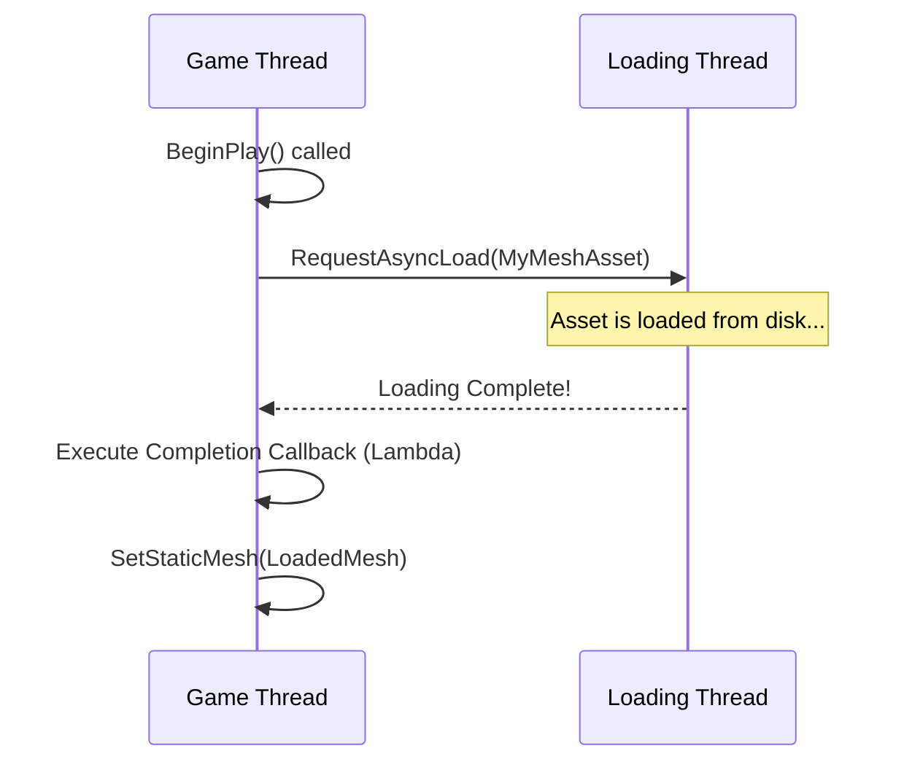

# Async Loading & Asset Management Visualized

This guide explains how to load assets asynchronously in Unreal Engine using C++. This is a critical skill for preventing game freezes, managing memory, and creating a smooth user experience in any project that grows beyond a trivial size.

## Table of Contents
- [The Problem & The Solution - Soft Pointers](#the-problem--the-solution---soft-pointers)
- [The Workhorse - FStreamableManager](#the-workhorse---fstreamablemanager)
- [Advanced Management - The Asset Manager](#advanced-management---the-asset-manager)

## The Problem & The Solution - Soft Pointers

### Concept
In Unreal Engine, a standard `UObject*` pointer (a "hard pointer") to an asset creates a strong reference. This means that as long as the pointer exists in memory, the asset it points to will be loaded and kept in memory. If you have a class with a `UStaticMesh*` property, that mesh asset will be loaded the moment an object of that class is created.

This becomes a problem when you have many large assets. Synchronously loading them all at once can cause the game thread to stall, resulting in noticeable hitches or long loading screens.

The solution is to use **Soft Pointers**: `TSoftObjectPtr` and `TSoftClassPtr`. These are special pointer types that store a string reference to an asset (e.g., `"/Game/Meshes/MyMesh.MyMesh"`) instead of holding the asset in memory directly. The asset remains on disk until you explicitly request to load it.

- **`TSoftObjectPtr<UObjectType>`**: A soft pointer to a specific asset instance (e.g., a material, a mesh, a texture).
- **`TSoftClassPtr<UClassType>`**: A soft pointer to a `UClass` (e.g., a Blueprint class).

### Code Example: Using Soft Pointers

```cpp
// MyActor.h
#pragma once

#include "CoreMinimal.h"
#include "GameFramework/Actor.h"
#include "MyActor.generated.h"

UCLASS()
class YOURPROJECT_API AMyActor : public AActor
{
    GENERATED_BODY()

public:
    AMyActor();

protected:
    // A soft pointer to a specific Static Mesh asset.
    // This does NOT load the mesh into memory on its own.
    UPROPERTY(EditAnywhere, Category = "Assets")
    TSoftObjectPtr<UStaticMesh> MyMeshAsset;

    // A soft pointer to a Blueprint class that inherits from AMyCharacter.
    // This does NOT load the Blueprint class into memory.
    UPROPERTY(EditAnywhere, Category = "Assets")
    TSoftClassPtr<class AMyCharacter> MyCharacterBlueprint;

    virtual void BeginPlay() override;
};
```

### Visualization: Hard Pointer vs. Soft Pointer

```mermaid
flowchart TD
    subgraph Hard Pointer
        A[UStaticMesh* MyMesh] --> B[
            **MyMesh Asset**
            (Loaded in Memory)
        ]
    end

    subgraph Soft Pointer
        C[TSoftObjectPtr<UStaticMesh> MyMesh] --> D[
            **String Path**
            "/Game/Meshes/MyMesh.MyMesh"
            (Asset on Disk)
        ]
    end

    A -- Creates Strong Reference --> B
    C -- Creates Weak Reference --> D
```

## The Workhorse - FStreamableManager

### Concept
The `FStreamableManager` is the primary engine system for handling asynchronous loading requests. It operates on a callback-based system. You give it a list of assets to load, and it loads them on a background thread. When the loading is complete, it executes a delegate (a callback function) on the game thread, providing you with safe access to the now-loaded assets.

This is the standard, recommended way to perform asynchronous loading in C++.

### Code Example: Using `RequestAsyncLoad`

This example shows how to load the `MyMeshAsset` from the previous example and assign it to a `UStaticMeshComponent` when it's ready.

```cpp
// MyActor.cpp
#include "MyActor.h"
#include "Engine/StreamableManager.h"
#include "Engine/AssetManager.h"
#include "Components/StaticMeshComponent.h"

AMyActor::AMyActor()
{
    PrimaryActorTick.bCanEverTick = false;

    // Create a component to hold the mesh once it's loaded
    UStaticMeshComponent* MeshComponent = CreateDefaultSubobject<UStaticMeshComponent>(TEXT("MeshComponent"));
    SetRootComponent(MeshComponent);
}

void AMyActor::BeginPlay()
{
    Super::BeginPlay();

    // Check if the soft pointer is valid (i.e., an asset has been assigned in the editor)
    if (MyMeshAsset.IsPending())
    {
        // Get the Streamable Manager from the Asset Manager singleton
        FStreamableManager& StreamableManager = UAssetManager::Get().GetStreamableManager();

        // Create a delegate that will be called when loading is complete
        // We use a C++ lambda here for convenience
        StreamableManager.RequestAsyncLoad(MyMeshAsset.ToSoftObjectPath(), [this]()
        {
            // This code executes on the game thread when the asset is loaded
            UStaticMesh* LoadedMesh = MyMeshAsset.Get();
            if (LoadedMesh)
            {
                UE_LOG(LogTemp, Warning, TEXT("Asset loaded successfully!"));
                // Get the component and assign the loaded mesh
                UStaticMeshComponent* MeshComponent = FindComponentByClass<UStaticMeshComponent>();
                if (MeshComponent)
                {
                    MeshComponent->SetStaticMesh(LoadedMesh);
                }
            }
            else
            {
                UE_LOG(LogTemp, Error, TEXT("Failed to load asset!"));
            }
        });
    }
}
```

### Visualization: Async Loading Flow



## Advanced Management - The Asset Manager

### Concept
While `FStreamableManager` is great for loading individual assets, the `UAssetManager` provides a higher-level, data-driven framework for managing large groups of assets. It is the centralized system for managing game assets and is highly configurable.

A key concept is the **Primary Asset ID**. This is a unique identifier (`FPrimaryAssetId`) that you can assign to assets in the editor. You can then use this ID to load, unload, and manage assets without needing direct references. You can also group assets into **Asset Bundles**, which are just named lists of secondary assets associated with a primary asset.

This approach is powerful for loading all assets required for a specific level, character, or gameplay feature with a single command.

### Code Example: Loading by Primary Asset ID

1.  **In the Editor:** Open a Data Asset, Blueprint, or other asset type. In its Asset Details panel, expand the "Asset Manager" section and assign a **Primary Asset Type** (e.g., `DA_WeaponData`) and a **Primary Asset Name** (e.g., `Pistol`).

2.  **In Code:** Use `UAssetManager::LoadPrimaryAssets` to load all assets of a certain type.

```cpp
// MyGameMode.cpp
#include "Engine/AssetManager.h"

void AMyGameMode::StartGame()
{
    UAssetManager& AssetManager = UAssetManager::Get();

    // Define the Primary Asset Type we want to load
    FPrimaryAssetType AssetTypeToLoad = TEXT("DA_WeaponData");

    // Create a list of IDs to load (can be empty to load all of a type)
    TArray<FPrimaryAssetId> AssetIDsToLoad;

    // Create a delegate for completion
    FStreamableDelegate OnAssetsLoadedDelegate = FStreamableDelegate::CreateUObject(this, &AMyGameMode::OnWeaponDataLoaded);

    // Start loading all assets of the specified type
    AssetManager.LoadPrimaryAssets(AssetIDsToLoad, TArray<FName>(), OnAssetsLoadedDelegate);
}

void AMyGameMode::OnWeaponDataLoaded()
{
    UE_LOG(LogTemp, Warning, TEXT("All weapon data assets have been loaded!"));
    // Now you can safely get and use these assets
}
```

### Visualization: Asset Manager Grouping

```mermaid
graph TD
    subgraph Asset Manager
        A[Primary Asset ID: "Level_Dungeon"] --> B[Dungeon_Wall.uasset]
        A --> C[Dungeon_Floor.uasset]
        A --> D[Torch_FX.uasset]
        A --> E[Skeleton_Enemy.uasset]
    end

    F[LoadPrimaryAsset("Level_Dungeon")] --> A

    style B fill:#f9f,stroke:#333,stroke-width:2px
    style C fill:#f9f,stroke:#333,stroke-width:2px
    style D fill:#f9f,stroke:#333,stroke-width:2px
    style E fill:#f9f,stroke:#333,stroke-width:2px
```
