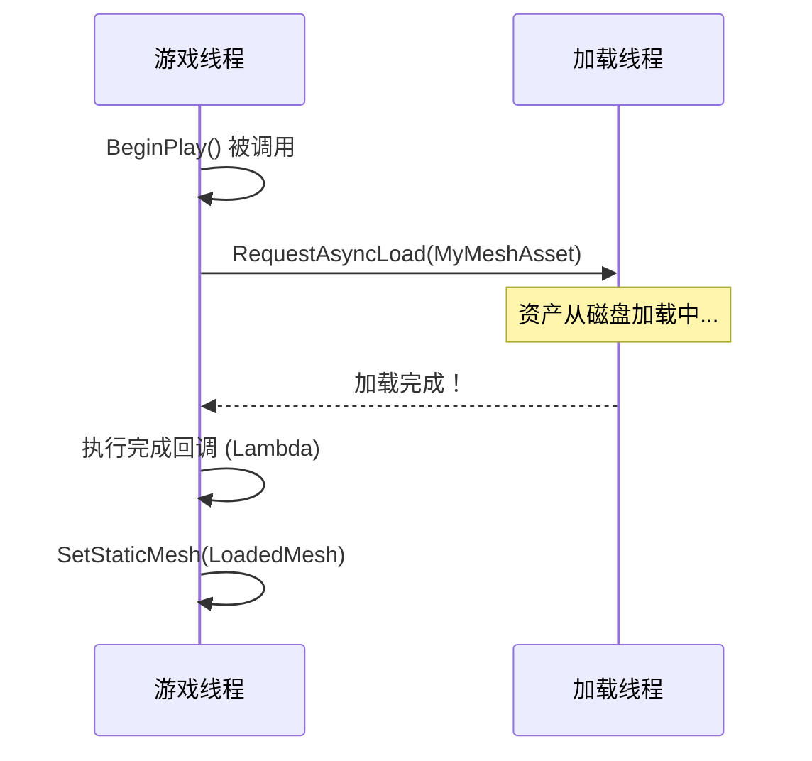

# 异步加载与资产管理可视化

本指南解释了如何在 Unreal Engine 中使用 C++ 异步加载资产。在任何规模超出简单的项目中，这都是一项至关重要的技能，可以防止游戏卡顿、管理内存并创造流畅的用户体验。

## 目录
- [问题与解决方案 - 软指针](#问题与解决方案---软指针)
- [核心工具 - FStreamableManager](#核心工具---fstreamablemanager)
- [高级管理 - 资产管理器](#高级管理---资产管理器)

## 问题与解决方案 - 软指针

### 概念
在 Unreal Engine 中，一个标准的 `UObject*` 指针（“硬指针”）会创建一个对资产的强引用。这意味着只要该指针存在于内存中，它所指向的资产就会被加载并保留在内存中。如果你的类有一个 `UStaticMesh*` 属性，那么该静态网格资产将在该类的对象被创建的瞬间被加载。

当你有许多大型资产时，这就成了一个问题。一次性同步加载所有资产会导致游戏线程阻塞，从而引起明显的卡顿或长时间的加载画面。

解决方案是使用**软指针**：`TSoftObjectPtr` 和 `TSoftClassPtr`。这些是特殊的指针类型，它们存储对资产的字符串引用（例如 `"/Game/Meshes/MyMesh.MyMesh"`），而不是直接将资产保留在内存中。资产会一直保留在磁盘上，直到你明确请求加载它。

- **`TSoftObjectPtr<UObjectType>`**：指向特定资产实例（如材质、网格、纹理）的软指针。
- **`TSoftClassPtr<UClassType>`**：指向一个 `UClass`（如蓝图类）的软指针。

### 代码示例：使用软指针

```cpp
// MyActor.h
#pragma once

#include "CoreMinimal.h"
#include "GameFramework/Actor.h"
#include "MyActor.generated.h"

UCLASS()
class YOURPROJECT_API AMyActor : public AActor
{
    GENERATED_BODY()

public:
    AMyActor();

protected:
    // 指向特定静态网格资产的软指针。
    // 这本身不会将网格加载到内存中。
    UPROPERTY(EditAnywhere, Category = "Assets")
    TSoftObjectPtr<UStaticMesh> MyMeshAsset;

    // 指向继承自 AMyCharacter 的蓝图类的软指针。
    // 这不会将蓝图类加载到内存中。
    UPROPERTY(EditAnywhere, Category = "Assets")
    TSoftClassPtr<class AMyCharacter> MyCharacterBlueprint;

    virtual void BeginPlay() override;
};
```

### 可视化：硬指针 vs. 软指针

```mermaid
flowchart TD
    subgraph 硬指针
        A[UStaticMesh* MyMesh] --> B[
            **MyMesh 资产**
            (已加载到内存)
        ]
    end

    subgraph 软指针
        C[TSoftObjectPtr<UStaticMesh> MyMesh] --> D[
            **字符串路径**
            "/Game/Meshes/MyMesh.MyMesh"
            (资产在磁盘上)
        ]
    end

    A -- 创建强引用 --> B
    C -- 创建弱引用 --> D
```

## 核心工具 - FStreamableManager

### 概念
`FStreamableManager` 是处理异步加载请求的主要引擎系统。它基于回调系统工作。你给它一个要加载的资产列表，它会在后台线程上加载它们。当加载完成时，它会在游戏线程上执行一个委托（回调函数），为你提供对已加载资产的安全访问。

这是在 C++ 中执行异步加载的标准推荐方法。

### 代码示例：使用 `RequestAsyncLoad`

此示例展示了如何加载前一个示例中的 `MyMeshAsset`，并在其准备就绪时将其分配给 `UStaticMeshComponent`。

```cpp
// MyActor.cpp
#include "MyActor.h"
#include "Engine/StreamableManager.h"
#include "Engine/AssetManager.h"
#include "Components/StaticMeshComponent.h"

AMyActor::AMyActor()
{
    PrimaryActorTick.bCanEverTick = false;

    // 创建一个组件以在网格加载后持有它
    UStaticMeshComponent* MeshComponent = CreateDefaultSubobject<UStaticMeshComponent>(TEXT("MeshComponent"));
    SetRootComponent(MeshComponent);
}

void AMyActor::BeginPlay()
{
    Super::BeginPlay();

    // 检查软指针是否有效（即是否已在编辑器中分配资产）
    if (MyMeshAsset.IsPending())
    {
        // 从 AssetManager 单例获取 Streamable Manager
        FStreamableManager& StreamableManager = UAssetManager::Get().GetStreamableManager();

        // 创建一个在加载完成时调用的委托
        // 为方便起见，我们在这里使用 C++ lambda
        StreamableManager.RequestAsyncLoad(MyMeshAsset.ToSoftObjectPath(), [this]()
        {
            // 此代码在资产加载后于游戏线程上执行
            UStaticMesh* LoadedMesh = MyMeshAsset.Get();
            if (LoadedMesh)
            {
                UE_LOG(LogTemp, Warning, TEXT("Asset loaded successfully!"));
                // 获取组件并分配加载的网格
                UStaticMeshComponent* MeshComponent = FindComponentByClass<UStaticMeshComponent>();
                if (MeshComponent)
                {
                    MeshComponent->SetStaticMesh(LoadedMesh);
                }
            }
            else
            {
                UE_LOG(LogTemp, Error, TEXT("Failed to load asset!"));
            }
        });
    }
}
```

### 可视化：异步加载流程



## 高级管理 - 资产管理器

### 概念
虽然 `FStreamableManager` 非常适合加载单个资产，但 `UAssetManager` 提供了一个更高级别、数据驱动的框架来管理大量的资产组。它是管理游戏资产的中央系统，并且高度可配置。

一个关键概念是**主资产ID (Primary Asset ID)**。这是一个唯一的标识符（`FPrimaryAssetId`），你可以在编辑器中分配给资产。然后，你可以使用此 ID 来加载、卸载和管理资产，而无需直接引用。你还可以将资产分组到**资产包 (Asset Bundles)** 中，这只是与主资产关联的次要资产的命名列表。

这种方法对于通过单个命令加载特定关卡、角色或游戏功能所需的所有资产非常强大。

### 代码示例：按主资产ID加载

1.  **在编辑器中：** 打开一个数据资产、蓝图或其他资产类型。在其资产详细信息面板中，展开“资产管理器”部分，并分配一个**主资产类型**（例如 `DA_WeaponData`）和一个**主资产名称**（例如 `Pistol`）。

2.  **在代码中：** 使用 `UAssetManager::LoadPrimaryAssets` 加载某种类型的所有资产。

```cpp
// MyGameMode.cpp
#include "Engine/AssetManager.h"

void AMyGameMode::StartGame()
{
    UAssetManager& AssetManager = UAssetManager::Get();

    // 定义我们要加载的主资产类型
    FPrimaryAssetType AssetTypeToLoad = TEXT("DA_WeaponData");

    // 创建要加载的 ID 列表（可以为空以加载某种类型的所有资产）
    TArray<FPrimaryAssetId> AssetIDsToLoad;

    // 创建一个完成委托
    FStreamableDelegate OnAssetsLoadedDelegate = FStreamableDelegate::CreateUObject(this, &AMyGameMode::OnWeaponDataLoaded);

    // 开始加载指定类型的所有资产
    AssetManager.LoadPrimaryAssets(AssetIDsToLoad, TArray<FName>(), OnAssetsLoadedDelegate);
}

void AMyGameMode::OnWeaponDataLoaded()
{
    UE_LOG(LogTemp, Warning, TEXT("All weapon data assets have been loaded!"));
    // 现在你可以安全地获取和使用这些资产了
}
```

### 可视化：资产管理器分组

```mermaid
graph TD
    subgraph 资产管理器
        A[主资产ID: "Level_Dungeon"] --> B[Dungeon_Wall.uasset]
        A --> C[Dungeon_Floor.uasset]
        A --> D[Torch_FX.uasset]
        A --> E[Skeleton_Enemy.uasset]
    end

    F[LoadPrimaryAsset("Level_Dungeon")] --> A

    style B fill:#f9f,stroke:#333,stroke-width:2px
    style C fill:#f9f,stroke:#333,stroke-width:2px
    style D fill:#f9f,stroke:#333,stroke-width:2px
    style E fill:#f9f,stroke:#333,stroke-width:2px
```
