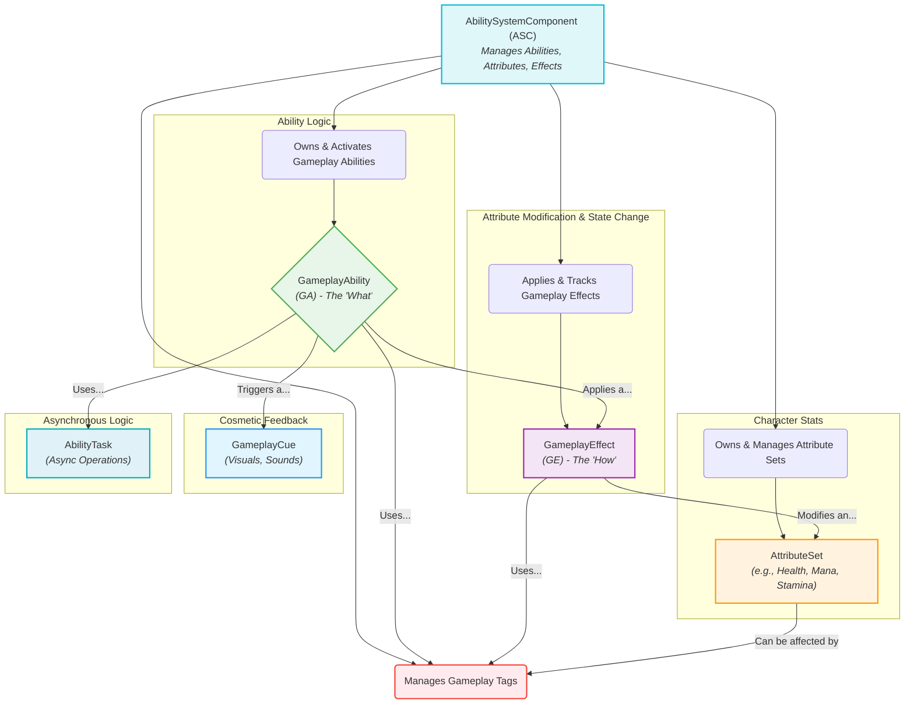
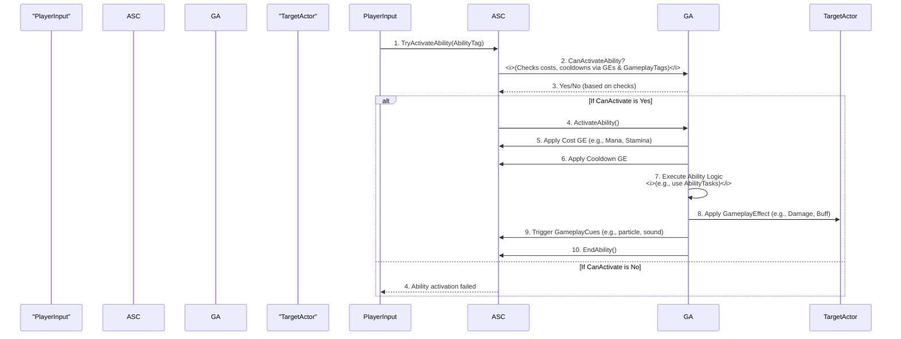

# The Gameplay Ability System (GAS) - Visualized

This document provides a comprehensive, visual summary of Unreal Engine's Gameplay Ability System (GAS), detailing its core components, their interactions, and advanced concepts.

## Summary

The Gameplay Ability System is a highly flexible and powerful framework for creating character abilities, attributes, and status effects. It is a complex but essential system for many genres, especially RPGs and MOBAs, as it handles everything from simple actions to complex, networked ability interactions. GAS is designed with multiplayer in mind, offering robust support for replicating abilities, attributes, and effects across clients and servers.

### Core Concepts

GAS is built on a few key concepts that work together to create a robust and scalable system:

*   **Ability System Component (ASC):** This is the central hub of GAS. It's a `UActorComponent` that you add to your character (or `PlayerState` for persistent multiplayer data). The ASC owns abilities, manages attributes, processes all gameplay effects, and handles network replication for these elements.

*   **Gameplay Ability (GA):** This is the "what" of an ability. It defines the logic for a single action a character can perform, like casting a spell, swinging a sword, or activating a passive buff. GAs can have costs, cooldowns, and trigger various effects. They can be implemented in C++ or Blueprint and have a defined lifecycle (activation, execution, ending).

*   **Attribute Set:** This holds the numerical data for a character, such as `Health`, `Mana`, `Stamina`, `AttackPower`, or `MovementSpeed`. It's a `UObject` containing a series of `FGameplayAttribute` properties. Attribute Sets track both a base value and a current value, allowing for temporary modifications (buffs/debuffs) without altering the base. The ASC is responsible for managing and replicating the Attribute Set.

*   **Gameplay Effect (GE):** This is the primary mechanism for applying changes to an Actor's attributes or Gameplay Tags. GEs define *how* attributes are modified. They can be:
    *   **Instant:** Applied once immediately (e.g., instant damage, healing).
    *   **Duration:** Applied over a period of time (e.g., a poison effect, temporary buff).
    *   **Infinite:** Applied indefinitely until removed (e.g., a permanent stat boost, a persistent debuff).
    GEs are also used to apply the costs and cooldowns for abilities. Complex calculations for GEs can be handled by `UGameplayEffectExecutionCalculation` or `UGameplayModMagnitudeCalculation` classes.

*   **Gameplay Tags:** These are hierarchical, name-based tags (e.g., `State.Stunned`, `Ability.Cooldown.Fireball`, `Effect.Buff.Speed`) used extensively within GAS for filtering data, categorizing abilities, effects, and other gameplay elements. They are highly efficient for managing and querying gameplay states and can help reduce the need for hard object references.

*   **Gameplay Cues:** These are used for cosmetic implementations like playing sound effects, particle effects, or spawning UI widgets (e.g., damage numbers). They are typically unreliable multicasts and are not triggered on dedicated servers by default, making them efficient for visual and audio feedback without affecting gameplay logic.

*   **Ability Tasks:** These are specialized `GameplayTask` classes that work with Gameplay Abilities. Unlike standard Blueprint nodes that execute immediately, Ability Tasks can track their state (inactive, in-progress, finished) and trigger events during their execution, allowing for more complex, asynchronous ability logic (e.g., `WaitTargetData`, `WaitDelay`).

*   **Prediction:** GAS is built with client-side prediction in mind for multiplayer games. This allows clients to simulate ability effects locally, reducing perceived latency and providing a smoother player experience, with the server ultimately authoritative.

*   **Targeting:** GAS provides mechanisms for abilities to select targets, ranging from simple self-targeting to complex area-of-effect or projectile-based targeting systems.

## Visualizations

### 1. Core GAS Component Relationships

This diagram shows how the main components of GAS interact with each other.

### 2. Simplified Ability Activation Flow with Effects

This sequence diagram illustrates the basic steps of activating an ability, applying its costs, and triggering its effects.

