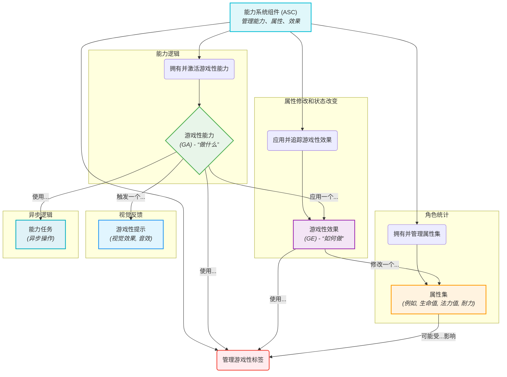
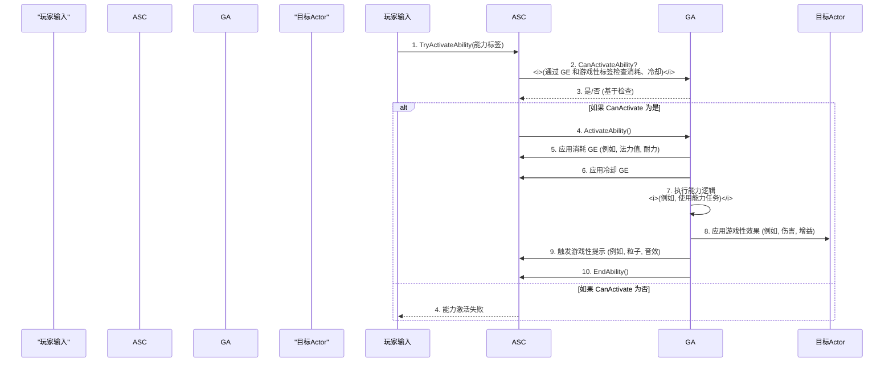

# 游戏性能力系统 (GAS) - 可视化

本文档提供了对虚幻引擎游戏性能力系统 (GAS) 的全面、可视化摘要，详细介绍了其核心组件、它们之间的交互以及高级概念。

## 摘要

游戏性能力系统是一个高度灵活且功能强大的框架，用于创建角色能力、属性和状态效果。对于许多类型的游戏，尤其是 RPG 和 MOBA，它是一个复杂但必不可少的系统，因为它处理从简单动作到复杂的、网络化的能力交互的所有内容。GAS 在设计时考虑了多人游戏，为跨客户端和服务器复制能力、属性和效果提供了强大的支持。

### 核心概念

GAS 建立在几个协同工作的关键概念之上，以创建一个健壮且可扩展的系统：

*   **能力系统组件 (ASC):** 这是 GAS 的核心枢纽。它是一个 `UActorComponent`，您可以将其添加到您的角色（或 `PlayerState` 以用于持久多人游戏数据）中。ASC 拥有能力、管理属性、处理所有游戏性效果，并处理这些元素的网络复制。

*   **游戏性能力 (GA):** 这是能力的“做什么”。它定义了角色可以执行的单个动作的逻辑，例如施法、挥剑或激活被动增益。GA 可以有消耗、冷却时间并触发各种效果。它们可以在 C++ 或蓝图中实现，并具有明确的生命周期（激活、执行、结束）。

*   **属性集 (Attribute Set):** 这包含角色的数值数据，例如 `Health`（生命值）、`Mana`（法力值）、`Stamina`（耐力）、`AttackPower`（攻击力）或 `MovementSpeed`（移动速度）。它是一个包含一系列 `FGameplayAttribute` 属性的 `UObject`。属性集跟踪基础值和当前值，允许进行临时修改（增益/减益）而不改变基础值。ASC 负责管理和复制属性集。

*   **游戏性效果 (GE):** 这是应用对 Actor 属性或游戏性标签更改的主要机制。GE 定义了属性 *如何* 被修改。它们可以是：
    *   **即时 (Instant):** 立即应用一次（例如，即时伤害、治疗）。
    *   **持续 (Duration):** 在一段时间内应用（例如，中毒效果、临时增益）。
    *   **无限 (Infinite):** 永久应用直到移除（例如，永久属性提升、持续减益）。
    GE 也用于应用能力的消耗和冷却时间。GE 的复杂计算可以通过 `UGameplayEffectExecutionCalculation` 或 `UGameplayModMagnitudeCalculation` 类处理。

*   **游戏性标签 (Gameplay Tags):** 这些是分层的、基于名称的标签（例如 `State.Stunned`、`Ability.Cooldown.Fireball`、`Effect.Buff.Speed`），在 GAS 中广泛用于过滤数据、分类能力、效果和其他游戏性元素。它们对于管理和查询游戏性状态非常高效，并有助于减少对硬引用的需求。

*   **游戏性提示 (Gameplay Cues):** 这些用于实现视觉效果，例如播放音效、粒子效果或生成 UI 小部件（例如，伤害数字）。它们通常是不可靠的多播，并且默认情况下不会在专用服务器上触发，这使得它们在不影响游戏性逻辑的情况下高效地提供视觉和音频反馈。

*   **能力任务 (Ability Tasks):** 这些是与游戏性能力一起使用的专用 `GameplayTask` 类。与立即执行的标准蓝图节点不同，能力任务可以跟踪其状态（非活动、进行中、完成）并在执行期间触发事件，从而实现更复杂的异步能力逻辑（例如 `WaitTargetData`、`WaitDelay`）。

*   **预测 (Prediction):** GAS 在设计时考虑了多人游戏的客户端预测。这允许客户端在本地模拟能力效果，减少感知延迟并提供更流畅的玩家体验，最终由服务器权威。

*   **目标选择 (Targeting):** GAS 提供了能力选择目标的机制，从简单的自我目标选择到复杂的范围效果或基于投射物的目标选择系统。

## 可视化

### 1. 核心 GAS 组件关系

此图显示了 GAS 的主要组件如何相互交互。

### 2. 简化的能力激活流程和效果

此序列图说明了激活能力、应用其消耗和触发其效果的基本步骤。

