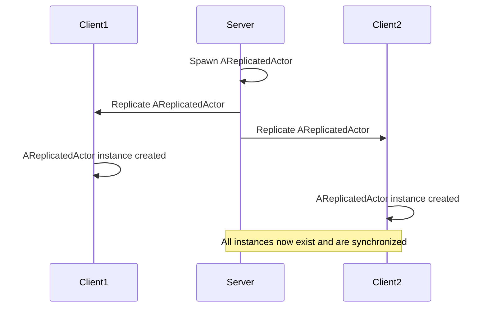
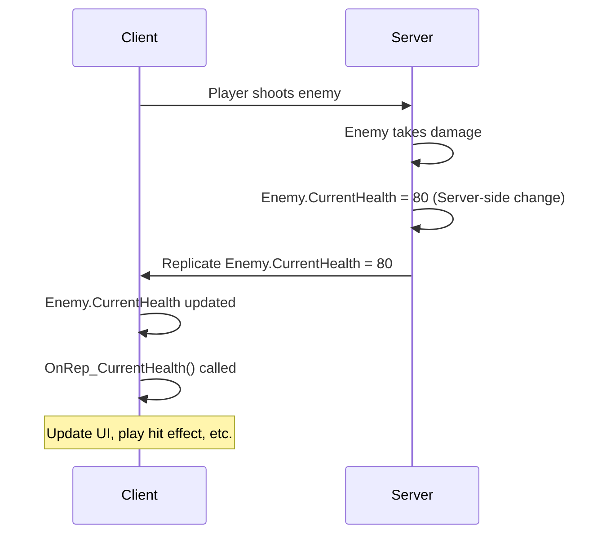
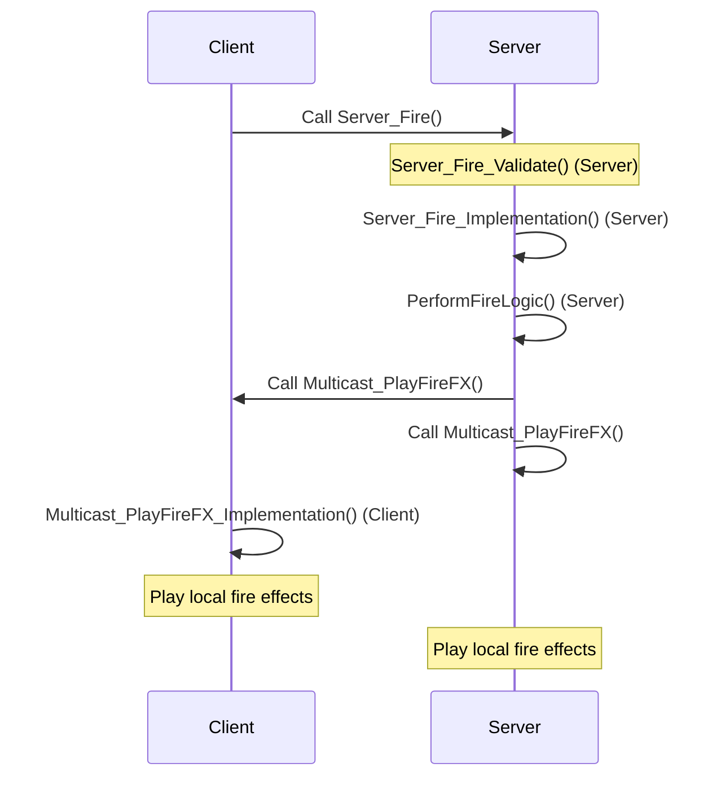

# Networking and Replication Visualized

This guide provides a clear, practical, and visualized understanding of Unreal Engine's C++ networking and replication system, essential for developing multiplayer games.

## Table of Contents
- [The Foundation - Actor Replication](#the-foundation---actor-replication)
- [State Synchronization - Property Replication](#state-synchronization---property-replication)
- [Executing Actions - Remote Procedure Calls (RPCs)](#executing-actions---remote-procedure-calls-rpcs)
- [Controlling Logic Flow - Roles & Authority](#controlling-logic-flow---roles--authority)

## The Foundation - Actor Replication

### Concept
Unreal Engine uses a client-server model for networking. For any `AActor` to exist and be synchronized across the network, it must be spawned on the server and explicitly marked for replication. The server is the authority for all gameplay logic and state.

When an Actor is replicated, the server creates an instance of that Actor on all connected clients. Any changes to its replicated properties or calls to its replicated functions will then be synchronized.

### Code Example: Basic Actor Replication

To make an Actor replicate, you typically set `bReplicates = true` in its constructor.

```cpp
// ReplicatedActor.h
#pragma once

#include "CoreMinimal.h"
#include "GameFramework/Actor.h"
#include "ReplicatedActor.generated.h"

UCLASS()
class YOURPROJECT_API AReplicatedActor : public AActor
{
    GENERATED_BODY()

public:
    AReplicatedActor();

protected:
    virtual void BeginPlay() override;

public:
    // Example function that might be called on the server
    UFUNCTION(BlueprintCallable, Category = "Networking")
    void ServerOnlyFunction();
};
```

```cpp
// ReplicatedActor.cpp
#include "ReplicatedActor.h"

AReplicatedActor::AReplicatedActor()
{
    // Crucial: Mark this Actor for replication
    bReplicates = true;
    // Optional: Set to true if this Actor can be owned by a player controller
    bAlwaysRelevant = true; // Keep this Actor replicated regardless of distance
    bNetLoadOnClient = true; // Allow clients to load this Actor when joining

    PrimaryActorTick.bCanEverTick = true;
}

void AReplicatedActor::BeginPlay()
{
    Super::BeginPlay();

    if (HasAuthority())
    {
        UE_LOG(LogTemp, Warning, TEXT("Server: AReplicatedActor spawned."));
    }
    else
    {
        UE_LOG(LogTemp, Warning, TEXT("Client: AReplicatedActor replicated."));
    }
}

void AReplicatedActor::ServerOnlyFunction()
{
    if (HasAuthority())
    {
        UE_LOG(LogTemp, Warning, TEXT("Server: ServerOnlyFunction executed."));
    }
}
```

### Visualization: Actor Replication Flow



## State Synchronization - Property Replication

### Concept
Once an Actor is replicated, its properties (variables) also need to be synchronized from the server to the clients. This is achieved using the `UPROPERTY(Replicated)` specifier and the `GetLifetimeReplicatedProps` function. Only properties marked for replication will be sent over the network.

`ReplicatedUsing` allows you to specify a function that will be called on the client whenever the replicated property's value changes. This is extremely useful for updating UI, playing effects, or triggering client-side logic based on server-driven state.

### Code Example: Replicating Health with `OnRep_`

```cpp
// PlayerCharacter.h
#pragma once

#include "CoreMinimal.h"
#include "GameFramework/Character.h"
#include "Net/UnrealNetwork.h"
#include "PlayerCharacter.generated.h"

UCLASS()
class YOURPROJECT_API APlayerCharacter : public ACharacter
{
    GENERATED_BODY()

public:
    APlayerCharacter();

    // Function to declare replicated properties
    virtual void GetLifetimeReplicatedProps(TArray<FLifetimeProperty>& OutLifetimeProps) const override;

protected:
    // Replicated property for health, with an OnRep function
    UPROPERTY(ReplicatedUsing = OnRep_CurrentHealth)
    float CurrentHealth;

    // OnRep function for CurrentHealth, called on clients when health changes
    UFUNCTION()
    void OnRep_CurrentHealth();

public:
    UFUNCTION(BlueprintCallable, Category = "Health")
    void TakeDamage(float DamageAmount);

    UFUNCTION(BlueprintCallable, Category = "Health")
    float GetCurrentHealth() const { return CurrentHealth; }
};
```

```cpp
// PlayerCharacter.cpp
#include "PlayerCharacter.h"
#include "GameFramework/PlayerState.h"

APlayerCharacter::APlayerCharacter()
{
    bReplicates = true;
    CurrentHealth = 100.0f;
}

void APlayerCharacter::GetLifetimeReplicatedProps(TArray<FLifetimeProperty>& OutLifetimeProps) const
{
    Super::GetLifetimeReplicatedProps(OutLifetimeProps);

    // DOREPLIFETIME macro marks a property for replication
    DOREPLIFETIME(APlayerCharacter, CurrentHealth);
}

void APlayerCharacter::OnRep_CurrentHealth()
{
    // This function is called on clients when CurrentHealth changes
    UE_LOG(LogTemp, Warning, TEXT("Client: Health updated to %f"), CurrentHealth);
    // Here you would update UI, play sound effects, etc.
}

void APlayerCharacter::TakeDamage(float DamageAmount)
{
    // Only allow server to modify health
    if (HasAuthority())
    {
        CurrentHealth = FMath::Max(0.0f, CurrentHealth - DamageAmount);
        UE_LOG(LogTemp, Warning, TEXT("Server: Health set to %f"), CurrentHealth);
        // If not using ReplicatedUsing, you might manually call OnRep_CurrentHealth() here
        // to ensure server also runs the client-side logic.
        OnRep_CurrentHealth();
    }
}
```

### Visualization: Property Replication with OnRep



## Executing Actions - Remote Procedure Calls (RPCs)

### Concept
RPCs are functions that are called on one machine (client or server) but executed on another. They are crucial for client-server interaction, allowing clients to request actions from the server, or the server to command clients.

There are three main types of RPCs:
*   **`Server` RPCs:** Called by a client, executed on the server. Used for client input or actions that need server validation/execution.
*   **`Client` RPCs:** Called by the server, executed on the owning client. Used for server to send specific commands or information to a single client.
*   **`NetMulticast` RPCs:** Called by the server, executed on the server and all connected clients. Used for broadcasting events that all players need to see (e.g., an explosion, a chat message).

### Code Example: Firing a Weapon with RPCs

```cpp
// Weapon.h
#pragma once

#include "CoreMinimal.h"
#include "GameFramework/Actor.h"
#include "Weapon.generated.h"

UCLASS()
class YOURPROJECT_API AWeapon : public AActor
{
    GENERATED_BODY()

public:
    AWeapon();

    // Called by client to request firing
    UFUNCTION(Server, Reliable, WithValidation)
    void Server_Fire();

    // Called by server to play fire effects on all clients
    UFUNCTION(NetMulticast, Unreliable)
    void Multicast_PlayFireFX();

protected:
    // Server-side implementation of firing logic
    void PerformFireLogic();
};
```

```cpp
// Weapon.cpp
#include "Weapon.h"

AWeapon::AWeapon()
{
    bReplicates = true;
    PrimaryActorTick.bCanEverTick = false;
}

// Server_Fire implementation (called on server)
bool AWeapon::Server_Fire_Validate()
{
    // Perform server-side validation (e.g., check ammo, cooldown)
    return true;
}

void AWeapon::Server_Fire_Implementation()
{
    // This code only runs on the server
    UE_LOG(LogTemp, Warning, TEXT("Server: Received fire request. Performing fire logic."));
    PerformFireLogic();
    Multicast_PlayFireFX(); // Tell all clients to play effects
}

void AWeapon::PerformFireLogic()
{
    // Actual firing logic (e.g., line trace, spawn projectile, consume ammo)
    UE_LOG(LogTemp, Warning, TEXT("Server: Firing logic executed."));
}

// Multicast_PlayFireFX implementation (called on server and all clients)
void AWeapon::Multicast_PlayFireFX_Implementation()
{
    // This code runs on all machines (server and clients)
    UE_LOG(LogTemp, Warning, TEXT("All: Playing fire effects."));
    // Play muzzle flash, sound, etc.
}
```

### Visualization: RPC Flow (Client -> Server -> Multicast)



## Controlling Logic Flow - Roles & Authority

### Concept
Understanding network roles and authority is fundamental to writing correct multiplayer code. It dictates which machine is responsible for executing specific logic and ensures consistency across all clients.

*   **`ROLE_Authority`:** The machine that owns and controls the Actor (usually the server for most Actors, or the owning client for its PlayerController/Pawn). This machine has the authoritative state.
*   **`ROLE_AutonomousProxy`:** The client that owns and controls a specific Actor (e.g., the player's own character). It can predict movement and send input to the server.
*   **`ROLE_SimulatedProxy`:** A client's representation of an Actor that is owned by another client or the server. It receives replicated updates but does not control the Actor.

The `HasAuthority()` function is a common way to check if the current machine is the server (or the authoritative owner) for a given Actor, allowing you to gate server-only logic.

### Code Example: Authority Check

```cpp
// MyActor.cpp
void AMyActor::Tick(float DeltaTime)
{
    Super::Tick(DeltaTime);

    // Logic that should only run on the server
    if (HasAuthority())
    {
        // Example: Update game state, check win conditions, apply damage
        // This ensures game rules are enforced by the server
        UE_LOG(LogTemp, Log, TEXT("Server: Running authoritative game logic."));
    }
    else // This code runs on clients
    {
        // Example: Client-side prediction, cosmetic updates, UI updates
        // This ensures clients have a smooth experience while waiting for server updates
        UE_LOG(LogTemp, Log, TEXT("Client: Running client-side prediction or cosmetic updates."));
    }
}

void AMyActor::SomeFunction()
{
    // More granular authority check within a function
    if (GetLocalRole() == ROLE_Authority)
    {
        UE_LOG(LogTemp, Log, TEXT("This code runs on the server or owning client with authority."));
    }
    else if (GetLocalRole() == ROLE_AutonomousProxy)
    {
        UE_LOG(LogTemp, Log, TEXT("This code runs on the owning client (autonomous proxy)."));
    }
    else if (GetLocalRole() == ROLE_SimulatedProxy)
    {
        UE_LOG(LogTemp, Log, TEXT("This code runs on a simulated client (not owning)."));
    }
}
```

### Visualization: Authority Flowchart

```mermaid
flowchart TD
    A[Function Called] --> B{HasAuthority()?}
    B -- Yes --> C[Execute Server-Only Logic]
    B -- No --> D[Execute Client-Side Logic]
    C --> E[End]
    D --> E[End]
```
