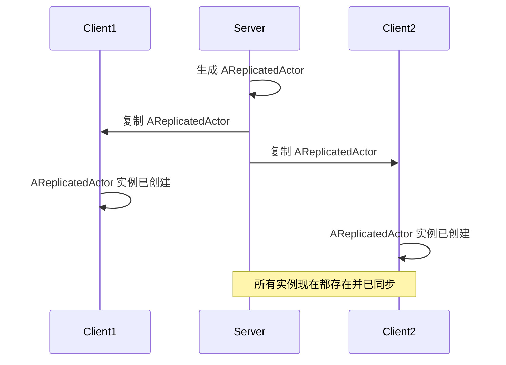
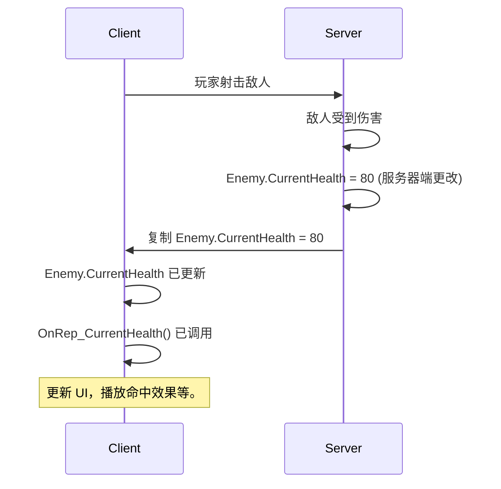
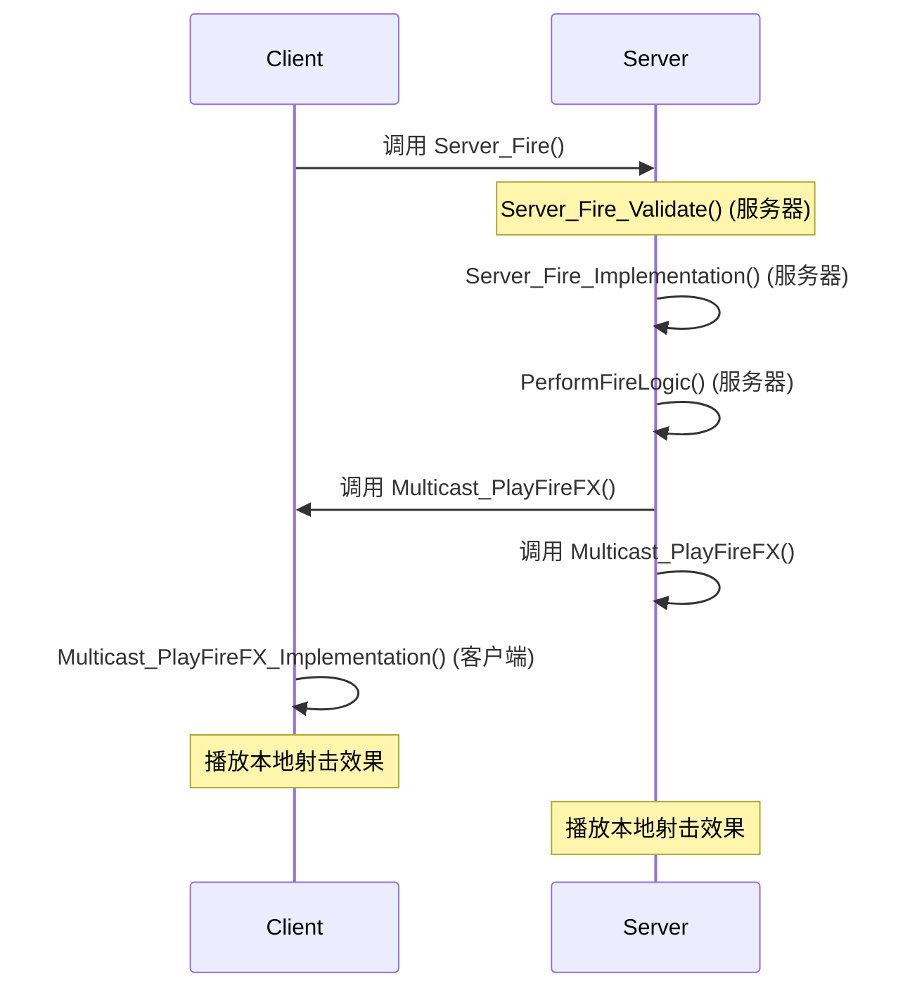
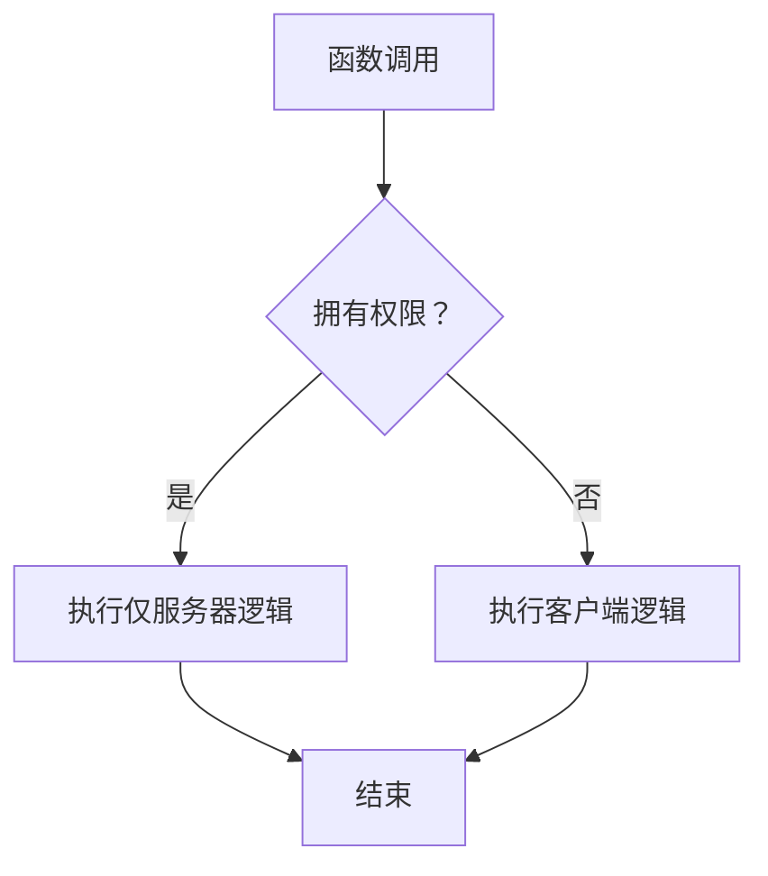

# 网络和复制可视化

本指南提供了一个清晰、实用且可视化的 Unreal Engine C++ 网络和复制系统理解，这对于开发多人游戏至关重要。

## 目录
- [基础 - Actor 复制](#基础---actor-复制)
- [状态同步 - 属性复制](#状态同步---属性复制)
- [执行动作 - 远程过程调用 (RPCs)](#执行动作---远程过程调用-rpcs)
- [控制逻辑流 - 角色与权限](#控制逻辑流---角色与权限)

## 基础 - Actor 复制

### 概念
Unreal Engine 使用客户端-服务器模型进行网络通信。任何 `AActor` 要在网络中存在并同步，它必须在服务器上生成并明确标记为可复制。服务器是所有游戏逻辑和状态的权威。

当一个 Actor 被复制时，服务器会在所有连接的客户端上创建该 Actor 的实例。其可复制属性的任何更改或对其可复制函数的调用都将随后同步。

### 代码示例：基本 Actor 复制

要使 Actor 复制，您通常在其构造函数中设置 `bReplicates = true`。

```cpp
// ReplicatedActor.h
#pragma once

#include "CoreMinimal.h"
#include "GameFramework/Actor.h"
#include "ReplicatedActor.generated.h"

UCLASS()
class YOURPROJECT_API AReplicatedActor : public AActor
{
    GENERATED_BODY()

public:
    AReplicatedActor();

protected:
    virtual void BeginPlay() override;

public:
    // 可能在服务器上调用的示例函数
    UFUNCTION(BlueprintCallable, Category = "Networking")
    void ServerOnlyFunction();
};
```

```cpp
// ReplicatedActor.cpp
#include "ReplicatedActor.h"

AReplicatedActor::AReplicatedActor()
{
    // 关键：将此 Actor 标记为可复制
    bReplicates = true;
    // 可选：如果此 Actor 可以由玩家控制器拥有，则设置为 true
    bAlwaysRelevant = true; // 无论距离如何，都保持此 Actor 复制
    bNetLoadOnClient = true; // 允许客户端在加入时加载此 Actor

    PrimaryActorTick.bCanEverTick = true;
}

void AReplicatedActor::BeginPlay()
{
    Super::BeginPlay();

    if (HasAuthority())
    {
        UE_LOG(LogTemp, Warning, TEXT("Server: AReplicatedActor spawned."));
    }
    else
    {
        UE_LOG(LogTemp, Warning, TEXT("Client: AReplicatedActor replicated."));
    }
}

void AReplicatedActor::ServerOnlyFunction()
{
    if (HasAuthority())
    {
        UE_LOG(LogTemp, Warning, TEXT("Server: ServerOnlyFunction executed."));
    }
}
```

### 可视化：Actor 复制流程



## 状态同步 - 属性复制

### 概念
一旦 Actor 被复制，其属性（变量）也需要从服务器同步到客户端。这通过使用 `UPROPERTY(Replicated)` 说明符和 `GetLifetimeReplicatedProps` 函数来实现。只有标记为可复制的属性才会通过网络发送。

`ReplicatedUsing` 允许您指定一个函数，该函数将在客户端上调用，每当可复制属性的值发生变化时。这对于根据服务器驱动的状态更新 UI、播放效果或触发客户端逻辑非常有用。

### 代码示例：使用 `OnRep_` 复制生命值

```cpp
// PlayerCharacter.h
#pragma once

#include "CoreMinimal.h"
#include "GameFramework/Character.h"
#include "Net/UnrealNetwork.h"
#include "PlayerCharacter.generated.h"

UCLASS()
class YOURPROJECT_API APlayerCharacter : public ACharacter
{
    GENERATED_BODY()

public:
    APlayerCharacter();

    // 声明可复制属性的函数
    virtual void GetLifetimeReplicatedProps(TArray<FLifetimeProperty>& OutLifetimeProps) const override;

protected:
    // 带有 OnRep 函数的生命值可复制属性
    UPROPERTY(ReplicatedUsing = OnRep_CurrentHealth)
    float CurrentHealth;

    // CurrentHealth 的 OnRep 函数，当生命值改变时在客户端上调用
    UFUNCTION()
    void OnRep_CurrentHealth();

public:
    UFUNCTION(BlueprintCallable, Category = "Health")
    void TakeDamage(float DamageAmount);

    UFUNCTION(BlueprintCallable, Category = "Health")
    float GetCurrentHealth() const { return CurrentHealth; }
};
```

```cpp
// PlayerCharacter.cpp
#include "PlayerCharacter.h"
#include "GameFramework/PlayerState.h"

APlayerCharacter::APlayerCharacter()
{
    bReplicates = true;
    CurrentHealth = 100.0f;
}

void APlayerCharacter::GetLifetimeReplicatedProps(TArray<FLifetimeProperty>& OutLifetimeProps) const
{
    Super::GetLifetimeReplicatedProps(OutLifetimeProps);

    // DOREPLIFETIME 宏将属性标记为可复制
    DOREPLIFETIME(APlayerCharacter, CurrentHealth);
}

void APlayerCharacter::OnRep_CurrentHealth()
{
    // 当 CurrentHealth 改变时，此函数在客户端上调用
    UE_LOG(LogTemp, Warning, TEXT("Client: Health updated to %f"), CurrentHealth);
    // 在此处更新 UI、播放音效等。
}

void APlayerCharacter::TakeDamage(float DamageAmount)
{
    // 只允许服务器修改生命值
    if (HasAuthority())
    {
        CurrentHealth = FMath::Max(0.0f, CurrentHealth - DamageAmount);
        UE_LOG(LogTemp, Warning, TEXT("Server: Health set to %f"), CurrentHealth);
        // 如果不使用 ReplicatedUsing，您可以在此处手动调用 OnRep_CurrentHealth()
        // 以确保服务器也运行客户端逻辑。
        OnRep_CurrentHealth();
    }
}
```

### 可视化：带 OnRep 的属性复制



## 执行动作 - 远程过程调用 (RPCs)

### 概念
RPCs 是在一个机器（客户端或服务器）上调用但在另一个机器上执行的函数。它们对于客户端-服务器交互至关重要，允许客户端向服务器请求操作，或服务器向客户端发出命令。

RPCs 主要有三种类型：
*   **`Server` RPCs：** 由客户端调用，在服务器上执行。用于客户端输入或需要服务器验证/执行的操作。
*   **`Client` RPCs：** 由服务器调用，在拥有客户端上执行。用于服务器向单个客户端发送特定命令或信息。
*   **`NetMulticast` RPCs：** 由服务器调用，在服务器和所有连接的客户端上执行。用于广播所有玩家都需要看到的事件（例如，爆炸、聊天消息）。

### 代码示例：使用 RPCs 射击武器

```cpp
// Weapon.h
#pragma once

#include "CoreMinimal.h"
#include "GameFramework/Actor.h"
#include "Weapon.generated.h"

UCLASS()
class YOURPROJECT_API AWeapon : public AActor
{
    GENERATED_BODY()

public:
    AWeapon();

    // 由客户端调用以请求射击
    UFUNCTION(Server, Reliable, WithValidation)
    void Server_Fire();

    // 由服务器调用以在所有客户端上播放射击效果
    UFUNCTION(NetMulticast, Unreliable)
    void Multicast_PlayFireFX();

protected:
    // 射击逻辑的服务器端实现
    void PerformFireLogic();
};
```

```cpp
// Weapon.cpp
#include "Weapon.h"

AWeapon::AWeapon()
{
    bReplicates = true;
    PrimaryActorTick.bCanEverTick = false;
}

// Server_Fire 实现（在服务器上调用）
bool AWeapon::Server_Fire_Validate()
{
    // 执行服务器端验证（例如，检查弹药、冷却时间）
    return true;
}

void AWeapon::Server_Fire_Implementation()
{
    // 此代码仅在服务器上运行
    UE_LOG(LogTemp, Warning, TEXT("Server: Received fire request. Performing fire logic."));
    PerformFireLogic();
    Multicast_PlayFireFX(); // 告诉所有客户端播放效果
}

void AWeapon::PerformFireLogic()
{
    // 实际射击逻辑（例如，射线追踪、生成弹丸、消耗弹药）
    UE_LOG(LogTemp, Warning, TEXT("Server: Firing logic executed."));
}

// Multicast_PlayFireFX 实现（在服务器和所有客户端上调用）
void AWeapon::Multicast_PlayFireFX_Implementation()
{
    // 此代码在所有机器（服务器和客户端）上运行
    UE_LOG(LogTemp, Warning, TEXT("All: Playing fire effects."));
    // 播放枪口闪光、音效等。
}
```

### 可视化：RPC 流程（客户端 -> 服务器 -> 多播）



## 控制逻辑流 - 角色与权限

### 概念
理解网络角色和权限是编写正确多人游戏代码的基础。它决定了哪台机器负责执行特定逻辑，并确保所有客户端之间的一致性。

*   **`ROLE_Authority`：** 拥有并控制 Actor 的机器（通常是大多数 Actor 的服务器，或拥有客户端的 PlayerController/Pawn）。这台机器拥有权威状态。
*   **`ROLE_AutonomousProxy`：** 拥有并控制特定 Actor 的客户端（例如，玩家自己的角色）。它可以预测移动并向服务器发送输入。
*   **`ROLE_SimulatedProxy`：** 客户端对由另一个客户端或服务器拥有的 Actor 的表示。它接收复制更新但不控制 Actor。

`HasAuthority()` 函数是检查当前机器是否是给定 Actor 的服务器（或权威所有者）的常用方法，允许您控制仅服务器逻辑。

### 代码示例：权限检查

```cpp
// MyActor.cpp
void AMyActor::Tick(float DeltaTime)
{
    Super::Tick(DeltaTime);

    // 仅应在服务器上运行的逻辑
    if (HasAuthority())
    {
        // 示例：更新游戏状态、检查胜利条件、应用伤害
        // 这确保了游戏规则由服务器强制执行
        UE_LOG(LogTemp, Log, TEXT("Server: Running authoritative game logic."));
    }
    else // 此代码在客户端上运行
    {
        // 示例：客户端预测、外观更新、UI 更新
        // 这确保了客户端在等待服务器更新时拥有流畅的体验
        UE_LOG(LogTemp, Log, TEXT("Client: Running client-side prediction or cosmetic updates."));
    }
}

void AMyActor::SomeFunction()
{
    // 函数中更细粒度的权限检查
    if (GetLocalRole() == ROLE_Authority)
    {
        UE_LOG(LogTemp, Log, TEXT("This code runs on the server or owning client with authority."));
    }
    else if (GetLocalRole() == ROLE_AutonomousProxy)
    {
        UE_LOG(LogTemp, Log, TEXT("This code runs on the owning client (autonomous proxy)."));
    }
    else if (GetLocalRole() == ROLE_SimulatedProxy)
    {
        UE_LOG(LogTemp, Log, TEXT("This code runs on a simulated client (not owning)."));
    }
}
```

### 可视化：权限流程图


