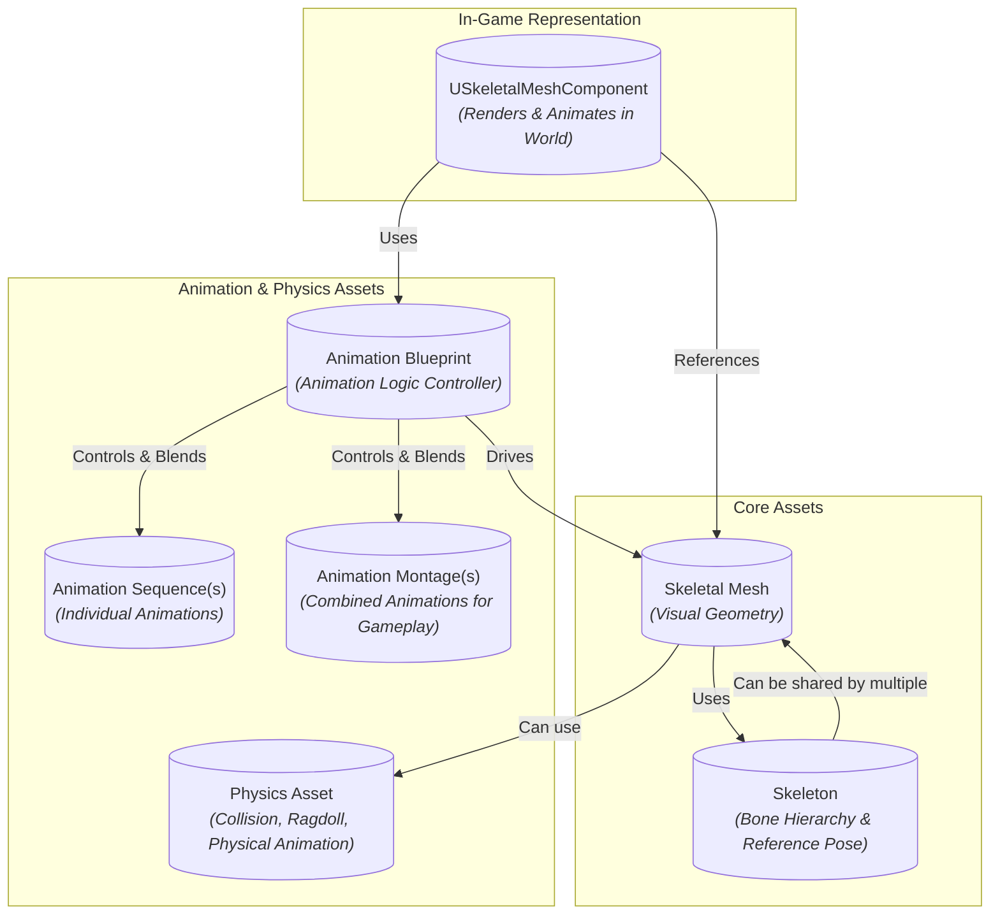
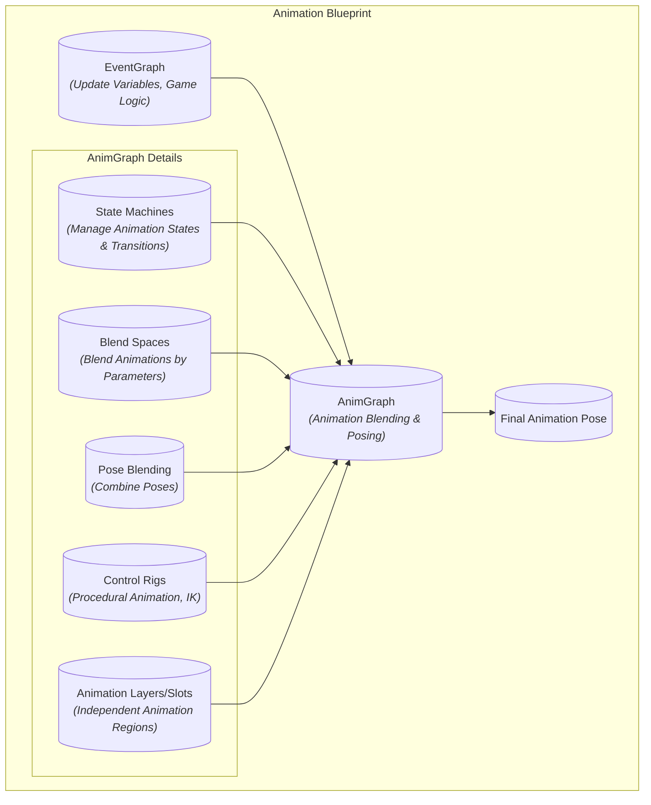
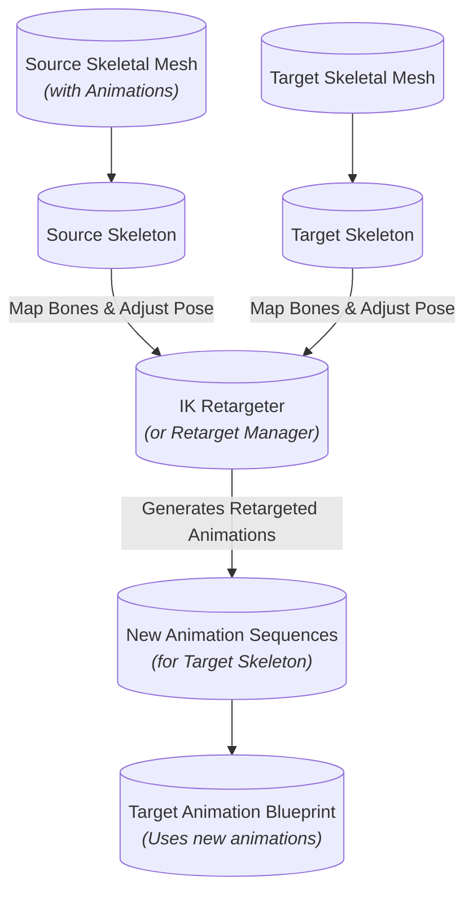

# Skeletal Mesh Assets - Visualized

This document provides a comprehensive overview of Unreal Engine's Skeletal Mesh animation system, covering core concepts, components, and workflows.

## Summary

A **Skeletal Mesh** is a 3D model rigged with a hierarchical "skeleton" of bones, enabling complex deformation and animation. These assets are crucial for animating characters, creatures, and other dynamic objects within Unreal Engine. The animation system is highly modular, allowing for flexible control over how these meshes move and interact.

### The Skeletal Mesh Ecosystem

The creation and animation of Skeletal Meshes involve several interconnected assets:

*   **Skeletal Mesh:** This is the visual geometry (the "skin") that is rendered in the game world. It's bound to a specific Skeleton asset.
*   **Skeleton:** A fundamental asset representing the hierarchical bone structure. A single Skeleton asset can be shared across multiple Skeletal Meshes, which is vital for animation retargeting and efficient asset management. It defines the bone names, hierarchy, and reference pose.
*   **Physics Asset (PhAT):** Automatically generated or manually created, this asset defines a simplified collision body for each bone (or groups of bones) in the Skeleton. It's used for:
    *   **Ragdoll Physics:** Simulating realistic floppy body movements upon impact or death.
    *   **Physical Animation:** Driving animation based on physics interactions (e.g., a character's cape swaying in the wind).
    *   **Collision:** Providing accurate collision detection for skeletal meshes.
*   **Animation Sequences:** Individual, linear animations (e.g., "Walk," "Run," "JumpStart"). These are typically imported from DCC applications.
*   **Animation Montages:** A powerful tool for combining multiple Animation Sequences into a single asset, often used for gameplay-specific actions like attacks, spell casts, or reactions. They allow for precise control over blending, looping, and slot-based animation playback.
*   **Animation Blueprints (AnimBP):** The central hub for controlling and blending animations. It's a visual scripting graph that defines the logic for how a Skeletal Mesh animates.

### Animation Blueprints: The Logic Controller

Animation Blueprints are critical for bringing Skeletal Meshes to life. They consist of several key graphs:

*   **AnimGraph:** The primary graph where animation logic is constructed. It uses a network of nodes to blend, pose, and modify animations. Key features include:
    *   **State Machines:** Manage complex animation states (e.g., Idle, Walk, Run, Jump) and define transitions between them based on game logic (e.g., "Speed > 0" to transition from Idle to Walk).
    *   **Blend Spaces:** Allow blending between multiple animations based on one or more input parameters (e.g., blending between walk, run, and strafe animations based on speed and direction).
    *   **Pose Blending:** Combining different poses or animations.
    *   **Control Rigs:** For procedural animation and inverse kinematics (IK).
    *   **Animation Layers/Slots:** Define specific areas of the skeleton where animations can be played independently (e.g., a "FullBody" slot for movement and an "UpperBody" slot for aiming).
*   **EventGraph:** Similar to a standard Blueprint Event Graph, this is where game logic interacts with the AnimBP. It's used to update variables (e.g., speed, direction, health) that drive the AnimGraph's animation logic.
*   **Curves:** Animation curves can be used to drive various parameters, such as material properties, morph targets, or even game logic, based on the animation's progress.

### Animation Retargeting

Animation Retargeting is the process of adapting animations created for one skeleton to work with another, potentially different, skeleton. This is a massive time-saver, allowing developers to reuse animation assets across various characters, even if they have different proportions or bone structures. Unreal Engine provides robust tools for retargeting, including:

*   **IK Retargeter:** A modern tool for transferring animations between different Skeletons, offering advanced control over bone mapping and pose adjustments.
*   **Retarget Manager (Legacy):** An older system for retargeting, still available but generally superseded by IK Retargeter for new projects.

### USkeletalMeshComponent

The `USkeletalMeshComponent` is the actual component attached to an Actor in the game world that is responsible for rendering the Skeletal Mesh and playing its associated Animation Blueprint. It acts as the bridge between the visual asset and the animation logic.

## Visualizations

### 1. Skeletal Mesh Asset Ecosystem Overview

This diagram illustrates the relationships between the core assets involved in Skeletal Mesh animation.

### 2. Animation Blueprint Internal Structure

This diagram breaks down the key components and flow within an Animation Blueprint.

### 3. Animation Retargeting Workflow

This flowchart illustrates the process of reusing animations across different skeletal meshes.

