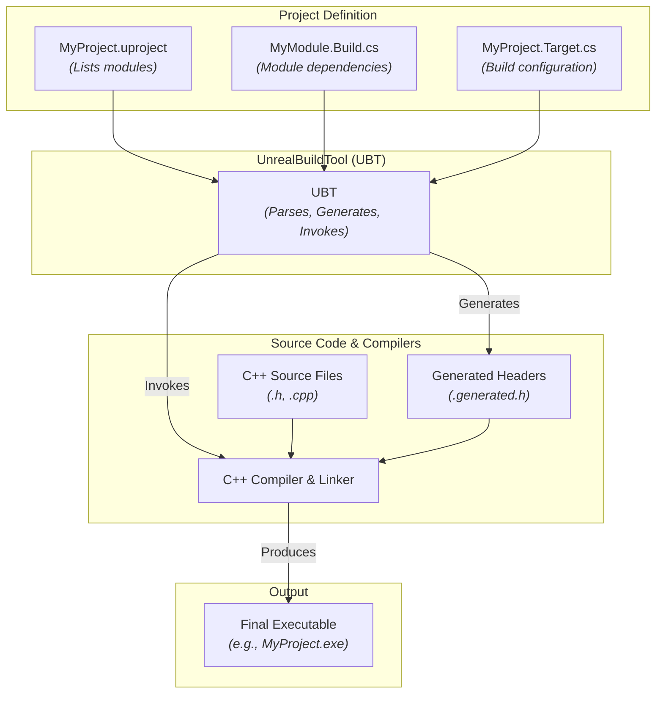
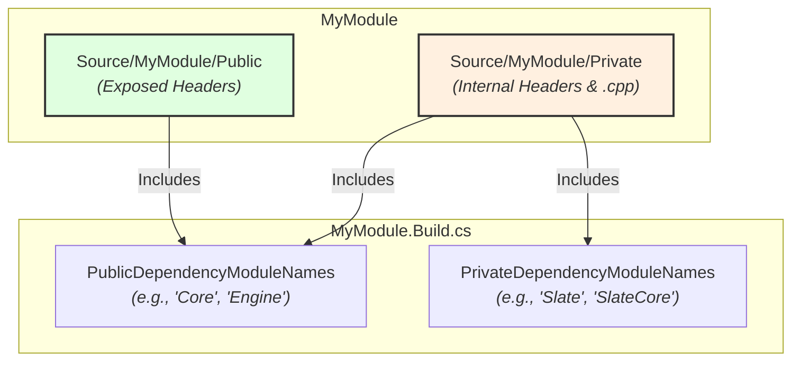

# The Unreal Build System - Visualized

This document provides a comprehensive, visual summary of the Unreal Engine Build System, detailing its core components, module structure, and build process.

## Summary

The Unreal Build System is a sophisticated, custom-built set of tools designed to automate the compilation and linking of Unreal Engine projects across various platforms. At its heart is the **UnrealBuildTool (UBT)**, a C# application that interprets project configuration files (`.uproject`, `.uplugin`) and module-specific build scripts (`.Target.cs`, `.Build.cs`) to orchestrate the entire build process. This system replaces traditional platform-specific build tools, offering a unified and efficient approach to development.

### Core Components

*   **UnrealBuildTool (UBT):** A powerful C# program responsible for managing the entire compilation, linking, and deployment process. It parses build configurations, resolves dependencies, and invokes the appropriate compilers and linkers for the target platform.

*   **Modules:** Unreal Engine projects are fundamentally organized into modules. A module is a self-contained unit of code (C++ classes, resources, etc.) that can be independently compiled and linked. Each module has a `[ModuleName].Build.cs` file defining its properties and dependencies.

*   **`.uproject` / `.uplugin` Files:** These JSON-formatted files define the project or plugin itself. They list the modules that belong to the project/plugin and specify other high-level settings. UBT reads these files to discover the modules it needs to build.

*   **`[ModuleName].Build.cs` Files:** These C# files are crucial for defining how a specific module is built. They declare: 
    *   **Dependencies:** Which other modules this module relies on.
    *   **Public/Private Definitions:** Macros and include paths.
    *   **Optimization Settings:** Compiler flags, etc.
    *   `PublicDependencyModuleNames`: Modules whose public header files are included by your module's public header files. This means any module that depends on *your* module will also implicitly depend on these public dependencies.
    *   `PrivateDependencyModuleNames`: Modules that are only used within your module's private `.cpp` files. These dependencies are not exposed to other modules that depend on yours.

*   **`[ProjectName].Target.cs` Files:** These C# files define a build target, which specifies *what* is being built and for *which configuration*. A project can have multiple target files, each defining a different executable or library.
    *   **`TargetType`:** Defines the type of executable being built:
        *   `Game`: The main game executable.
        *   `Editor`: The Unreal Editor executable (includes editor-specific modules).
        *   `Client`: A dedicated client executable for networked games.
        *   `Server`: A dedicated server executable for networked games.
    *   **Build Configuration:** Specifies settings like optimization level, debug symbols, and whether to include editor-only content.

### Source Code Structure and IWYU

Within each module's `Source` directory, a common convention is to separate code into `Public` and `Private` folders:

*   **`Public` Folder:** Contains header files (`.h`) that are intended to be exposed and included by other modules. These headers should only include other public headers.
*   **`Private` Folder:** Contains implementation files (`.cpp`) and any header files that are only used internally within the module. These headers should not be included by other modules.

This structure strongly supports the **Include What You Use (IWYU)** principle. IWYU dictates that every source file (`.cpp`) and header file (`.h`) should explicitly include all the headers it needs, and *only* the headers it needs. This improves compilation times, reduces build dependencies, and makes code easier to refactor.

*   **`*.generated.h` Files:** These files are automatically generated by UBT during the build process. They contain boilerplate code for Unreal Engine's reflection system, allowing features like garbage collection, serialization, and Blueprint integration to work seamlessly with C++ classes.

## Visualizations

### 1. High-Level Build Process Flow

This diagram illustrates how the UnrealBuildTool orchestrates the compilation process, from project definition to the final executable.

### 2. Module Source Structure and Dependencies

This diagram shows the typical `Public`/`Private` folder structure within a module and how dependencies are declared.

