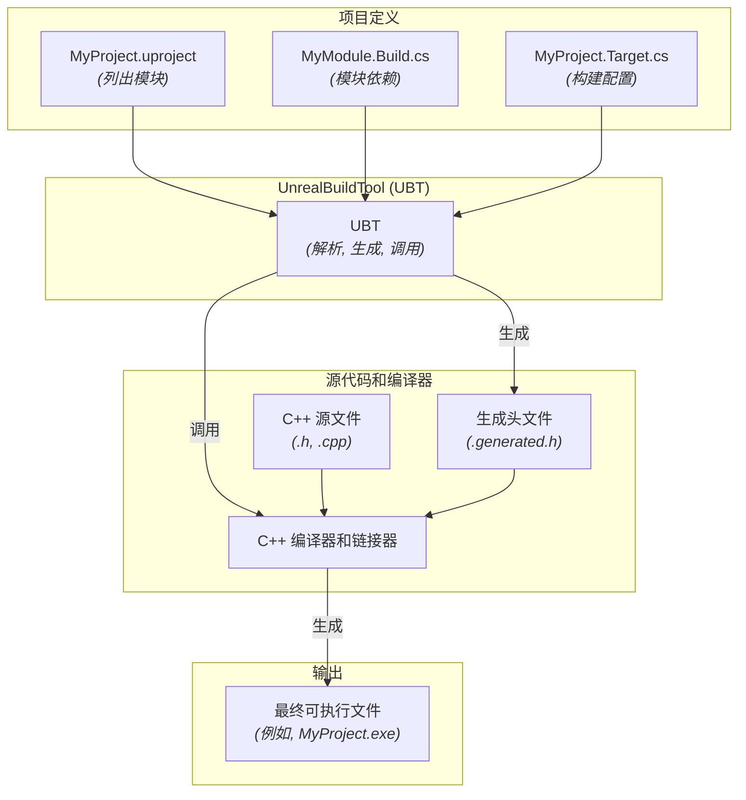
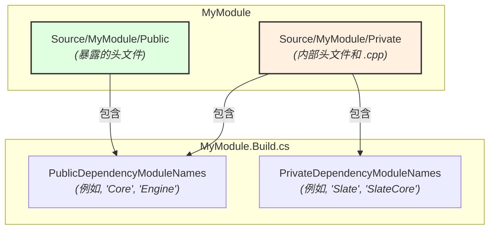

# 虚幻构建系统 - 可视化

本文档提供了对虚幻引擎构建系统（Unreal Build System）的全面、可视化摘要，详细介绍了其核心组件、模块结构和构建过程。

## 摘要

虚幻构建系统是一套复杂且定制化的工具，旨在自动化虚幻引擎项目在各种平台上的编译和链接过程。其核心是 **UnrealBuildTool (UBT)**，一个 C# 应用程序，它解析项目配置文件（`.uproject`、`.uplugin`）和模块特定的构建脚本（`.Target.cs`、`.Build.cs`），以协调整个构建过程。该系统取代了传统的平台特定构建工具，为开发提供了一种统一且高效的方法。

### 核心组件

*   **UnrealBuildTool (UBT):** 一个强大的 C# 程序，负责管理整个编译、链接和部署过程。它解析构建配置，解决依赖关系，并为目标平台调用适当的编译器和链接器。

*   **模块 (Modules):** 虚幻引擎项目从根本上组织成模块。模块是代码（C++ 类、资源等）的自包含单元，可以独立编译和链接。每个模块都有一个 `[ModuleName].Build.cs` 文件，用于定义其属性和依赖关系。

*   **`.uproject` / `.uplugin` 文件:** 这些 JSON 格式的文件定义了项目或插件本身。它们列出了属于项目/插件的模块，并指定了其他高级设置。UBT 读取这些文件以发现需要构建的模块。

*   **`[ModuleName].Build.cs` 文件:** 这些 C# 文件对于定义特定模块的构建方式至关重要。它们声明了：
    *   **依赖关系 (Dependencies):** 该模块依赖于哪些其他模块。
    *   **公共/私有定义 (Public/Private Definitions):** 宏和包含路径。
    *   **优化设置 (Optimization Settings):** 编译器标志等。
    *   `PublicDependencyModuleNames`: 那些公共头文件被你的模块的公共头文件包含的模块。这意味着任何依赖于你的模块的模块也将隐式地依赖于这些公共依赖项。
    *   `PrivateDependencyModuleNames`: 仅在你的模块的私有 `.cpp` 文件中使用的模块。这些依赖项不会暴露给依赖于你的模块的其他模块。

*   **`[ProjectName].Target.cs` 文件:** 这些 C# 文件定义了一个构建目标，它指定了正在构建的 *内容* 和 *配置*。一个项目可以有多个目标文件，每个文件定义一个不同的可执行文件或库。
    *   **`TargetType`:** 定义正在构建的可执行文件的类型：
        *   `Game`: 主要的游戏可执行文件。
        *   `Editor`: 虚幻编辑器可执行文件（包含编辑器特定的模块）。
        *   `Client`: 用于网络游戏的专用客户端可执行文件。
        *   `Server`: 用于网络游戏的专用服务器可执行文件。
    *   **构建配置 (Build Configuration):** 指定优化级别、调试符号以及是否包含仅编辑器内容等设置。

### 源代码结构和 IWYU

在每个模块的 `Source` 目录中，一个常见的约定是将代码分为 `Public` 和 `Private` 文件夹：

*   **`Public` 文件夹:** 包含旨在暴露并被其他模块包含的头文件（`.h`）。这些头文件应仅包含其他公共头文件。
*   **`Private` 文件夹:** 包含实现文件（`.cpp`）以及仅在模块内部使用的任何头文件。这些头文件不应被其他模块包含。

这种结构强烈支持 **Include What You Use (IWYU)** 原则。IWYU 规定每个源文件（`.cpp`）和头文件（`.h`）都应显式包含它需要的所有头文件，并且 *只* 包含它需要的头文件。这可以缩短编译时间，减少构建依赖，并使代码更易于重构。

*   **`*.generated.h` 文件:** 这些文件由 UBT 在构建过程中自动生成。它们包含虚幻引擎反射系统的样板代码，使垃圾回收、序列化和蓝图集成等功能能够与 C++ 类无缝协作。

## 可视化

### 1. 高层级构建流程

此图说明了 UnrealBuildTool 如何协调编译过程，从项目定义到最终可执行文件。

### 2. 模块源结构和依赖关系

此图显示了模块内典型的 `Public`/`Private` 文件夹结构以及如何声明依赖关系。

