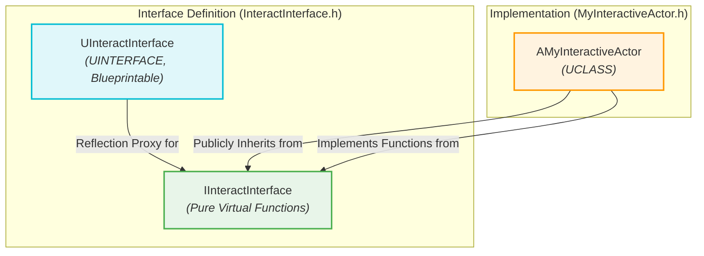
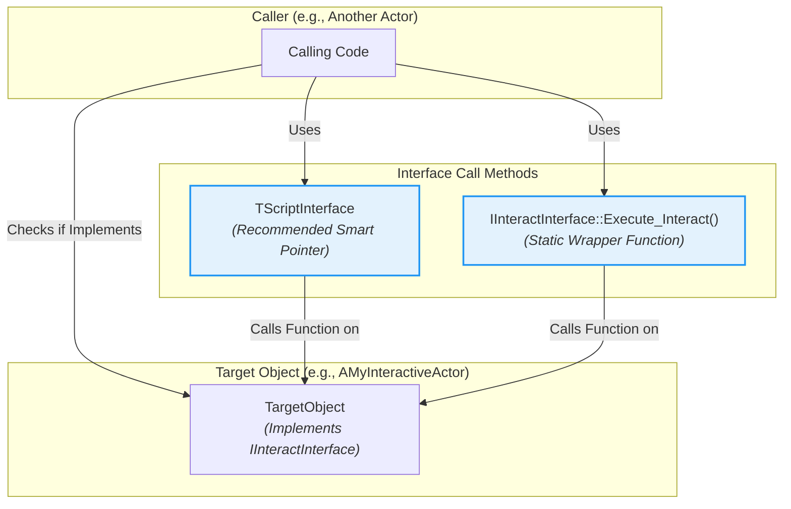

# C++ Interfaces in Unreal Engine - Visualized

This document provides a comprehensive, visual summary of how C++ Interfaces are implemented and used within Unreal Engine, focusing on their integration with the reflection system and Blueprint.

## Summary

Unreal Engine's C++ Interfaces offer a powerful mechanism for achieving polymorphism and defining common behaviors across disparate classes without relying on a shared inheritance hierarchy. They are particularly useful for enabling communication between different types of objects (e.g., an `AActor` and a `UObject`) and for exposing functionality to Blueprint. Unlike pure C++ abstract base classes, Unreal Interfaces are deeply integrated with the engine's reflection system, allowing them to be callable from Blueprint.

### Core Concepts

*   **Contract Definition:** An interface defines a "contract" – a set of functions that any class can agree to implement. This promotes modularity and allows for flexible interaction patterns.
*   **Functionality, Not Data:** Interfaces are primarily designed to define *actions* or *behaviors*, not to store data. For shared data, `UActorComponent`s are generally a more suitable solution.
*   **Blueprint Integration:** A key advantage of Unreal Interfaces is their ability to be exposed to and implemented within Blueprint, bridging the gap between C++ and visual scripting.

### The Dual Class Structure: `UInterface` and `IInterface`

Unreal Engine C++ Interfaces are unique because each interface definition involves two distinct C++ classes:

1.  **The `U`-prefixed class (e.g., `UInteractInterface`)**:
    *   This class inherits from `UInterface` and uses the `UINTERFACE` macro (instead of `UCLASS`).
    *   It serves as a lightweight placeholder for Unreal's reflection system, allowing the engine to recognize and manage the interface.
    *   Crucial specifiers like `MinimalAPI` and `Blueprintable` are often used here. `Blueprintable` is essential if you intend for Blueprints to implement this interface.

    ```cpp
    // InteractInterface.h
    UINTERFACE(MinimalAPI, Blueprintable)
    class UInteractInterface : public UInterface
    {
        GENERATED_BODY()
    };
    ```

2.  **The `I`-prefixed class (e.g., `IInteractInterface`)**:
    *   This class contains the actual declarations of the interface functions (pure virtual functions).
    *   It does *not* inherit directly from `UObject` or `AActor`.
    *   C++ classes that implement the interface will publicly inherit from this `I`-prefixed class.

    ```cpp
    // InteractInterface.h (continued)
    class IInteractInterface
    {
        GENERATED_BODY()
    
    public:
        // Interface function declarations go here
        UFUNCTION(BlueprintNativeEvent, BlueprintCallable, Category = "Interaction")
        void Interact(AActor* Instigator);
    
        virtual void PerformCppOnlyAction() = 0;
    };
    ```

### Declaring Interface Functions

Interface functions are declared within the `I`-prefixed class using `UFUNCTION` macros to control their visibility and behavior:

*   **C++ Only Functions:** Declared as pure virtual functions (`= 0`) without `UFUNCTION` specifiers. They must be overridden in C++ classes.
    ```cpp
    virtual void PerformCppOnlyAction() = 0;
    ```

*   **Blueprint Native Event (`BlueprintNativeEvent`):** These functions can have both a C++ implementation and be overridden in Blueprints. If a C++ implementation is provided, it must follow the `FunctionName_Implementation` naming convention.
    ```cpp
    UFUNCTION(BlueprintNativeEvent, BlueprintCallable, Category = "Interaction")
    void Interact(AActor* Instigator);
    // C++ implementation signature:
    virtual void Interact_Implementation(AActor* Instigator);
    ```

*   **Blueprint Implementable Event (`BlueprintImplementableEvent`):** These functions are intended to be implemented *only* in Blueprints. They do not have a C++ implementation within the class that implements the interface.
    ```cpp
    UFUNCTION(BlueprintImplementableEvent, Category = "Interaction")
    void OnInteractionStarted();
    ```

### Implementing Interfaces

*   **In C++:** A C++ class implements an interface by publicly inheriting from the `I`-prefixed interface class and overriding its pure virtual functions (or `_Implementation` for `BlueprintNativeEvent`).

    ```cpp
    // MyInteractiveActor.h
    class AMyInteractiveActor : public AActor, public IInteractInterface
    {
        GENERATED_BODY()
    public:
        // Implement the BlueprintNativeEvent
        virtual void Interact_Implementation(AActor* Instigator) override;
        // Implement C++ only functions
        virtual void PerformCppOnlyAction() override;
    };
    ```

*   **In Blueprint:** For interfaces marked `Blueprintable`, you can add them to a Blueprint class via the "Class Settings" panel under "Implemented Interfaces."

### Calling Interface Functions Reliably

Calling interface functions requires careful handling to ensure compatibility with both C++ and Blueprint implementations:

*   **Checking for Implementation:**
    *   `YourObject->GetClass()->ImplementsInterface(UYourInterface::StaticClass())`: A reliable way to check if an object (C++ or Blueprint) implements the interface.
    *   `YourObject->Implements<IYourInterface>()`: Another robust method for `UObjects`.

*   **Recommended Calling Methods:**
    *   **`TScriptInterface<IYourInterface>`:** This is the recommended and Epic-approved way to store and call interface functions. It's a smart pointer that safely holds both the `UObject` and the interface pointer, correctly dispatching calls to either C++ or Blueprint implementations.
        ```cpp
        TScriptInterface<IInteractInterface> InteractableObject;
        // ... assign InteractableObject ...
        if (InteractableObject)
        {
            InteractableObject->Interact(MyCharacter); // Calls the appropriate implementation
        }
        ```
    *   **Static `Execute_` Wrapper Functions:** For `BlueprintNativeEvent` and `BlueprintImplementableEvent` functions, Unreal generates static wrapper functions (e.g., `IInteractInterface::Execute_Interact(YourObject, Instigator)`). These are highly reliable as they correctly dispatch to the appropriate implementation.
        ```cpp
        if (YourObject->GetClass()->ImplementsInterface(UInteractInterface::StaticClass()))
        {
            IInteractInterface::Execute_Interact(YourObject, MyCharacter);
        }
        ```

### Best Practices

*   **Favor `TScriptInterface` or `Execute_`:** Always use these methods for calling interface functions to ensure robustness across C++ and Blueprint.
*   **`Blueprintable` for Blueprint Interaction:** Always mark your `UINTERFACE` as `Blueprintable` if you intend for Blueprints to interact with it.
*   **`GetAllActorsWithInterface`:** Use `UGameplayStatics::GetAllActorsWithInterface` to find all actors in the world that implement a specific interface.

## Visualizations

### 1. Dual Class Structure of Unreal Interfaces

This diagram illustrates the relationship between the `U`-prefixed and `I`-prefixed classes that define an Unreal Engine C++ Interface.



### 2. Calling Interface Functions

This diagram shows the recommended ways to call interface functions, ensuring compatibility with both C++ and Blueprint implementations.

