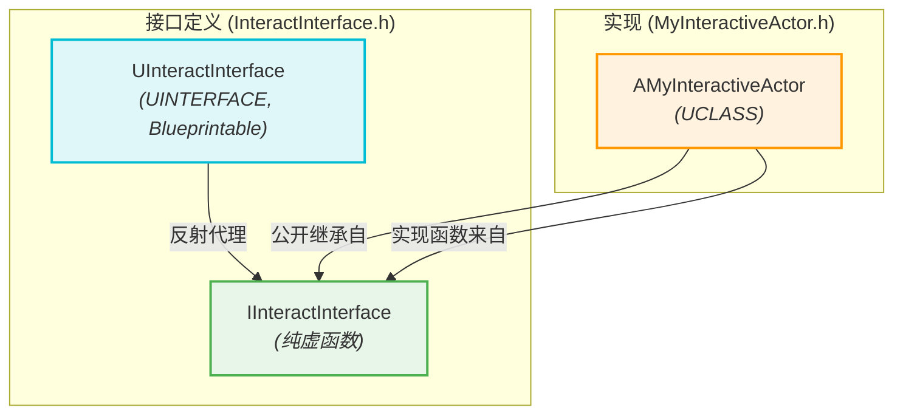
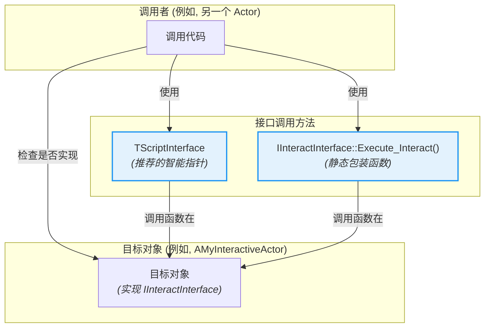

# 虚幻引擎中的 C++ 接口 - 可视化

本文档提供了对虚幻引擎中 C++ 接口如何实现和使用的全面、可视化摘要，重点关注它们与反射系统和蓝图的集成。

## 摘要

虚幻引擎的 C++ 接口提供了一种强大的机制，可以在不依赖共享继承层次结构的情况下，在不同的类之间实现多态性并定义通用行为。它们对于实现不同类型对象（例如 `AActor` 和 `UObject`）之间的通信以及向蓝图公开功能特别有用。与纯 C++ 抽象基类不同，虚幻接口与引擎的反射系统深度集成，允许它们从蓝图调用。

### 核心概念

*   **契约定义:** 接口定义了一个“契约”——一组任何类都可以同意实现的功能。这促进了模块化并允许灵活的交互模式。
*   **功能而非数据:** 接口主要设计用于定义 *动作* 或 *行为*，而不是存储数据。对于共享数据，`UActorComponent` 通常是更合适的解决方案。
*   **蓝图集成:** 虚幻接口的一个主要优点是它们能够暴露给蓝图并在蓝图中实现，从而弥合了 C++ 和可视化脚本之间的鸿沟。

### 双类结构：`UInterface` 和 `IInterface`

虚幻引擎 C++ 接口是独一无二的，因为每个接口定义都涉及两个不同的 C++ 类：

1.  **`U` 前缀类（例如 `UInteractInterface`）**：
    *   此类继承自 `UInterface` 并使用 `UINTERFACE` 宏（而不是 `UCLASS`）。
    *   它充当虚幻反射系统的轻量级占位符，允许引擎识别和管理接口。
    *   通常在此处使用 `MinimalAPI` 和 `Blueprintable` 等关键说明符。如果打算让蓝图实现此接口，`Blueprintable` 至关重要。

    ```cpp
    // InteractInterface.h
    UINTERFACE(MinimalAPI, Blueprintable)
    class UInteractInterface : public UInterface
    {
        GENERATED_BODY()
    };
    ```

2.  **`I` 前缀类（例如 `IInteractInterface`）**：
    *   此类包含接口函数的实际声明（纯虚函数）。
    *   它不直接继承自 `UObject` 或 `AActor`。
    *   实现接口的 C++ 类将公开继承自此 `I` 前缀类。

    ```cpp
    // InteractInterface.h (续)
    class IInteractInterface
    {
        GENERATED_BODY()
    
    public:
        // 接口函数声明在此处
        UFUNCTION(BlueprintNativeEvent, BlueprintCallable, Category = "Interaction")
        void Interact(AActor* Instigator);
    
        virtual void PerformCppOnlyAction() = 0;
    };
    ```

### 声明接口函数

接口函数在 `I` 前缀类中声明，使用 `UFUNCTION` 宏来控制其可见性和行为：

*   **仅 C++ 函数:** 声明为纯虚函数（`= 0`），不带 `UFUNCTION` 说明符。它们必须在 C++ 类中被覆盖。
    ```cpp
    virtual void PerformCppOnlyAction() = 0;
    ```

*   **蓝图原生事件 (`BlueprintNativeEvent`):** 这些函数可以同时具有 C++ 实现并在蓝图中被覆盖。如果提供了 C++ 实现，它必须遵循 `FunctionName_Implementation` 命名约定。
    ```cpp
    UFUNCTION(BlueprintNativeEvent, BlueprintCallable, Category = "Interaction")
    void Interact(AActor* Instigator);
    // C++ 实现签名:
    virtual void Interact_Implementation(AActor* Instigator);
    ```

*   **蓝图可实现事件 (`BlueprintImplementableEvent`):** 这些函数旨在 *仅* 在蓝图中实现。它们在实现接口的类中没有 C++ 实现。
    ```cpp
    UFUNCTION(BlueprintImplementableEvent, Category = "Interaction")
    void OnInteractionStarted();
    ```

### 实现接口

*   **在 C++ 中:** C++ 类通过公开继承自 `I` 前缀接口类并覆盖其纯虚函数（或 `BlueprintNativeEvent` 的 `_Implementation`）来实现在接口。

    ```cpp
    // MyInteractiveActor.h
    class AMyInteractiveActor : public AActor, public IInteractInterface
    {
        GENERATED_BODY()
    public:
        // 实现蓝图原生事件
        virtual void Interact_Implementation(AActor* Instigator) override;
        // 实现仅 C++ 函数
        virtual void PerformCppOnlyAction() override;
    };
    ```

*   **在蓝图中:** 对于标记为 `Blueprintable` 的接口，您可以通过“类设置”面板下的“已实现接口”将其添加到蓝图类中。

### 可靠地调用接口函数

调用接口函数需要仔细处理，以确保与 C++ 和蓝图实现兼容：

*   **检查实现:**
    *   `YourObject->GetClass()->ImplementsInterface(UYourInterface::StaticClass())`: 检查对象（C++ 或蓝图）是否实现接口的可靠方法。
    *   `YourObject->Implements<IYourInterface>()`: 另一种针对 `UObjects` 的健壮方法。

*   **推荐的调用方法:**
    *   **`TScriptInterface<IYourInterface>`:** 这是推荐的、Epic 批准的存储和调用接口函数的方法。它是一个智能指针，可以安全地同时持有 `UObject` 和接口指针，正确地将调用分派给 C++ 或蓝图实现。
        ```cpp
        TScriptInterface<IInteractInterface> InteractableObject;
        // ... 赋值 InteractableObject ...
        if (InteractableObject)
        {
            InteractableObject->Interact(MyCharacter); // 调用适当的实现
        }
        ```
    *   **静态 `Execute_` 包装函数:** 对于 `BlueprintNativeEvent` 和 `BlueprintImplementableEvent` 函数，虚幻会生成静态包装函数（例如 `IInteractInterface::Execute_Interact(YourObject, Instigator)`）。这些函数非常可靠，因为它们正确地分派到适当的实现。
        ```cpp
        if (YourObject->GetClass()->ImplementsInterface(UInteractInterface::StaticClass()))
        {
            IInteractInterface::Execute_Interact(YourObject, MyCharacter);
        }
        ```

### 最佳实践

*   **优先使用 `TScriptInterface` 或 `Execute_`:** 始终使用这些方法调用接口函数，以确保 C++ 和蓝图的健壮性。
*   **`Blueprintable` 用于蓝图交互:** 如果您打算让蓝图与您的接口交互，请始终将您的 `UINTERFACE` 标记为 `Blueprintable`。
*   **`GetAllActorsWithInterface`:** 使用 `UGameplayStatics::GetAllActorsWithInterface` 查找世界中所有实现特定接口的 Actor。

## 可视化

### 1. 虚幻接口的双类结构

此图说明了定义虚幻引擎 C++ 接口的 `U` 前缀和 `I` 前缀类之间的关系。



### 2. 调用接口函数

此图显示了调用接口函数的推荐方法，确保与 C++ 和蓝图实现兼容。

