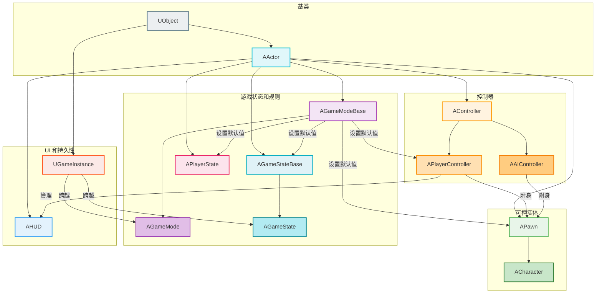
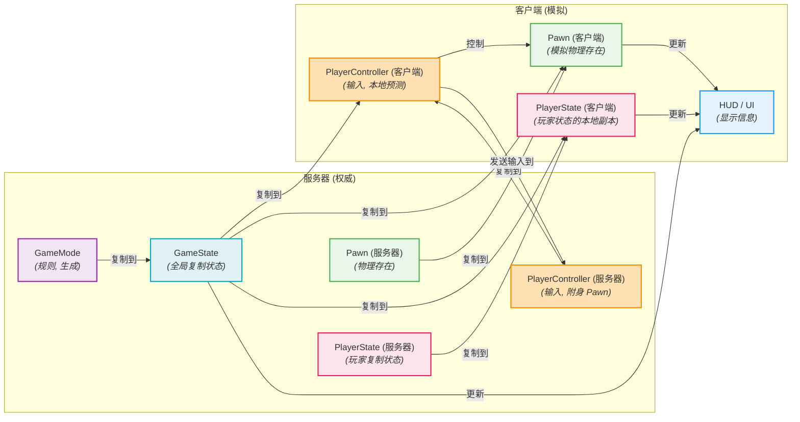

# 虚幻引擎游戏性架构 - 可视化

本文档提供了对构成虚幻引擎游戏性架构核心类的全面、可视化摘要，解释了它们的作用、关系以及它们如何促进游戏逻辑。

## 摘要

虚幻引擎的游戏性架构建立在核心类的分层系统之上，这些核心类协同工作以定义游戏规则、玩家交互以及游戏世界中的实体。理解这个框架对于在虚幻引擎中开发健壮且可扩展的游戏至关重要。这些类提供了一种结构化的方法来管理从玩家输入和角色移动到游戏状态和多人同步的所有内容。

### 核心游戏性类

1.  **Actor (`AActor`):**
    *   **描述:** 虚幻引擎中最基本的构建块。`AActor` 是任何可以放置或生成到关卡中的对象。它具有 3D 变换（位置、旋转、缩放），可以在游戏过程中创建和销毁。
    *   **作用:** 作为 `Components`（例如 `StaticMeshComponent`、`MovementComponent`）的容器，这些组件定义了其行为和外观。Actor 可以每帧“Tick”（更新）以实现连续逻辑。

2.  **Pawn (`APawn`):**
    *   **描述:** `AActor` 的一种特殊类型，表示游戏世界中可以由玩家或人工智能（AI）控制的物理实体。
    *   **作用:** 体现玩家或 AI 的物理存在。它可以被 `Controller`（`APlayerController` 或 `AAIController`）“Possess”（附身）以接收输入并执行动作。

3.  **Character (`ACharacter`):**
    *   **描述:** `APawn` 的一个常见子类，专门为类人、垂直方向的玩家角色设计。它具有内置的移动能力和碰撞。
    *   **作用:** 提供开箱即用的行走、奔跑、跳跃、游泳和飞行支持，以及 `CharacterMovementComponent` 和 `CapsuleComponent` 用于碰撞。

4.  **Controller (`AController`):**
    *   **描述:** 一个非物理的 `AActor`，它附身于 `APawn` 以控制它。它充当 Pawn 的“大脑”。
    *   **作用:** 处理输入（来自玩家或 AI）并将其转换为所附身 Pawn 的动作。主要有两种类型：
        *   **PlayerController (`APlayerController`):** 代表人类玩家的意愿。它处理玩家输入，管理玩家的摄像机，并在关卡更改或 Pawn 重生时持续存在。它是存储不应重置的玩家特定数据（例如分数、库存）的好地方。
        *   **AIController (`AAIController`):** 控制 AI 驱动的 Pawn。

5.  **GameMode (`AGameModeBase` / `AGameMode`):**
    *   **描述:** 定义特定关卡的游戏规则和流程。在多人游戏中，它是一个仅限服务器端的类。
    *   **作用:** 规定基本的游戏性方面，例如玩家加入、生成、胜负条件以及其他游戏特定行为。它还为关卡设置 `Pawn`、`PlayerController`、`HUD`、`GameState` 和 `PlayerState` 的默认类。`AGameMode` 是 `AGameModeBase` 的子类，具有针对多人、基于比赛的游戏的附加功能。

6.  **GameState (`AGameStateBase` / `AGameState`):**
    *   **描述:** 存储与所有连接客户端相关的全局游戏状态。每个游戏实例只有一个 `AGameState`。
    *   **作用:** 将游戏范围的信息复制到所有客户端，例如当前游戏阶段、分数、连接玩家列表或剩余时间。`AGameState` 是 `AGameStateBase` 的子类，具有额外的多人游戏特定功能。

7.  **PlayerState (`APlayerState`):**
    *   **描述:** 存储与所有其他玩家（和服务器）相关的 *单个玩家* 的状态。每个连接玩家有一个 `APlayerState`。
    *   **作用:** 复制玩家特定信息，例如玩家姓名、分数、团队以及需要所有客户端知道的其他持久数据。与 `APawn` 不同，`APlayerState` 在重生时持续存在。

8.  **HUD (`AHUD`):**
    *   **描述:** 抬头显示类，负责直接在玩家屏幕上绘制 2D 元素。
    *   **作用:** 用于显示游戏信息，例如生命条、弹药计数、小地图和其他 UI 元素。通常与 UMG（Unreal Motion Graphics）小部件协同工作。

9.  **GameInstance (`UGameInstance`):**
    *   **描述:** 一个 `UObject`，在游戏启动时创建，在游戏结束时销毁。它在关卡更改时持续存在。
    *   **作用:** 非常适合存储需要在不同关卡或地图之间持续存在的全局、持久数据（例如玩家设置、保存游戏数据、网络会话信息）。

### 控制流和通信

在典型的虚幻引擎游戏中，这些类之间的控制流和通信如下：

*   **GameMode** 是服务器上的中央权威，定义规则并生成默认类。
*   **PlayerController** 接收来自玩家的输入并将其转换为其附身的 **Pawn** 的命令。
*   **Pawn**（或 `Character`）根据其 Controller 的命令在世界中执行物理动作。
*   **GameState** 将全局游戏信息复制到所有客户端。
*   **PlayerState** 将单个玩家信息复制到所有客户端。
*   **HUD**（和 UMG 小部件）向玩家显示信息，通常从 PlayerController、Pawn、GameState 和 PlayerState 查询数据。
*   **GameInstance** 包含需要在多个关卡之间持续存在的数据。

## 可视化

### 1. 核心游戏性类层次结构和关系

此图说明了核心游戏性类之间的继承层次结构和关键关系。

### 2. 多人游戏信息流

此图简化了虚幻引擎多人游戏中的信息流和权限。

