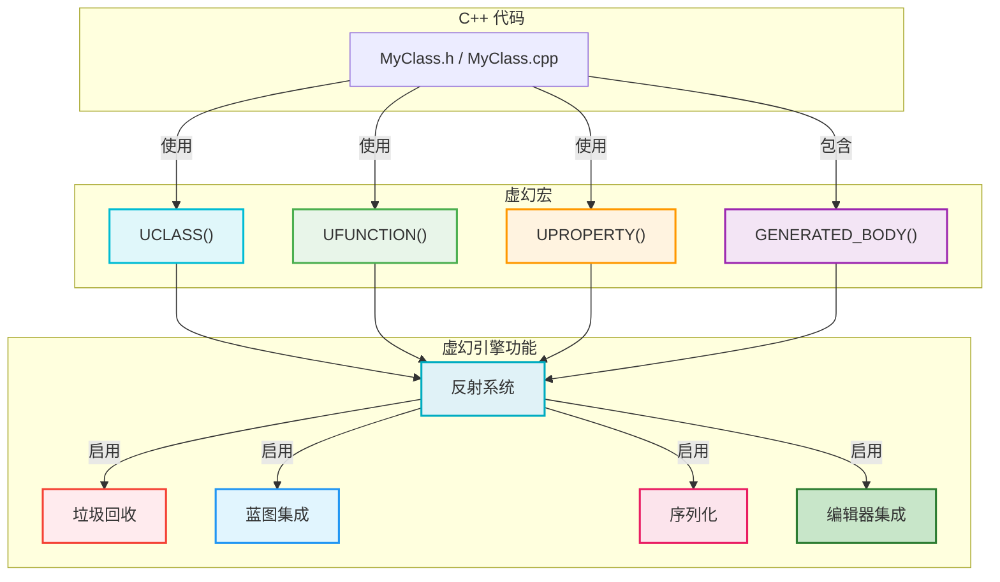
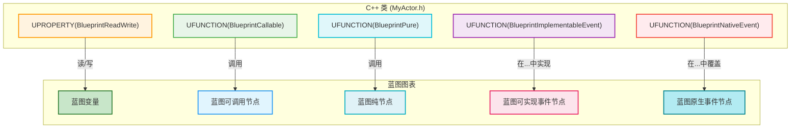

# 虚幻引擎中的 C++ 编程 - 可视化

本文档提供了在虚幻引擎中使用 C++ 编程的全面、可视化摘要，重点关注其独特的反射系统、核心宏以及将 C++ 与引擎和蓝图集成的最佳实践。

## 摘要

虚幻引擎利用 C++ 作为其主要的开发语言，但它通过强大的反射系统扩展了标准 C++。该系统通过特定的宏启用，允许引擎以纯 C++ 无法实现的方式理解和与您的 C++ 代码交互。这种集成对于垃圾回收、序列化、蓝图互操作性和编辑器集成等功能至关重要，使 C++ 成为虚幻中游戏开发的强大而高效的选择。

### 虚幻的反射系统和核心宏

虚幻引擎 C++ 集成的核心在于其反射系统，该系统使用一组宏在编译期间生成元数据和样板代码。此元数据允许引擎在运行时查询有关您的类、函数和属性的信息。

*   **`GENERATED_BODY()`:** 此宏放置在任何 `UCLASS`、`USTRUCT` 或 `UENUM` 定义的开头。它负责生成虚幻反射系统所需的所有样板代码，包括构造函数、属性访问器和其他基本函数。

*   **`UCLASS()`:**
    *   **目的:** 将 C++ 类暴露给虚幻引擎的反射系统，使其可被编辑器、垃圾回收器和蓝图识别。
    *   **继承:** `UCLASS` 通常继承自 `UObject`（用于通用对象）或 `AActor`（用于可放置在世界中的对象）。继承自 `UObject` 的类以 `U` 为前缀（例如 `UGameInstance`），继承自 `AActor` 的类以 `A` 为前缀（例如 `APawn`）。
    *   **关键说明符:**
        *   `Blueprintable`/`BlueprintType`: 允许蓝图基于您的 C++ 类或存储其实例。
        *   `Abstract`: 将类标记为抽象，阻止直接实例化。
        *   `Category`: 在蓝图编辑器的上下文菜单中组织类。
        *   `MinimalAPI`: 减少生成的代码以加快编译速度。

*   **`UFUNCTION()`:**
    *   **目的:** 将 C++ 函数暴露给虚幻引擎的反射系统，允许它从蓝图调用、响应网络事件或充当控制台命令。
    *   **关键说明符:**
        *   `BlueprintCallable`: 允许从蓝图执行函数。
        *   `BlueprintPure`: 用于不修改对象状态并返回值的函数。它们在蓝图中显示为纯节点（没有执行引脚）。
        *   `BlueprintImplementableEvent`: 在 C++ 中定义一个函数，该函数旨在 *仅* 在蓝图中实现。
        *   `BlueprintNativeEvent`: 允许同时具有原生 C++ 实现（使用 `_Implementation` 后缀）和在蓝图中覆盖。
        *   `Category`: 在蓝图上下文菜单中组织函数。
        *   `Server`/`Client`/`NetMulticast`: 控制网络复制行为。
        *   `CallInEditor`: 允许直接从编辑器中的详细信息面板执行函数。
        *   `Exec`: 将函数暴露为控制台命令。

*   **`UPROPERTY()`:**
    *   **目的:** 将 C++ 成员变量暴露给虚幻引擎的反射系统，启用序列化、垃圾回收、编辑器可见性和蓝图访问等功能。
    *   **关键说明符:**
        *   `VisibleAnywhere`/`VisibleDefaultsOnly`: 控制在编辑器详细信息面板中的可见性（对于所有实例或仅类默认值）。
        *   `EditAnywhere`/`EditDefaultsOnly`: 控制在编辑器详细信息面板中的可编辑性。
        *   `BlueprintReadOnly`/`BlueprintReadWrite`: 允许蓝图读取或读/写属性值。
        *   `Category`: 在详细信息面板中组织属性。
        *   `Config`: 允许从 `.ini` 配置文件加载/保存属性。
        *   `BlueprintSetter`: 分配一个函数来处理在蓝图中设置属性值，从而在更改时启用自定义逻辑。
        *   `TObjectPtr`: `UPROPERTY` 定义中 `UObject` 指针的最佳实践，确保正确的垃圾回收管理。

*   **`USTRUCT()` / `UENUM()`:**
    *   **目的:** 将 C++ 结构体和枚举暴露给反射系统，允许它们在蓝图中使用并受益于序列化。

### 常见虚幻 C++ 类型

虚幻引擎提供了自己的一组容器类和字符串类型，针对引擎使用进行了优化：

*   **`TArray<T>`:** 虚幻的动态数组，类似于 `std::vector`，但针对引擎内存管理和序列化进行了优化。
*   **`TMap<KeyType, ValueType>`:** 虚幻的哈希映射，类似于 `std::map` 或 `std::unordered_map`。
*   **`FString`:** 可变、动态大小的字符串类，主要用于面向用户的文本和操作。
*   **`FName`:** 不可变、不区分大小写的字符串标识符，针对快速比较和查找进行了优化。非常适合资产名称、骨骼名称等。
*   **`FText`:** 本地化文本类，旨在以与语言无关的方式向用户显示文本。

### 内存管理基础

虚幻引擎采用复杂的内存管理系统：

*   **垃圾回收（针对 `UObject`）:** `UObject` 实例由虚幻的垃圾回收器管理。只要 `UObject` 被 `UPROPERTY` 引用或添加到根集，它就不会被垃圾回收。这简化了引擎管理对象的内存管理。
*   **智能指针（针对非 `UObject`）:** 对于非 `UObject` C++ 类，虚幻提供了自己的一组智能指针（`TSharedPtr`、`TWeakPtr`、`TUniquePtr`）来安全地管理内存并防止内存泄漏。（有关更多详细信息，请参阅“智能指针可视化”文档）。

## 可视化

### 1. 虚幻 C++ 反射系统概述

此图说明了虚幻的宏如何使反射系统将 C++ 代码与各种引擎功能集成。

### 2. C++ 与蓝图的互操作性

此图显示了 `UFUNCTION` 和 `UPROPERTY` 说明符如何控制 C++ 和蓝图之间的交互。

