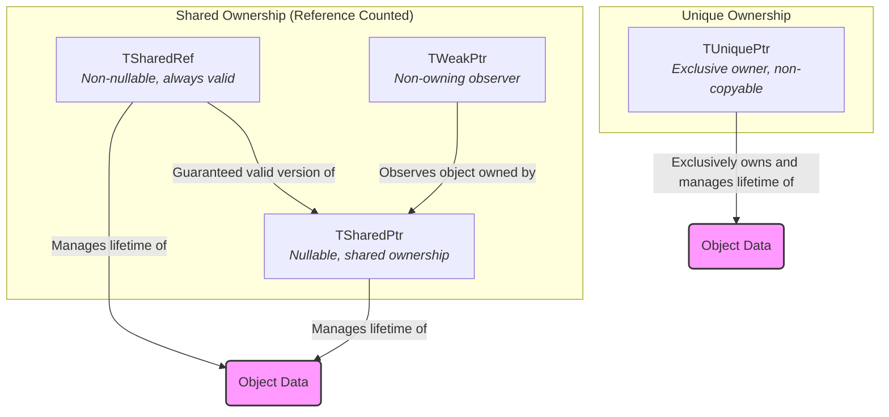
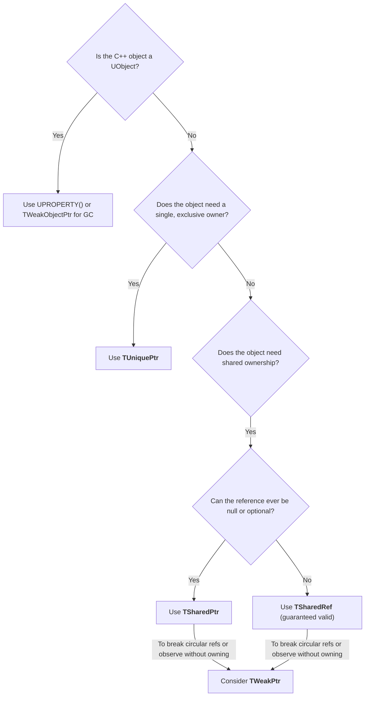
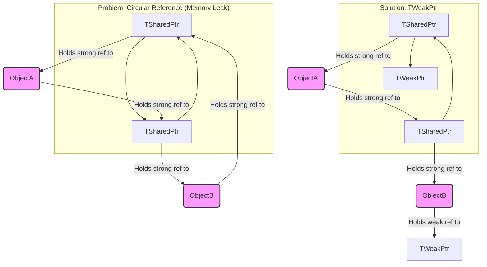

# Unreal Engine Smart Pointers - Visualized

This document provides an in-depth look into Unreal Engine's custom smart pointers, designed for robust memory management of non-UObject C++ types. Understanding these smart pointers is crucial for writing safe, efficient, and modern C++ code within the Unreal Engine framework.

## Summary

In C++, manual memory management can lead to common issues like memory leaks (forgetting to `delete` allocated memory) and dangling pointers (accessing memory after it has been freed). Unreal Engine addresses these challenges for non-`UObject` types by providing its own suite of smart pointers, which automatically manage object lifetimes through ownership semantics.

**Crucial Distinction:** These smart pointers are **exclusively for C++ objects that do NOT inherit from `UObject`**. `UObject` instances are managed by Unreal Engine's Garbage Collection (GC) system, primarily through `UPROPERTY()` declarations and `TWeakObjectPtr` for weak references.

### Why Unreal Engine's Smart Pointers?

While C++11 introduced `std::shared_ptr`, `std::unique_ptr`, and `std::weak_ptr`, Unreal Engine uses its own implementations (`TSharedPtr`, `TUniquePtr`, `TWeakPtr`) for several reasons:

*   **Custom Allocators:** Unreal Engine uses its own memory allocators, which are optimized for game development and often integrate with its memory tracking and debugging tools.
*   **Engine-Specific Features:** The engine's smart pointers can integrate more deeply with other engine systems if needed.
*   **Consistency:** Provides a consistent memory management paradigm across the engine's codebase.

### Smart Pointer Types and Their Usage

#### 1. Shared Pointers (`TSharedPtr` and `TSharedRef`)

These implement a shared, reference-counted ownership model. The object they point to is automatically destroyed when the last `TSharedPtr` or `TSharedRef` referencing it is destroyed.

*   **`TSharedPtr<Type>`:**
    *   **Nullable:** Can be `nullptr` (empty). Use when a reference to an object might not always exist.
    *   **Creation:** Typically created using `MakeShared<Type>(...)` for efficient allocation.
    *   **Access:** Use `Get()` to get the raw pointer, `IsValid()` to check if it holds a valid object, or `operator*` and `operator->` for direct access.
    *   **Example:**
        ```cpp
        class FMyData { /* ... */ };
        TSharedPtr<FMyData> DataPtr = MakeShared<FMyData>();
        if (DataPtr.IsValid())
        {
            DataPtr->DoSomething();
        }
        ```

*   **`TSharedRef<Type>`:**
    *   **Non-nullable:** Must always refer to a valid object. Cannot be `nullptr`.
    *   **Creation:** Also typically created using `MakeShared<Type>(...)` and then implicitly converted, or explicitly constructed from a `TSharedPtr` that is guaranteed to be valid.
    *   **Use Case:** Ideal when you *know* an object must exist and you want to enforce that guarantee at compile time.
    *   **Access:** `operator*` and `operator->` are always safe to use.
    *   **Example:**
        ```cpp
        TSharedRef<FMyData> DataRef = MakeShared<FMyData>(); // Always valid
        DataRef->DoSomethingElse();
        ```

#### 2. Weak Pointers (`TWeakPtr`)

`TWeakPtr` is a non-owning pointer that holds a "weak" reference to an object managed by `TSharedPtr` or `TSharedRef`. It does not contribute to the object's reference count, meaning it won't prevent the object from being deleted.

*   **Purpose:** Primarily used to break **circular reference cycles** between `TSharedPtr`s, which would otherwise lead to memory leaks.
*   **Safety:** To safely access the object, you must first convert the `TWeakPtr` to a `TSharedPtr` using the `Pin()` method. `Pin()` returns a valid `TSharedPtr` if the object still exists, or an empty `TSharedPtr` if the object has been destroyed.
*   **Example:**
    ```cpp
    TSharedPtr<FMyData> Data = MakeShared<FMyData>();
    TWeakPtr<FMyData> WeakData = Data; // Weakly observes Data

    if (TSharedPtr<FMyData> PinnedData = WeakData.Pin())
    {
        PinnedData->DoSomething(); // Object is still alive
    }
    else
    {
        // Object has been destroyed
    }
    ```

#### 3. Unique Pointers (`TUniquePtr`)

`TUniquePtr` provides exclusive, unique ownership of an object. Only one `TUniquePtr` can point to a given object at any time. When the `TUniquePtr` goes out of scope, the object it owns is automatically deleted.

*   **Ownership Transfer:** `TUniquePtr` cannot be copied; ownership can only be *moved* using `MoveTemp` (similar to `std::move`). This enforces the single-owner policy.
*   **Use Case:** Ideal for objects that have a clear, single owner throughout their lifetime.
*   **Creation:** Typically created using `MakeUnique<Type>(...)`.
*   **Example:**
    ```cpp
    TUniquePtr<FMyData> UniqueData = MakeUnique<FMyData>();
    // TUniquePtr<FMyData> AnotherUniqueData = UniqueData; // Compile error: cannot copy
    TUniquePtr<FMyData> MovedData = MoveTemp(UniqueData); // Ownership transferred
    // UniqueData is now null, MovedData owns the object
    ```

### Common Pitfalls and Best Practices

*   **Mixing Raw Pointers:** Avoid storing raw pointers to objects managed by smart pointers for extended periods, as the raw pointer can become dangling if the smart pointer releases ownership.
*   **Circular Dependencies:** Be mindful of `TSharedPtr` circular references. If Object A has a `TSharedPtr` to Object B, and Object B has a `TSharedPtr` to Object A, neither will ever be destroyed. Use `TWeakPtr` for one of the references to break the cycle.
*   **Performance:** While convenient, smart pointers introduce a small overhead (e.g., reference counting for `TSharedPtr`). For very performance-critical, short-lived objects, raw pointers might be considered, but always prioritize safety and correctness.
*   **`UObject` vs. Non-`UObject`:** Always remember the fundamental rule: `UObject`s use GC, non-`UObject`s use smart pointers (or manual `new`/`delete` if absolutely necessary and carefully managed).

## Visualizations

### 1. Smart Pointer Ownership Models

This diagram illustrates the different ownership semantics of Unreal Engine's smart pointers.



### 2. Smart Pointer Decision Flowchart

This flowchart guides you in choosing the appropriate smart pointer for non-UObject C++ classes.



### 3. TWeakPtr for Breaking Circular References

This diagram shows how `TWeakPtr` helps resolve circular dependencies between `TSharedPtr`s.

