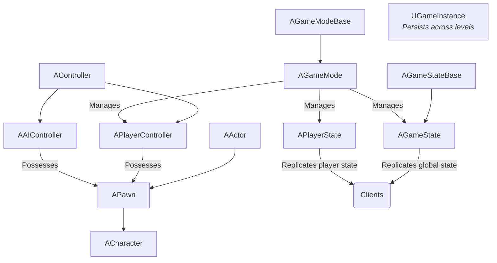
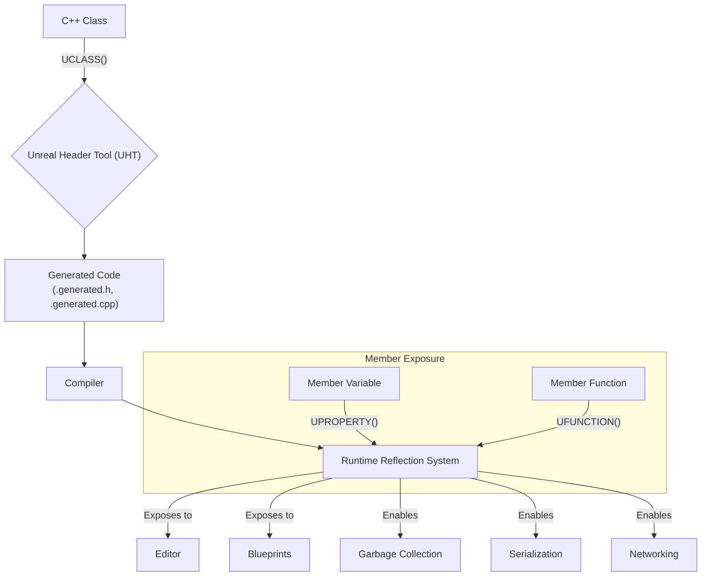
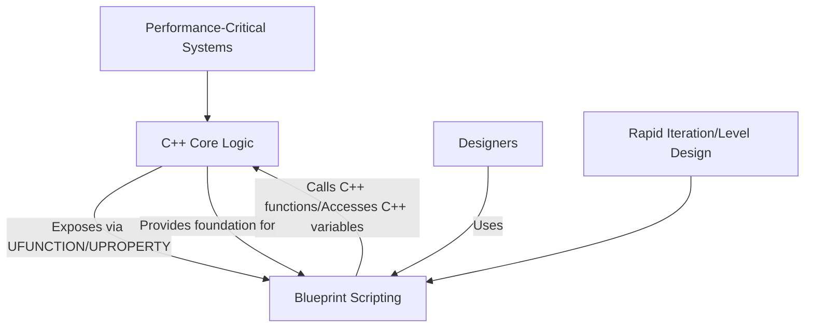

# Tom Looman's Unreal Engine C++ Guide - Visualized

This document summarizes key concepts and best practices from Tom Looman's comprehensive guides on Unreal Engine C++ development, focusing on the Gameplay Framework, Unreal Object System, data structures, smart pointers, delegates, interfaces, and C++/Blueprint integration.

## Summary

Tom Looman's guides are highly regarded resources for mastering C++ in Unreal Engine. They emphasize understanding the engine's unique C++ features and how to build robust, scalable gameplay systems. The core philosophy revolves around leveraging Unreal's powerful reflection system, memory management, and the interplay between C++ and Blueprints.

### 1. Unreal Gameplay Framework

Understanding the Gameplay Framework is fundamental. It defines the core classes that structure a game:

*   **`AActor`:** The most basic unit that can be placed in a world. It has a transform (location, rotation, scale) and can contain `UActorComponent`s.
*   **`APawn`:** An `AActor` that can be possessed by a `AController`. Represents the physical manifestation of a player or AI in the world.
*   **`ACharacter`:** A specialized `APawn` designed for bipedal characters, providing built-in movement capabilities (e.g., walking, running, jumping).
*   **`AController`:** Non-physical `AActor` that possesses a `APawn` to control its actions. Can be `APlayerController` (for players) or `AAIController` (for AI).
*   **`AGameModeBase` / `AGameMode`:** Defines the rules of the game, including player spawning, scoring, and win conditions. Exists only on the server.
*   **`AGameStateBase` / `AGameState`:** Replicates game-specific state to all clients (e.g., current score, game phase). Exists on both server and clients.
*   **`APlayerState`:** Replicates player-specific state to all clients (e.g., player name, score, health). Exists on both server and clients.
*   **`UGameInstance`:** A singleton object that persists for the lifetime of the game application, across level changes. Good for global data and systems.

### 2. Unreal Object System (UObject)

The `UObject` system is the backbone of Unreal Engine, providing reflection, garbage collection, serialization, and networking capabilities. Key macros and classes include:

*   **`UCLASS()`:** Marks a C++ class for the Unreal Object System, enabling reflection, Blueprint exposure, and garbage collection.
*   **`UPROPERTY()`:** Exposes member variables to the editor, Blueprints, serialization, and replication.
*   **`UFUNCTION()`:** Exposes C++ functions to Blueprints, RPCs (Remote Procedure Calls), and delegates.
*   **`GENERATED_BODY()`:** A macro that handles boilerplate code generation for `UObject` classes.
*   **`UEnum` / `UStruct`:** Allow defining custom enumerations and structures that benefit from the `UObject` system's features.

### 3. Data Structures

Unreal Engine provides its own highly optimized container classes, which should generally be preferred over standard C++ library containers for `UObject` types and often for performance reasons:

*   **`TArray<Type>`:** Dynamic array, similar to `std::vector`. Optimized for performance and memory usage within Unreal.
*   **`TSet<Type>`:** Hash set, similar to `std::unordered_set`. Stores unique elements.
*   **`TMap<KeyType, ValueType>`:** Hash map, similar to `std::unordered_map`. Stores key-value pairs.
*   **`FString`:** Unreal's string class, designed for efficient manipulation and localization.
*   **`FName`:** Immutable, case-insensitive string identifier, optimized for fast comparisons.
*   **`FText`:** Localized text, used for UI and any user-facing strings.

### 4. Smart Pointers

For managing the lifetime of non-`UObject` C++ objects, Unreal Engine provides custom smart pointers:

*   **`TSharedPtr<Type>` / `TSharedRef<Type>`:** Implement shared ownership with reference counting. `TSharedRef` is non-nullable.
*   **`TWeakPtr<Type>`:** A non-owning observer for objects managed by `TSharedPtr`/`TSharedRef`, used to break circular dependencies.
*   **`TUniquePtr<Type>`:** Exclusive ownership, non-copyable, similar to `std::unique_ptr`.

### 5. Delegates and Interfaces

*   **Delegates:** Unreal's powerful event system, allowing for loose coupling between objects. They can be single-cast (`DECLARE_DELEGATE`) or multi-cast (`DECLARE_MULTICAST_DELEGATE`), and can be bound to C++ functions or Blueprint events.
*   **Interfaces:** Unreal uses a specific pattern for C++ interfaces (`UINTERFACE`, `IInterface`), enabling polymorphic behavior across `UObject`s and allowing Blueprints to implement C++ defined interfaces.

### 6. Casting

Unreal Engine provides safe casting mechanisms for `UObject`s:

*   **`Cast<TargetType>(ObjectPtr)`:** Safely casts a `UObject` pointer to a derived type. Returns `nullptr` if the cast fails.
*   **`ICast<TargetInterface>(ObjectPtr)`:** Safely casts a `UObject` pointer to an interface type. Returns `nullptr` if the object does not implement the interface.

### 7. Combining C++ and Blueprints

Tom Looman emphasizes a hybrid approach:

*   **C++ for Core Logic:** Implement foundational systems, complex algorithms, and performance-critical code in C++.
*   **Blueprints for Game-Specific Scripting:** Use Blueprints for rapid iteration, level design, data-driven behavior, and exposing C++ functionality to designers.
*   **Exposing C++ to Blueprints:** Use `UFUNCTION(BlueprintCallable)`, `UPROPERTY(BlueprintReadWrite)`, etc., to expose C++ elements to the Blueprint visual scripting environment.

## Visualizations

### 1. Unreal Gameplay Framework Hierarchy

### 2. UObject System Reflection Flow

### 3. C++ and Blueprint Interaction

