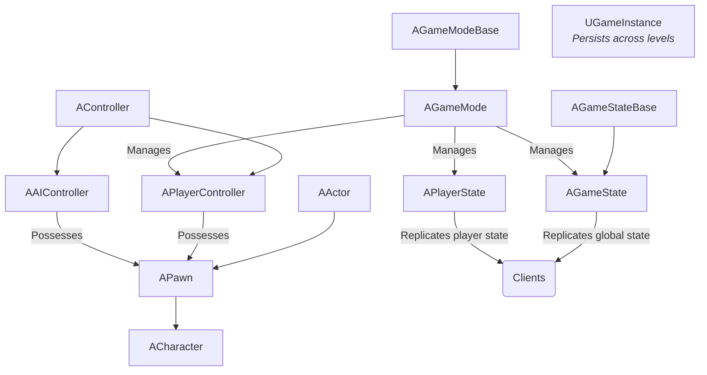
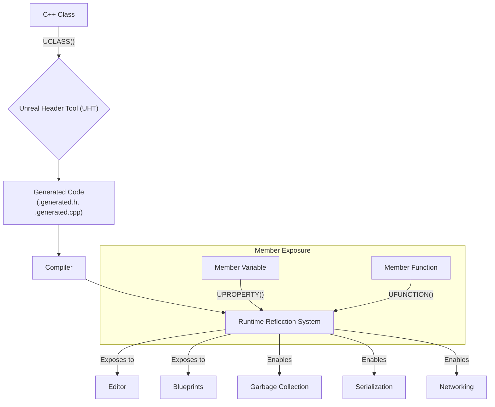
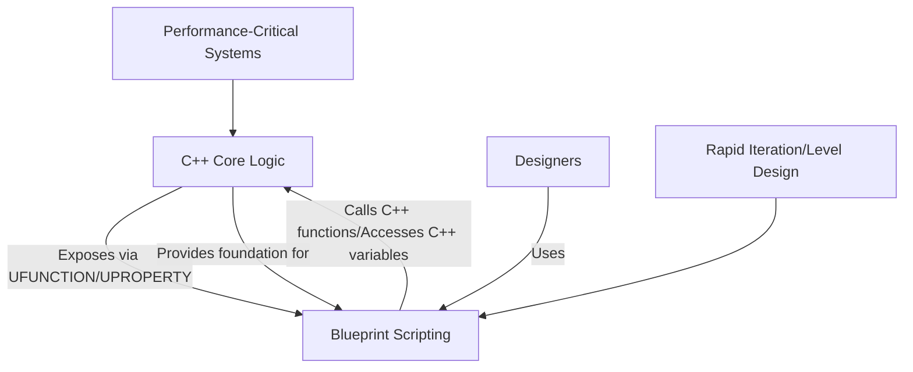

# Tom Looman 的虚幻引擎 C++ 指南 - 可视化

本文档总结了 Tom Looman 关于虚幻引擎 C++ 开发的综合指南中的关键概念和最佳实践，重点关注游戏性框架、虚幻对象系统、数据结构、智能指针、委托、接口以及 C++ 与蓝图的集成。

## 概述

Tom Looman 的指南是掌握虚幻引擎中 C++ 的重要资源。它们强调理解引擎独特的 C++ 功能以及如何构建健壮、可扩展的游戏性系统。其核心理念围绕着利用虚幻强大的反射系统、内存管理以及 C++ 和蓝图之间的相互作用。

### 1. 虚幻游戏性框架

理解游戏性框架是基础。它定义了构成游戏结构的核心类：

*   **`AActor`：** 可以在世界中放置的最基本单元。它具有变换（位置、旋转、缩放）并且可以包含 `UActorComponent`。
*   **`APawn`：** 可以被 `AController` 附着的 `AActor`。代表玩家或 AI 在世界中的物理表现。
*   **`ACharacter`：** 专为双足角色设计的 `APawn`，提供内置的移动能力（例如，行走、奔跑、跳跃）。
*   **`AController`：** 非物理 `AActor`，附着 `APawn` 以控制其动作。可以是 `APlayerController`（用于玩家）或 `AAIController`（用于 AI）。
*   **`AGameModeBase` / `AGameMode`：** 定义游戏规则，包括玩家生成、得分和胜利条件。仅存在于服务器上。
*   **`AGameStateBase` / `AGameState`：** 将游戏特定状态复制到所有客户端（例如，当前分数、游戏阶段）。存在于服务器和客户端上。
*   **`APlayerState`：** 将玩家特定状态复制到所有客户端（例如，玩家姓名、分数、生命值）。存在于服务器和客户端上。
*   **`UGameInstance`：** 一个单例对象，在游戏应用程序的整个生命周期内（跨关卡更改）持续存在。适用于全局数据和系统。

### 2. 虚幻对象系统 (UObject)

`UObject` 系统是虚幻引擎的支柱，提供反射、垃圾回收、序列化和网络功能。关键宏和类包括：

*   **`UCLASS()`：** 将 C++ 类标记为虚幻对象系统的一部分，启用反射、蓝图暴露和垃圾回收。
*   **`UPROPERTY()`：** 将成员变量暴露给编辑器、蓝图、序列化和复制。
*   **`UFUNCTION()`：** 将 C++ 函数暴露给蓝图、RPC（远程过程调用）和委托。
*   **`GENERATED_BODY()`：** 一个宏，用于处理 `UObject` 类的样板代码生成。
*   **`UEnum` / `UStruct`：** 允许定义受益于 `UObject` 系统功能的自定义枚举和结构体。

### 3. 数据结构

虚幻引擎提供了自己高度优化的容器类，通常应优先于标准 C++ 库容器，特别是对于 `UObject` 类型以及出于性能原因：

*   **`TArray<Type>`：** 动态数组，类似于 `std::vector`。在虚幻中针对性能和内存使用进行了优化。
*   **`TSet<Type>`：** 哈希集合，类似于 `std::unordered_set`。存储唯一元素。
*   **`TMap<KeyType, ValueType>`：** 哈希映射，类似于 `std::unordered_map`。存储键值对。
*   **`FString`：** 虚幻的字符串类，专为高效操作和本地化而设计。
*   **`FName`：** 不可变、不区分大小写的字符串标识符，针对快速比较进行了优化。
*   **`FText`：** 本地化文本，用于 UI 和任何面向用户的字符串。

### 4. 智能指针

为了管理非 `UObject` C++ 对象的生命周期，虚幻引擎提供了自定义智能指针：

*   **`TSharedPtr<Type>` / `TSharedRef<Type>`：** 实现带有引用计数的共享所有权。`TSharedRef` 不可为空。
*   **`TWeakPtr<Type>`：** 对由 `TSharedPtr`/`TSharedRef` 管理的对象的非拥有观察者，用于打破循环依赖。
*   **`TUniquePtr<Type>`：** 独占所有权，不可复制，类似于 `std::unique_ptr`。

### 5. 委托和接口

*   **委托：** 虚幻强大的事件系统，允许对象之间松散耦合。它们可以是单播 (`DECLARE_DELEGATE`) 或多播 (`DECLARE_MULTICAST_DELEGATE`)，并且可以绑定到 C++ 函数或蓝图事件。
*   **接口：** 虚幻使用特定的 C++ 接口模式（`UINTERFACE`，`IInterface`），实现 `UObject` 之间的多态行为，并允许蓝图实现 C++ 定义的接口。

### 6. 类型转换

虚幻引擎为 `UObject` 提供了安全的类型转换机制：

*   **`Cast<TargetType>(ObjectPtr)`：** 将 `UObject` 指针安全地转换为派生类型。如果转换失败，则返回 `nullptr`。
*   **`ICast<TargetInterface>(ObjectPtr)`：** 将 `UObject` 指针安全地转换为接口类型。如果对象未实现该接口，则返回 `nullptr`。

### 7. C++ 与蓝图的结合

Tom Looman 强调混合方法：

*   **C++ 用于核心逻辑：** 在 C++ 中实现基础系统、复杂算法和性能关键代码。
*   **蓝图用于游戏特定脚本：** 使用蓝图进行快速迭代、关卡设计、数据驱动行为，并将 C++ 功能暴露给设计师。
*   **将 C++ 暴露给蓝图：** 使用 `UFUNCTION(BlueprintCallable)`、`UPROPERTY(BlueprintReadWrite)` 等，将 C++ 元素暴露给蓝图可视化脚本环境。

## 可视化

### 1. 虚幻游戏性框架层次结构

### 2. UObject 系统反射流程

### 3. C++ 与蓝图交互

