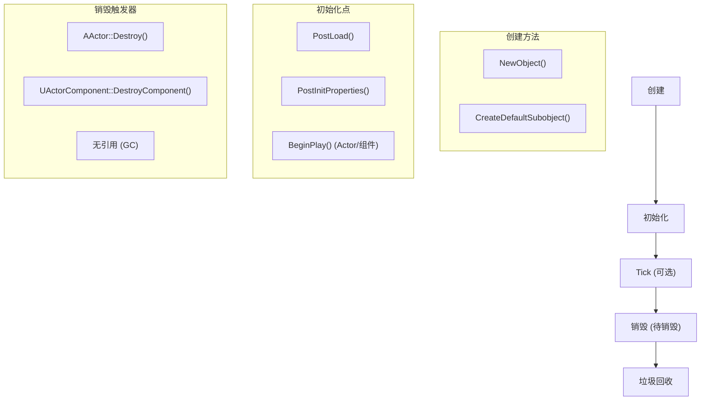
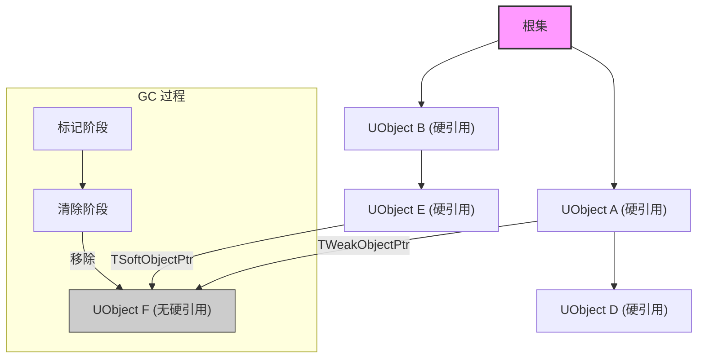
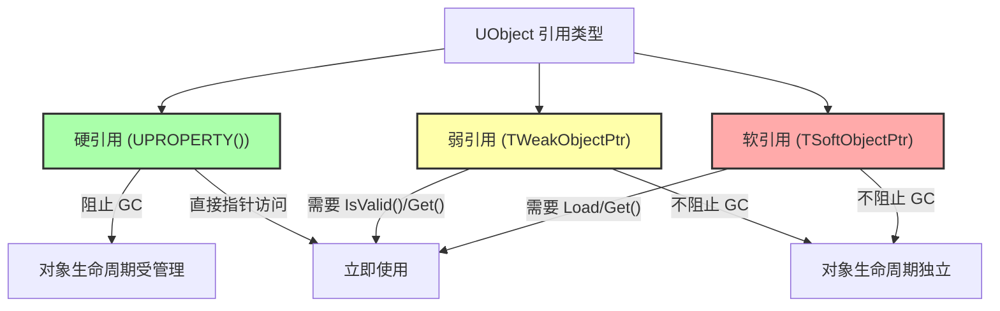

# 虚幻对象处理 - 可视化

虚幻引擎的 `UObject` 系统是管理游戏对象、其生命周期以及通过健壮的垃圾回收 (GC) 机制进行内存管理的基础框架。理解此系统对于高效稳定的虚幻引擎开发至关重要。

## 概述

`UObject` 系统为派生自 `UObject` 的对象提供了核心功能，例如反射、序列化、网络和自动内存管理。它确保对象在不再需要时得到正确初始化、更新并最终清理，从而防止内存泄漏和悬空指针。

### 1. UObject 生命周期

`UObject` 的生命周期涉及几个关键阶段：

*   **创建：**
    *   **`NewObject<T>()`：** 在运行时用于创建新的 `UObject` 实例。
    *   **`CreateDefaultSubobject<T>()`：** 在 `UObject` 的构造函数中用于创建作为对象默认状态一部分的子对象。这些子对象会自动管理。
    *   **构造函数：** `UObject` 构造函数应该轻量级，主要用于设置默认值和创建子对象。对于 `AActor` 和 `UActorComponent`，复杂的初始化应在 `BeginPlay()` 中进行。
*   **初始化：**
    *   **`PostLoad()`：** 对象从磁盘加载后调用。
    *   **`PostInitProperties()`：** 属性初始化后调用。
    *   **`BeginPlay()`：** (对于 `AActor` 和 `UActorComponent`) 游戏逻辑的关键初始化点，在游戏开始或 Actor 生成到世界中时调用。
*   **更新 (Tick)：**
    *   `AActor` 和 `UActorComponent` 具有内置的 `Tick()` 函数，如果启用，则每帧调用一次。
    *   通用 `UObject` 默认不 Tick。要启用每帧更新，`UObject` 必须继承自 `FTickableGameObject`。
*   **销毁：**
    *   对象可以被显式标记为销毁（例如，`AActor::Destroy()`、`UActorComponent::DestroyComponent()`）。
    *   一旦标记，它们将进入待销毁状态，并最终由垃圾回收器从内存中移除。
    *   销毁过程涉及调用 `BeginDestroy()`、`IsReadyForFinishDestroy()` 和 `FinishDestroy()`。

### 2. 垃圾回收 (GC)

虚幻引擎对 `UObject` 采用标记-清除垃圾回收方案，以自动清理不再引用的对象。

*   **工作原理：**
    1.  引擎从 `UObject` 的“根集”（例如，`UGameInstance`、`UWorld`、显式添加到根的对象）开始构建引用图。
    2.  任何被根集直接或间接引用的 `UObject` 都被视为“正在使用”，并且不会被垃圾回收。
    3.  无法从根集访问的对象有资格进行清理。
*   **阻止 GC 的因素：**
    *   **`UPROPERTY()` 引用：** 使用 `UPROPERTY()` 声明 `UObject` 指针会创建“硬引用”，阻止被引用对象被垃圾回收。如果被引用对象被销毁，这些指针会自动置空。
    *   **添加到根集：** 对象可以使用 `AddToRoot()` 显式添加到根集，确保其在生命周期内保留在内存中。
*   **限制：**
    *   GC 仅适用于 `UObject`。对于其他类型（结构体、非 `UObject` 类），请使用标准 C++ 内存管理或虚幻的智能指针（`TSharedPtr`、`TUniquePtr`）。
    *   **原始指针：** 指向 `UObject` 的原始 C++ 指针 *不* 受垃圾回收器跟踪。如果 `UObject` 被销毁，指向它的原始指针将成为悬空指针，并且不会自动置空，从而导致崩溃。
*   **GC 集群：** 虚幻引擎将相关对象分组到集群中进行垃圾回收，通过减少单个对象检查的开销来提高性能。

### 3. 引用和所有权

虚幻引擎为 `UObject` 定义了各种类型的引用和所有权关系：

*   **硬引用 (`UPROPERTY()`):** 这是维护对 `UObject` 的引用并阻止其垃圾回收的主要方式。它们表示所有权或强依赖关系。
*   **`Outer` 关系：** 每个 `UObject` 都有一个 `Outer` 对象。如果对象的 `Outer` 被垃圾回收，对象本身也将被回收。对于 `AActor`，它们的 `Outer` 通常是它们所在的 `ULevel`。
*   **`Owner` 关系 (对于 `AActor`):** `AActor` 之间的一种特定关系。如果 `AActor` 的 `Owner` 被销毁，则拥有的 `AActor` 也将被销毁。这对于网络复制也很重要。

### 4. TWeakObjectPtr

`TWeakObjectPtr` 是一个“弱”指针，旨在引用 `UObject` 而不阻止其垃圾回收。

*   **目的：** 当您需要引用 `UObject` 但不想延长其生命周期时使用（例如，不拥有被观察对象的观察者对象）。
*   **行为：** 如果被引用的 `UObject` 被销毁或垃圾回收，`TWeakObjectPtr` 会自动置空。
*   **用法：** 在访问底层对象之前，始终使用 `IsValid()` 或通过调用 `Get()` 并检查 `nullptr` 来检查其有效性。

### 5. TSoftObjectPtr

`TSoftObjectPtr` 是一个“软”指针，用于引用可能已加载或未加载到内存中的资产。

*   **目的：** 存储资产的路径，并提供在运行时异步加载该资产的功能。非常适合管理对不应在需要之前加载的大型资产的引用，从而防止不必要的内存使用。
*   **行为：** 与 `TWeakObjectPtr` 类似，它 *不* 会阻止被引用对象在加载后被垃圾回收。
*   **用法：**
    *   `IsPending()`：检查资产路径是否有效，但对象实例尚未加载。
    *   `Get()`：如果对象未加载，则返回 `nullptr`。
    *   `TSoftClassPtr`：用于引用类或蓝图类型的类似类型。

### 6. 最佳实践

*   **`UPROPERTY()` 用于所有权：** 在您打算拥有对象或阻止其 GC 的 `UObject` 引用中，始终使用 `UPROPERTY()`。
*   **`TWeakObjectPtr` 用于非所有权：** 在引用 `UObject` 而不影响其生命周期时，使用 `TWeakObjectPtr`。
*   **`TSoftObjectPtr` 用于异步加载：** 对于可能未加载的资产，使用 `TSoftObjectPtr`，从而实现高效的异步加载。
*   **避免 `UObject` 的原始指针：** 除非经过精心管理，否则指向 `UObject` 的原始 C++ 指针不受 GC 跟踪，并可能导致悬空指针。
*   **基于组件的设计：** 利用虚幻的组件系统实现可重用性和模块化。
*   **构造函数与 `BeginPlay`：** 构造函数用于轻量级初始化；`BeginPlay()` 用于 `AActor` 和 `UActorComponent` 中的复杂设置逻辑。
*   **最小化循环依赖：** 避免具有循环引用的复杂对象链，以防止内存使用增加。
*   **覆盖 `AddReferencedObjects()` (很少使用)：** 对于以 `UPROPERTY()` 无法识别的方式持有引用的自定义 `UObject`，请覆盖 `AddReferencedObjects()` 以显式通知 GC。
*   **性能分析：** 定期分析 `UObject` 以优化内存使用和执行速度。

## 可视化

### 1. UObject 生命周期流程

### 2. 垃圾回收引用图

### 3. UObject 引用类型

