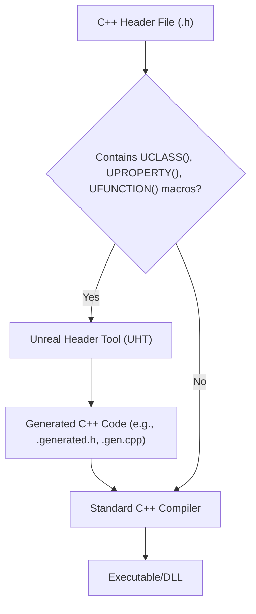
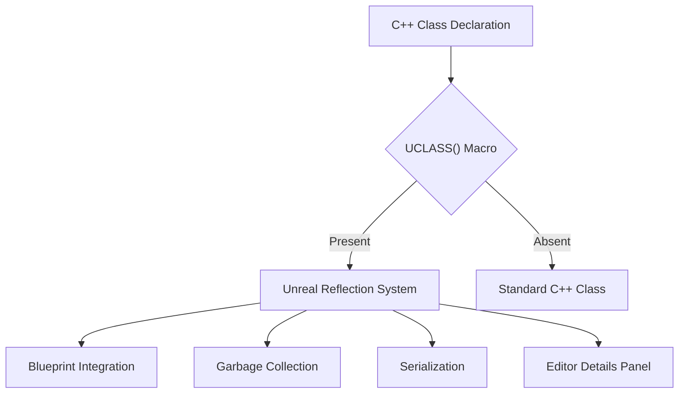
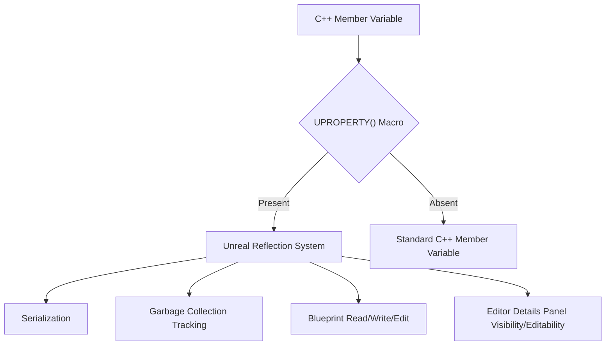
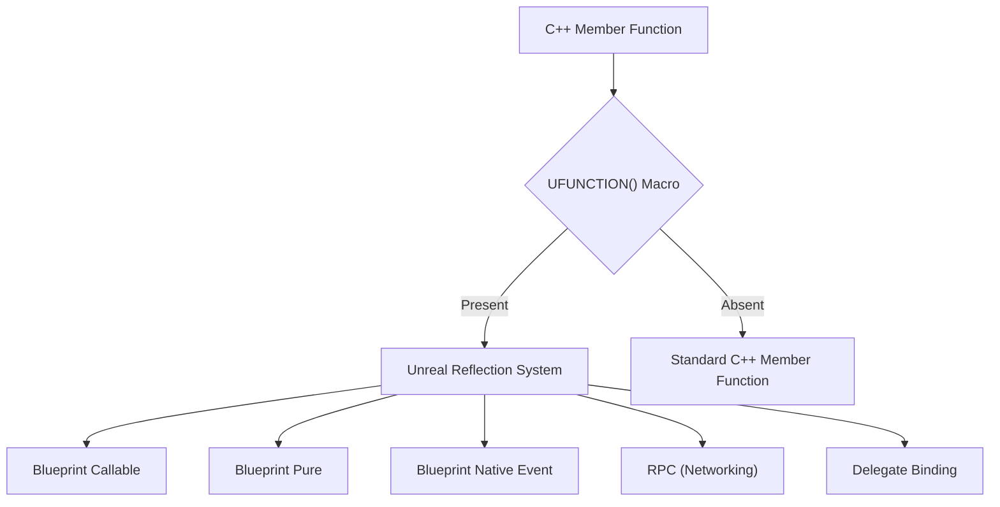

# Unreal Property System: Reflection

The Unreal Engine's Property System, often referred to as Reflection, is a fundamental pillar of the engine's architecture. It allows the engine to understand and manipulate C++ classes, properties, and functions at runtime, enabling powerful features like Blueprint integration, serialization, garbage collection, and editor tooling.

## What is Reflection?

In programming, reflection is the ability of a program to examine or modify its own structure and behavior at runtime. Unreal Engine extends standard C++ with its own reflection system, which is crucial because standard C++ lacks built-in reflection capabilities.

## How Unreal Engine Achieves Reflection

Unreal Engine uses a custom build step involving the Unreal Header Tool (UHT) to achieve reflection. When you compile your Unreal C++ code, UHT parses your header files, looking for specific macros like `UCLASS()`, `UPROPERTY()`, and `UFUNCTION()`.

**Diagram 1: Unreal Header Tool (UHT) Process**

UHT generates additional C++ code (e.g., `.generated.h` and `.gen.cpp` files) that contains metadata about your classes, properties, and functions. This metadata is then compiled along with your regular C++ code. At runtime, the engine can query this metadata to understand the structure of your C++ objects.

## Key Reflection Macros

### `UCLASS()`

The `UCLASS()` macro is placed above a class declaration to mark it as an Unreal Engine class. This enables the class for reflection, allowing it to be integrated with Blueprints, participate in garbage collection, and be used by editor tools.

**Diagram 2: UCLASS() Macro and its Impact**

Common specifiers for `UCLASS()` include `Blueprintable`, `Abstract`, `EditInlineNew`, etc.

### `UPROPERTY()`

The `UPROPERTY()` macro is used to expose member variables to the Unreal reflection system. This is essential for:

*   **Serialization:** Saving and loading property values.
*   **Garbage Collection:** Allowing the garbage collector to track references to `UObject`s.
*   **Blueprint Integration:** Making properties accessible and editable in Blueprints.
*   **Editor Details Panel:** Displaying and allowing editing of properties in the Unreal Editor.

**Diagram 3: UPROPERTY() Macro and its Features**

Common specifiers for `UPROPERTY()` include `EditAnywhere`, `VisibleAnywhere`, `BlueprintReadWrite`, `BlueprintReadOnly`, `Category`, etc.

### `UFUNCTION()`

The `UFUNCTION()` macro exposes member functions to the Unreal reflection system. This allows functions to be:

*   **Callable from Blueprints:** Executed directly from Blueprint graphs.
*   **Overridable in Blueprints:** Implemented or extended in Blueprint child classes.
*   **Used for RPCs (Remote Procedure Calls):** For network replication.
*   **Bound to Delegates:** For event handling.

**Diagram 4: UFUNCTION() Macro and its Capabilities**

Common specifiers for `UFUNCTION()` include `BlueprintCallable`, `BlueprintPure`, `BlueprintNativeEvent`, `Server`, `Client`, `Category`, etc.

## Benefits of the Reflection System

The Unreal Property System provides numerous benefits:

*   **Blueprint Integration:** Seamlessly bridge C++ and Blueprint, allowing designers to extend C++ functionality without writing code.
*   **Serialization & Persistence:** Automatically save and load game state, including complex object graphs.
*   **Garbage Collection:** Efficiently manage memory for `UObject`s, preventing leaks and dangling pointers.
*   **Editor Tooling:** Drive the details panel, property editors, and other editor features, making development faster and more intuitive.
*   **Networking:** Facilitate replication of properties and function calls across a network.
*   **Modularity & Extensibility:** Promote a more modular codebase where components can interact without tight coupling, thanks to runtime type information.

## Conclusion

The Unreal Property System and its reflection capabilities are at the heart of what makes Unreal Engine so powerful and flexible. By understanding how `UCLASS()`, `UPROPERTY()`, and `UFUNCTION()` macros work, developers can leverage the full potential of the engine, creating robust, extensible, and performant games and applications.
