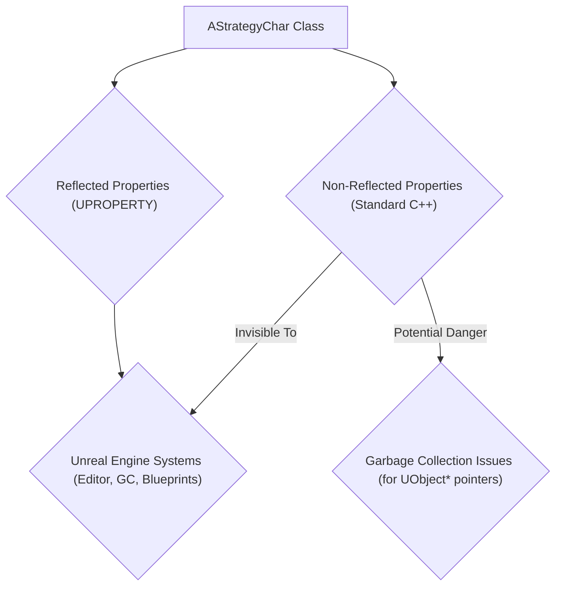
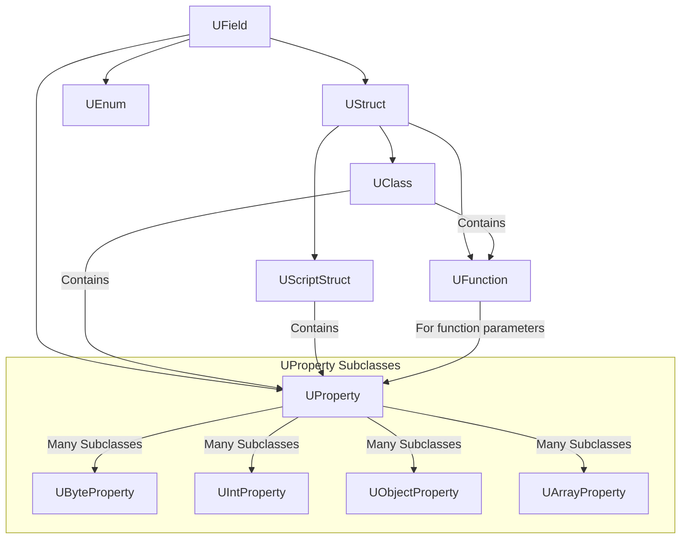
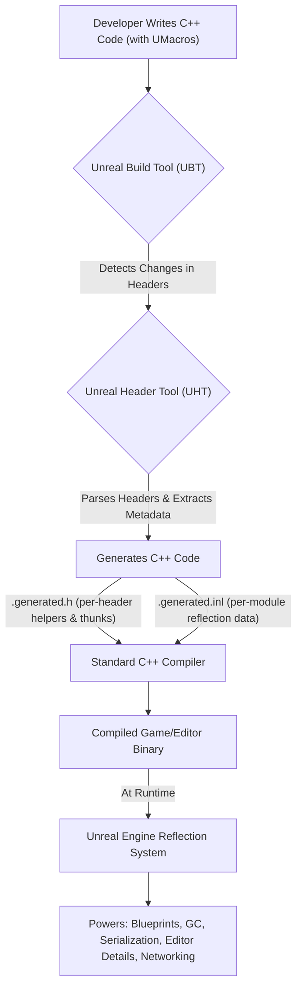

# Unreal Property System (Reflection)

**March 28, 2014**
**By Michael Noland**

Reflection is the ability of a program to examine itself at runtime. This is hugely useful and is a foundational technology of the Unreal engine, powering many systems such as detail panels in the editor, serialization, garbage collection, network replication, and Blueprint/C++ communication. However, C++ doesn’t natively support any form of reflection, so Unreal has its own system to harvest, query, and manipulate information about C++ classes, structs, functions, member variables, and enumerations. We typically refer to reflection as the property system since reflection is also a graphics term.

The reflection system is opt-in. You need to annotate any types or properties that you want to be visible to the reflection system, and Unreal Header Tool (UHT) will harvest that information when you compile your project.

## Markup

To mark a header as containing reflected types, add a special include at the top of the file. This lets UHT know that they should consider this file, and it’s also required for the implementation of the system (see the ‘A peek behind the curtain’ section for more information).

```cpp
#include "FileName.generated.h"
```

You can now use `UENUM()`, `UCLASS()`, `USTRUCT()`, `UFUNCTION()`, and `UPROPERTY()` to annotate different types and member variables in the header. Each of these macros goes before the type or member declaration, and can contain additional specifier keywords. Let’s take a look at a real world example (from StrategyGame):

```cpp
//////////////////////////////////////////////////////////////////////////
// Base class for mobile units (soldiers)

#include "StrategyTypes.h"
#include "StrategyChar.generated.h"

UCLASS(Abstract)

class AStrategyChar : public ACharacter, public IStrategyTeamInterface
{

GENERATED_UCLASS_BODY()

/** How many resources this pawn is worth when it dies. */
UPROPERTY(EditAnywhere, Category=Pawn)
int32 ResourcesToGather;

/** set attachment for weapon slot */
UFUNCTION(BlueprintCallable, Category=Attachment)
void SetWeaponAttachment(class UStrategyAttachment* Weapon);

UFUNCTION(BlueprintCallable, Category=Attachment)
bool IsWeaponAttached();

protected:

/** melee anim */
UPROPERTY(EditDefaultsOnly, Category=Pawn)
UAnimMontage* MeleeAnim;

/** Armor attachment slot */
UPROPERTY()
UStrategyAttachment* ArmorSlot;

/** team number */
uint8 MyTeamNum;

[more code omitted]
};
```

This header declares a new class called `AStrategyChar` deriving from `ACharacter`. It uses `UCLASS()` to indicate it is reflected, which is also paired with a macro `GENERATED_UCLASS_BODY()` inside of the C++ definition. The `GENERATED_UCLASS_BODY()` / `GENERATED_USTRUCT_BODY()` macros are required in reflected classes or structs, as they inject additional functions and typedefs into the class body.

The first property shown is `ResourcesToGather`, which is annotated with `EditAnywhere` and `Category=Pawn`. This means the property can be edited in any details panel in the editor, and will show up in the `Pawn` category. There are a couple of annotated functions marked with `BlueprintCallable` and a category, meaning they’ll be available to call from Blueprints.

As the `MyTeamNum` declaration shows, it’s fine to mix reflected and non-reflected properties in the same class, just be aware that the non-reflected properties are invisible to all of the systems that rely on reflection (e.g., storing a raw unreflected `UObject` pointer is usually dangerous since the garbage collector can’t see your reference).

**Diagram 1: Mixing Reflected and Non-Reflected Properties**



Each of the specifier keywords (such as `EditAnywhere` or `BlueprintCallable`) is mirrored in `ObjectBase.h` with a short comment on the meaning or usage. If you’re not sure what a keyword does, Alt+G will usually work to take you to the definition in `ObjectBase.h` (they aren’t real C++ keywords, but Intellisense or VAX don’t seem to mind/understand the difference).

Check out the Gameplay Programming Reference for more information.

## Limitations

UHT isn’t a real C++ parser. It understands a decent subset of the language and actively tries to skip any text that it can; only paying attention to reflected types, functions, and properties. However, some things can still confuse it, so you may have to reword something or wrap it in an `#if CPP / #endif` pair when adding a reflected type to an existing header. You should also avoid using `#if/#ifdef` (except for `WITH_EDITOR` and `WITH_EDITORONLY_DATA`) around any annotated properties or functions, since the generated code references them and will cause compile errors in any configuration where the define isn’t true.

Most common types work as expected, but the property system can’t represent all possible C++ types (notably only a few template types such as `TArray` and `TSubclassOf` are supported, and their template parameters cannot be nested types). UHT will give you a descriptive error message if you annotate a type that can’t be represented at runtime.

## Using Reflection Data

Most game code can ignore the property system at runtime, enjoying the benefits of the systems that it powers, but you might find it useful when writing tool code or building gameplay systems.

The type hierarchy for the property system looks like this:

**Diagram 2: Reflection Type Hierarchy**



`UStruct` is the basic type of aggregate structures (anything that contains other members, such as a C++ class, struct, or function), and shouldn’t be confused with a C++ struct (that's `UScriptStruct`). `UClass` can contain functions or properties as their children, while `UFunction` and `UScriptStruct` are limited to just properties.

You can get the `UClass` or `UScriptStruct` for a reflected C++ type by writing `UTypeName::StaticClass()` or `FTypeName::StaticStruct()`, and you can get the type for a `UObject` instance using `Instance->GetClass()` (it's not possible to get the type of a struct instance since there is no common base class or required storage for structs).

To iterate over all members of a `UStruct`, use a `TFieldIterator`:

```cpp
for (TFieldIterator<UProperty> PropIt(GetClass()); PropIt; ++PropIt)
{
UProperty* Property = *PropIt;
// Do something with the property
}
```

The template argument to `TFieldIterator` is used as a filter (so you can look at both properties and functions using `UField`, or just one or the other). The second argument to the iterator constructor indicates whether you only want fields introduced in the specified class/struct, or fields in the parent class/struct as well (the default); it doesn't have any effect for functions.

Each type has a unique set of flags (`EClassFlags` + `HasAnyClassFlags`, etc…), as well as a generic metadata storage system inherited from `UField`. The keyword specifiers are usually either stored as flags or metadata, depending on whether they are needed in a runtime game, or only for editor functionality. This allows the editor-only metadata to be stripped out to save memory, while the runtime flags are always available.

You can do a lot of different things using the reflection data (enumerating properties, getting or setting values in a data-driven manner, invoking reflected functions, or even constructing new objects); rather than go in depth on any one case here, it’s probably easier to have a look thru `UnrealType.h` and `Class.h`, and track down an example of code that does something similar to what you want to accomplish.

## A Peek Behind the Curtain

**Diagram 3: Unreal Header Tool (UHT) and Unreal Build Tool (UBT) Workflow**



Unreal Build Tool (UBT) and Unreal Header Tool (UHT) act in concert to generate the data that is needed to power runtime reflection. UBT has to scan headers to do its job, and it remembers any modules that contain a header with at least one reflected type. If any of those headers have changed since the last compile, UHT is invoked to harvest and update the reflection data. UHT parses the headers, builds up a set of reflection data, and then generates C++ code containing the reflection data (contributing to a per-module `.generated.inl`), as well as various helpers and thunk functions (per-header `.generated.h`).

One of the major benefits of storing the reflection data as generated C++ code is that it is guaranteed to be in sync with the binary. You can never load stale or out of date reflection data since it’s compiled in with the rest of the engine code, and it computes member offsets/etc… at startup using C++ expressions, rather than trying to reverse engineer the packing behavior of a particular platform/compiler/optimization combo. UHT is also built as a standalone program that doesn’t consume any generated headers, so it avoids the chicken-and-egg issues that were a common complaint with the script compiler in UE3.

The generated functions include things like `StaticClass()` / `StaticStruct()`, which make it easy to get reflection data for the type, as well as thunks used to call C++ functions from Blueprints or network replication. These must be declared as part of the class or struct, which explains why a `GENERATED_UCLASS_BODY()` or `GENERATED_USTRUCT_BODY()` macro is included in your reflected types, as well as the `#include "TypeName.generated.h"` which defines those macros.
