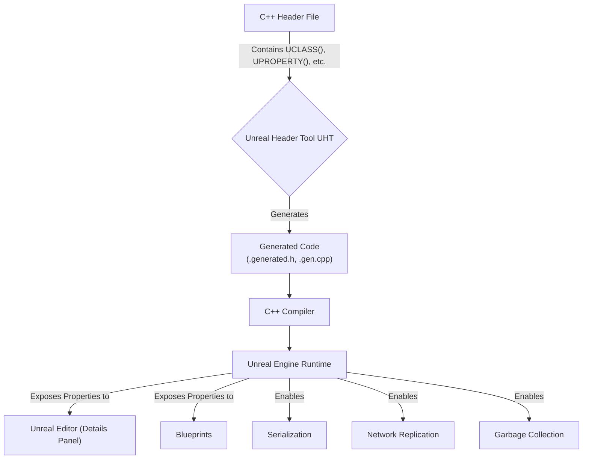
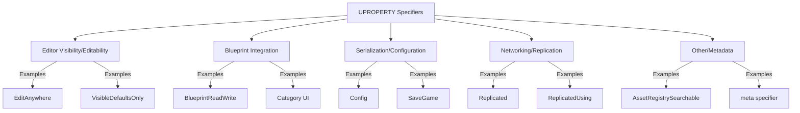
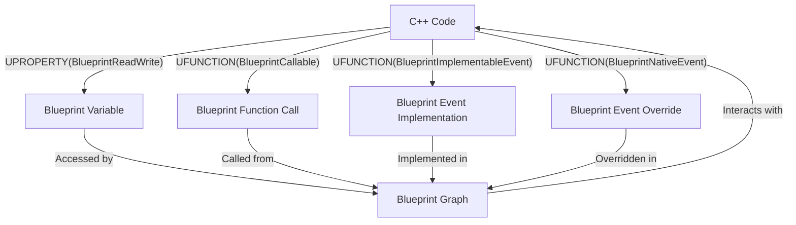

# Unreal Property System - Visualized

Unreal Engine's Property System, driven by the `UPROPERTY` macro and the Unreal Header Tool (UHT), is a cornerstone for integrating C++ code with the engine's powerful features, including the editor, Blueprints, serialization, and networking.

## Summary

The Property System enables C++ variables to be exposed and managed by the Unreal Engine runtime. This allows for automatic handling of memory, saving/loading data, synchronizing values across a network, and providing a seamless interface for designers to interact with C++ code through the Unreal Editor and Blueprints.

### 1. UPROPERTY Macro and Specifiers

`UPROPERTY` is a macro used to expose C++ member variables to the Unreal Engine. It allows you to define how a property behaves within the engine, using various specifiers.

*   **Visibility/Editability in Editor:**
    *   `VisibleAnywhere`: Visible in Details panel for instances and Blueprints, but not editable.
    *   `VisibleDefaultsOnly`: Visible only in Class Defaults for instances and Blueprints.
    *   `EditAnywhere`: Visible and editable in Details panel for instances and Blueprints.
    *   `EditDefaultsOnly`: Visible and editable only in Class Defaults for instances and Blueprints.
    *   `AdvancedDisplay`: Places the property in an advanced (collapsible) section.
*   **Blueprint Integration:**
    *   `BlueprintReadOnly`: Readable by Blueprints, not modifiable. Incompatible with `BlueprintReadWrite`.
    *   `BlueprintReadWrite`: Readable and writable from Blueprints.
    *   `Category="MyCategory"`: Organizes the property in the Details panel and Blueprint nodes. Nested categories use `|` (e.g., `Category="MyCategory|SubCategory"`).
*   **Serialization and Configuration:**
    *   `Config`: Property value can be loaded/saved to an `.ini` file for external configuration.
    *   `GlobalConfig`: Similar to `Config`, but loads from the base class's config.
    *   `SaveGame`: Marks the property for inclusion in save game data.
*   **Networking/Replication:**
    *   `Replicated`: Property value synchronized from server to all clients.
    *   `ReplicatedUsing=FunctionName`: Property is replicated, and `FunctionName` (an `OnRep_` function) is called on clients when the value changes.
    *   `NotReplicated`: Prevents the property from being replicated.
*   **Other:**
    *   `AssetRegistrySearchable`: Property and its value added to the Asset Registry.
    *   `meta=(key=value)`: Provides additional metadata for editor behavior (e.g., `ClampMin`, `ClampMax`, `UIMin`, `UIMax`, `AllowPrivateAccess`).

### 2. Unreal Header Tool (UHT)

The Unreal Header Tool (UHT) is a custom parsing and code generation tool that is indispensable for Unreal Engine's `UObject` system.

*   **Role of UHT:**
    *   **Reflection:** UHT processes C++ headers with `UCLASS`, `USTRUCT`, `UENUM`, `UFUNCTION`, and `UPROPERTY` macros. It generates boilerplate code (`.generated.h`, `.gen.cpp` files) that allows the engine to understand the structure of C++ classes, properties, and functions at runtime.
    *   **Garbage Collection:** Contributes to managing the lifecycle of `UObject` instances.
    *   **Serialization:** Generates code for saving and loading `UObject` data, handling property serialization to various archives.
    *   **Network Replication:** Generates boilerplate code for property and function replication across a network.
    *   **Editor Integration:** Enables properties and functions to be exposed and manipulated within the Unreal Editor.

### 3. Serialization

Unreal Engine uses `FArchive` objects for serialization. When saving or loading data, the engine iterates through `UPROPERTY`s. The `SaveGame` specifier is crucial for marking properties to be included in save game data, often used with `FMemoryWriter` and its `ArIsSaveGame` flag.

### 4. Replication Best Practices

Replication ensures game state synchronization between server and clients in multiplayer environments.

*   **Server-Authoritative:** Replication is primarily server-to-client. Clients do not directly update properties on the server or other clients.
*   **`Replicated` and `ReplicatedUsing`:**
    *   `UPROPERTY(Replicated)`: For simple value synchronization.
    *   `UPROPERTY(ReplicatedUsing=OnRep_MyProperty)`: For custom client-side logic when a replicated property changes. The `OnRep_` function is called on the client. Server must manually call `OnRep_` if it needs local execution.
*   **`GetLifetimeReplicatedProps`:** Override this function in `AActor` or `UActorComponent` derived classes to specify replicated properties using `DOREPLIFETIME` or `DOREPLIFETIME_CONDITION` macros.
*   **Conditional Replication:** Use `DOREPLIFETIME_CONDITION` with `COND_` flags (e.g., `COND_SimulatedOnly`) or custom conditions to control when and to whom properties are replicated, optimizing network bandwidth.
*   **Push Model Replication:** A more efficient model where properties are explicitly marked "dirty" to trigger replication (e.g., `MARK_PROPERTY_DIRTY_FROM_NAME`).
*   **Avoid Passing Actors Directly in RPCs/Replicated Events:** Pass unique identifiers (like `FNetworkGUID`) and resolve them on the receiving end to avoid lifetime and network overhead issues.
*   **`bReplicates = true`:** Ensure `AActor` or `UActorComponent` is set to replicate in its constructor.

### 5. Blueprint Integration Best Practices

Integrating C++ with Blueprints combines C++'s performance with Blueprint's rapid prototyping capabilities.

*   **C++ for Performance-Critical Logic:** Implement high-frequency updates, complex algorithms, and core game logic in C++.
*   **Expose C++ to Blueprints Judiciously:**
    *   `BlueprintCallable`: Allows Blueprints to call C++ functions. Use `BlueprintPure` for functions that don't modify state and return a value.
    *   `BlueprintImplementableEvent`: C++ function intended for Blueprint implementation.
    *   `BlueprintNativeEvent`: C++ function with a default C++ implementation, but can be overridden in Blueprints.
    *   `BlueprintReadOnly` / `BlueprintReadWrite`: Control access to C++ variables from Blueprints.
*   **Organize with Categories:** Use the `Category` specifier for `UPROPERTY` and `UFUNCTION` to keep the Blueprint editor tidy.
*   **Use Components for Shared Behavior:** Encapsulate functionalities in `UActorComponent`s for modularity and reusability.
*   **Interfaces over Casting:** Prefer C++ interfaces (`UInterface`) for robust, less coupled interactions between different actor types.
*   **Data Structures:** Manage complex data in C++ (`TArray`, `TMap`, `USTRUCT`s) and expose them as needed. `USTRUCT(BlueprintType)` allows C++ structs in Blueprints.
*   **Profile and Optimize:** Use tools like Unreal Insights to identify and address performance bottlenecks.

## Visualizations

### 1. UHT Workflow and Property System

### 2. UPROPERTY Specifier Categories

### 3. C++ to Blueprint Integration Flow

