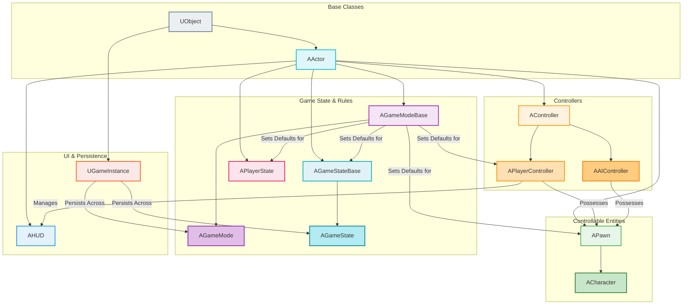
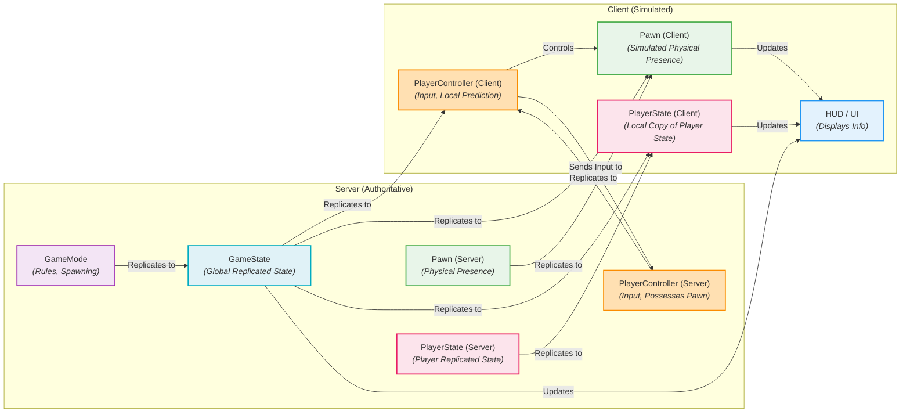

# Unreal Engine Gameplay Architecture - Visualized

This document provides a comprehensive, visual summary of the core classes that form the backbone of Unreal Engine's gameplay architecture, explaining their roles, relationships, and how they contribute to game logic.

## Summary

Unreal Engine's gameplay architecture is built upon a hierarchical system of core classes that work in concert to define game rules, player interactions, and the entities within a game world. Understanding this framework is fundamental to developing robust and scalable games in Unreal Engine. These classes provide a structured approach to managing everything from player input and character movement to game state and multiplayer synchronization.

### Core Gameplay Classes

1.  **Actor (`AActor`):**
    *   **Description:** The most fundamental building block in Unreal Engine. An `AActor` is any object that can be placed or spawned into a level. It has a 3D transform (location, rotation, scale) and can be created and destroyed during gameplay.
    *   **Role:** Serves as a container for `Components` (e.g., `StaticMeshComponent`, `MovementComponent`), which define its behavior and appearance. Actors can "tick" (update) each frame for continuous logic.

2.  **Pawn (`APawn`):**
    *   **Description:** A specialized type of `AActor` that represents a physical entity within the game world that can be controlled by either a player or Artificial Intelligence (AI).
    *   **Role:** Embodies the physical presence of a player or AI. It can be "possessed" by a `Controller` (either `APlayerController` or `AAIController`) to receive input and execute actions.

3.  **Character (`ACharacter`):**
    *   **Description:** A common subclass of `APawn`, specifically designed for humanoid, vertically-oriented player characters. It comes with built-in movement capabilities and collision.
    *   **Role:** Provides out-of-the-box support for walking, running, jumping, swimming, and flying, along with a `CharacterMovementComponent` and a `CapsuleComponent` for collision.

4.  **Controller (`AController`):**
    *   **Description:** A non-physical `AActor` that possesses a `APawn` to control it. It acts as the "brain" for a Pawn.
    *   **Role:** Processes input (from a player or AI) and translates it into actions for the possessed Pawn. There are two main types:
        *   **PlayerController (`APlayerController`):** Represents the human player's will. It handles player input, manages the player's camera, and persists across level changes or Pawn respawns. It's a good place for player-specific data that shouldn't reset (e.g., score, inventory).
        *   **AIController (`AAIController`):** Controls AI-driven Pawns.

5.  **GameMode (`AGameModeBase` / `AGameMode`):**
    *   **Description:** Defines the rules and flow of the game for a specific level. It is a server-side-only class in multiplayer games.
    *   **Role:** Dictates fundamental gameplay aspects like player joining, spawning, win/loss conditions, and other game-specific behaviors. It also sets default classes for `Pawn`, `PlayerController`, `HUD`, `GameState`, and `PlayerState` for the level. `AGameMode` is a subclass of `AGameModeBase` with additional features for multiplayer, match-based games.

6.  **GameState (`AGameStateBase` / `AGameState`):**
    *   **Description:** Stores the global state of the game that is relevant to all connected clients. There is only one `AGameState` per game instance.
    *   **Role:** Replicates game-wide information to all clients, such as the current game phase, score, list of connected players, or time remaining. `AGameState` is a subclass of `AGameStateBase` with additional multiplayer-specific features.

7.  **PlayerState (`APlayerState`):**
    *   **Description:** Stores the state of a *single player* that is relevant to all other players (and the server). There is one `APlayerState` per connected player.
    *   **Role:** Replicates player-specific information like player name, score, team, and other persistent data that needs to be known by all clients. Unlike the `APawn`, the `APlayerState` persists across respawns.

8.  **HUD (`AHUD`):**
    *   **Description:** The Head-Up Display class, responsible for drawing 2D elements directly onto the player's screen.
    *   **Role:** Used for displaying game information like health bars, ammo counts, minimaps, and other UI elements. Often works in conjunction with UMG (Unreal Motion Graphics) widgets.

9.  **GameInstance (`UGameInstance`):**
    *   **Description:** A `UObject` that is created when the game starts and destroyed when the game ends. It persists across level changes.
    *   **Role:** Ideal for storing global, persistent data that needs to survive between different levels or maps (e.g., player settings, save game data, network session information).

### Flow of Control and Communication

In a typical Unreal Engine game, the flow of control and communication between these classes is as follows:

*   The **GameMode** is the central authority on the server, defining the rules and spawning default classes.
*   The **PlayerController** receives input from the player and translates it into commands for the **Pawn** it possesses.
*   The **Pawn** (or `Character`) executes the physical actions in the world based on commands from its Controller.
*   The **GameState** replicates global game information to all clients.
*   The **PlayerState** replicates individual player information to all clients.
*   The **HUD** (and UMG widgets) displays information to the player, often querying data from the PlayerController, Pawn, GameState, and PlayerState.
*   The **GameInstance** holds data that needs to persist across multiple levels.

## Visualizations

### 1. Core Gameplay Class Hierarchy and Relationships

This diagram illustrates the inheritance hierarchy and key relationships between the core gameplay classes.

### 2. Multiplayer Flow of Information

This diagram simplifies the flow of information and authority in a multiplayer Unreal Engine game.

