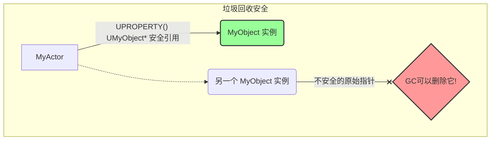
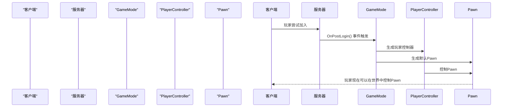
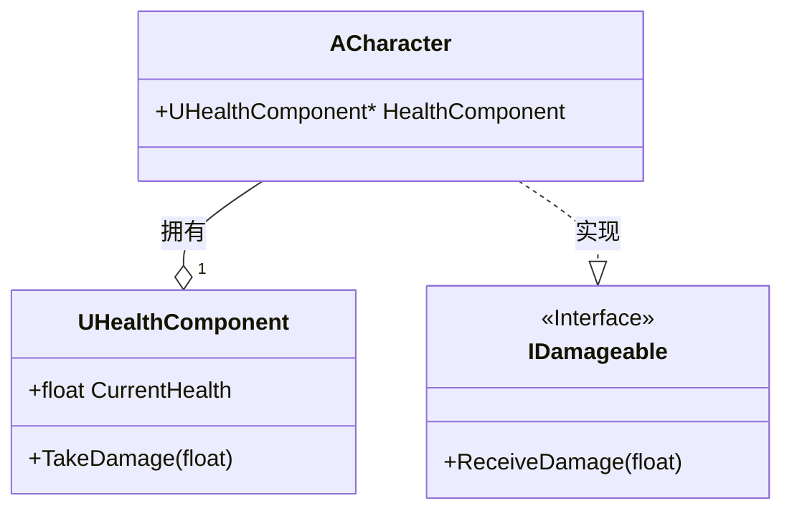
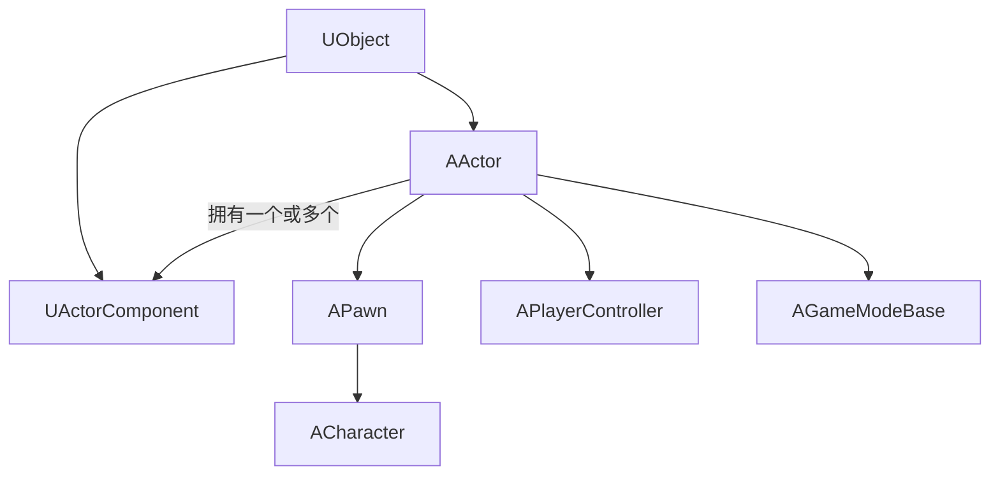
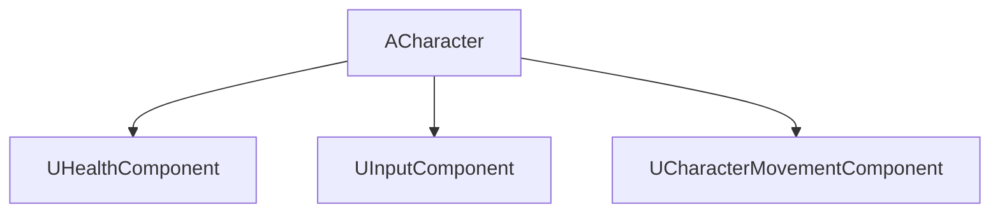
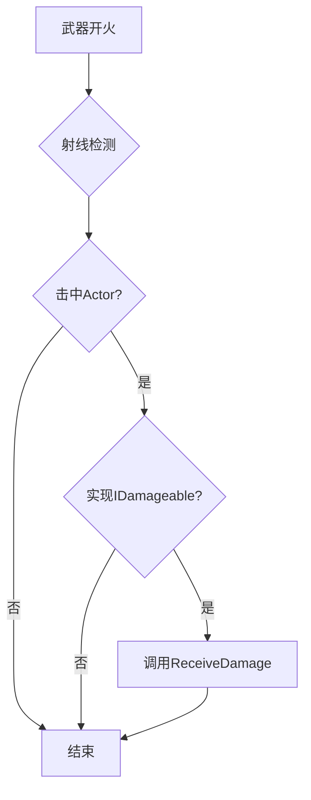
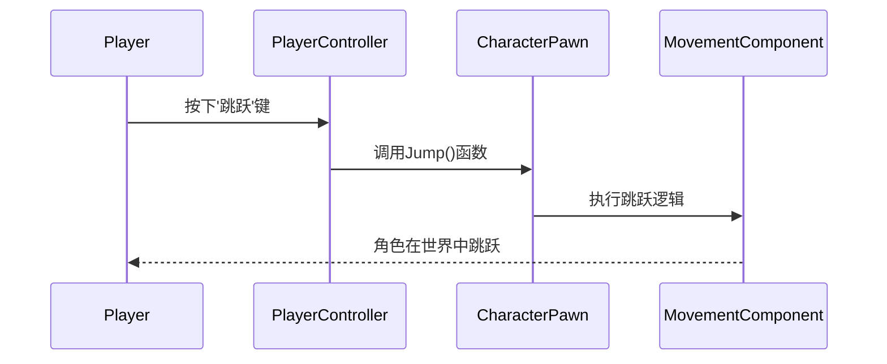

# 面向现代C++程序员的UE4学习指南

本指南专为拥有扎实C++11基础但刚接触虚幻引擎生态系统的程序员设计。它使用PDCA（计划-执行-检查-行动）循环和SOLID原则作为掌握UE4 C++范式框架。

---

## 第一阶段：计划 - 构建基础

本阶段专注于建立UE4工作方式的心智模型，从通用C++知识过渡到引擎的特定框架。目标是理解*为什么*UE4会如此设计。

### 核心概念路线图

#### UObject系统
这是虚幻引擎中C++的基础。`UCLASS()`、`UPROPERTY()`和`UFUNCTION()`等宏将您的标准C++代码暴露给虚幻引擎的反射系统。该系统是实现自动垃圾回收、序列化（保存/加载）、网络复制以及蓝图视觉脚本与C++代码交互能力的动力。对于C++程序员来说，这是最需要掌握的关键概念，因为它是将您的代码融入引擎其余部分的“魔法”。

#### 内存管理
忘掉`new`和`delete`。`UObject`由自动垃圾回收（GC）系统管理。任何`UObject*`成员变量都必须标记为`UPROPERTY()`，以通知GC它正在被引用，从而防止它被过早销毁。对于非UObject数据，虚幻引擎提供了自己的智能指针，如`TSharedPtr`和`TUniquePtr`，它们的功能与标准库类似，但已集成到引擎的生态系统中。理解这一点对于防止内存泄漏和悬挂指针崩溃至关重要。



#### Actor-Component模型
这是虚幻引擎对“组合优于继承”原则的回答。`AActor`是可以放置在世界中的任何对象（例如角色、灯、触发器）。`UActorComponent`是可以附加到Actor的功能片段（例如生命值、移动、库存）。您不是通过创建庞大的继承树来构建Actor，而是通过将它们由更小的、可重用的组件组合而成。这是单一职责原则和开闭原则的直接体现。

#### 游戏框架
这是一组为您的游戏提供结构的类。它对于多人游戏和清晰的架构至关重要。
*   **GameMode:** 游戏的规则（仅限服务器端）。
*   **GameState:** 游戏的状态，复制到所有客户端（例如分数、比赛时间）。
*   **PlayerController:** 玩家的“意志”，接收输入并指导一个Pawn。
*   **PlayerState:** 特定玩家的状态，复制到所有客户端（例如姓名、分数）。
*   **Pawn/Character:** 玩家或AI在世界中的物理表现。`Character`是一种特殊的`Pawn`，具有内置的移动逻辑。



#### UE4接口 (`UInterface`)
接口是类可以承诺实现的行为契约。在虚幻中，这是通过`UInterface`完成的。这是实现真正解耦的方式。例如，您可以创建一个`IDamageable`接口。现在，射弹不需要知道它击中的是`AEnemy`还是`BreakableBarrel`；它只需要知道它击中的对象是否实现了`IDamageable`。这就是依赖倒置原则的实际应用，也是编写可扩展、可维护代码的关键。

#### 构建系统
虚幻引擎使用自己的虚幻构建工具（UBT）。项目中的每个代码模块都有一个`[ModuleName].Build.cs`文件。这个C#文件是您定义模块依赖项的地方。如果您想使用Slate UI框架，您必须将“Slate”和“SlateCore”添加到您的公共或私有依赖模块列表中。忘记这样做是新手最常见的编译器/链接器错误来源之一。

### 推荐资源

*   **官方文档:**
    *   [虚幻引擎 C++ API 参考](https://docs.unrealengine.com/en-US/API/index.html)
    *   [Actors and Components](https://docs.unrealengine.com/en-US/ProgrammingAndScripting/ProgrammingWithCPP/ActorsAndComponents/index.html)
    *   [Gameplay Framework](https://docs.unrealengine.com/en-US/ProgrammingAndScripting/GameplayArchitecture/index.html)
*   **社区教程:**
    *   **Tom Looman:** [Unreal Engine C++ Tutorials](https://www.tomlooman.com/unreal-engine-cpp-tutorials/)
    *   **Stephen Ulibarri (Udemy):** 备受推崇的综合课程。
*   **书籍:**
    *   "Game Development with C++ and Unreal Engine" by Stephen Whittle.

---

## 第二阶段：执行 - 实现与实践

通过构建一个小的、精美的“垂直切片”来应用所学的知识。

### 项目：简单的第三人称动作游戏

#### 里程碑

1.  **角色设置:** 创建一个可以移动和跳跃的C++ `ACharacter`。
2.  **组件创建:** 在C++中构建一个`UHealthComponent`并将其添加到角色中。使用简单的`UE_LOG`在屏幕上显示生命值。
3.  **接口实现:** 定义一个带有`ReceiveDamage`函数的`IDamageable` C++接口。让玩家角色和一个简单的“虚拟”`AActor`实现它。
4.  **交互:** 创建一个武器或射弹，在重叠时检查另一个actor是否实现了`IDamageable`并调用接口函数。
5.  **蓝图集成:** 创建C++角色的蓝图版本，以方便地调整移动速度或生命值等变量。

#### 实用代码片段

以下是`UHealthComponent`和`IDamageable`接口的更完整示例。

**IDamageable.h**
```cpp
#pragma once

#include "CoreMinimal.h"
#include "UObject/Interface.h"
#include "Damageable.generated.h"

UINTERFACE(MinimalAPI)
class UDamageable : public UInterface
{
    GENERATED_BODY()
};

class IDamageable
{
    GENERATED_BODY()

public:
    // 实现此接口的类必须定义此函数。
    UFUNCTION(BlueprintNativeEvent, BlueprintCallable, Category = "Damage")
    void ReceiveDamage(float Amount);
};
```

**UHealthComponent.h**
```cpp
#pragma once

#include "CoreMinimal.h"
#include "Components/ActorComponent.h"
#include "HealthComponent.generated.h"

UCLASS( ClassGroup=(Custom), meta=(BlueprintSpawnableComponent) )
class YOURPROJECT_API UHealthComponent : public UActorComponent
{
    GENERATED_BODY()

public:
    UHealthComponent();

protected:
    virtual void BeginPlay() override;

    UPROPERTY(EditAnywhere, BlueprintReadWrite, Category = "Health")
    float MaxHealth = 100.0f;

    UPROPERTY(VisibleAnywhere, BlueprintReadOnly, Category = "Health")
    float CurrentHealth;

public:
    UFUNCTION(BlueprintCallable, Category = "Health")
    void TakeDamage(float DamageAmount);
};
```

**UHealthComponent.cpp**
```cpp
#include "HealthComponent.h"

UHealthComponent::UHealthComponent()
{
    PrimaryComponentTick.bCanEverTick = false;
}

void UHealthComponent::BeginPlay()
{
    Super::BeginPlay();
    CurrentHealth = MaxHealth;
}

void UHealthComponent::TakeDamage(float DamageAmount)
{
    CurrentHealth = FMath::Clamp(CurrentHealth - DamageAmount, 0.0f, MaxHealth);
    if (CurrentHealth <= 0)
    {
        UE_LOG(LogTemp, Warning, TEXT("%s 已被击败!"), *GetOwner()->GetName());
    }
}
```

#### 代码结构可视化

此图显示了`ACharacter`如何拥有一个`UHealthComponent`并同时实现`IDamageable`接口。



### 连接C++与虚幻编辑器

*   **`UPROPERTY()` 说明符:** `UHealthComponent.h`中`MaxHealth`上的`EditAnywhere`说明符允许您直接在任何拥有此组件的actor的“详细信息”面板中更改其值。`VisibleAnywhere`使`CurrentHealth`可见但不可编辑。
*   **从C++创建蓝图:** 在内容浏览器中右键单击您的C++角色类，然后选择“基于...创建蓝图类”。这将创建一个新的蓝图资产，它继承了所有的C++逻辑，但允许设计师在不接触代码的情况下更改属性或添加视觉组件。
*   **附加组件:** 在Actor的蓝图中，您可以单击“+ 添加组件”并搜索您的`HealthComponent`以直接添加它。

---

## 第三阶段：检查 - 验证与调试

持续根据您正在学习的原则评估您的工作。

### SOLID自查清单

*   **SRP:** “这个类是否有多个需要更改的理由？”（例如，我的角色类是否同时管理其库存和任务日志？）
*   **OCP:** “我能否在不更改角色类的情况下添加一种新型武器？”
*   **LSP:** “如果我制作一个继承自`BaseEnemy`的`SuperEnemy`，我能否在任何期望`BaseEnemy`的地方使用它而不会破坏东西？”
*   **ISP:** “我的接口是否小而专注（`IDamageable`、`IInteractable`），而不是一个巨大的`IGameplayActions`接口？”
*   **DIP:** “我的高层武器逻辑是依赖于底层的`AMonster`类，还是依赖于像`IDamageable`这样的抽象？”

### 核心调试与分析

*   **日志记录:** 使用`UE_LOG(LogTemp, Warning, TEXT("My value is %f"), MyFloatVariable);`将消息打印到输出日志。
*   **调试器:** 在Visual Studio/Rider中设置断点，并使用“附加到编辑器”功能实时调试您的C++代码。
*   **Unreal Insights:** 一个强大的性能分析工具。用它来找出是什么拖慢了您的游戏。

---

## 第四阶段：行动 - 优化与改进

根据“检查”阶段的结果，采取具体步骤进行改进。

### C++开发者的常见陷阱

*   **忘记调用`Super::`:** 在覆盖像`BeginPlay()`或`Tick()`这样的引擎函数时，始终在开始时调用`Super::BeginPlay();`以确保父类的逻辑得以运行。
*   **垃圾回收:** 作为成员变量存储的任何`UObject*`指针**必须**是`UPROPERTY()`，才能对垃圾回收器可见。否则，它可能会被意外删除，导致崩溃。
*   **构建错误:** 如果您为不同的模块（例如`GameplayAbilities`）添加了新的`#include`，您必须将该模块的名称添加到您项目的`YourProject.Build.cs`文件中。

### 挑战目标

*   将一段蓝图逻辑重构为一个干净、可重用的C++ `UActorComponent`。
*   创建第二种武器类型，使用相同的`IDamageable`接口造成持续伤害。
*   学习游戏玩法能力系统（GAS）并实现一个能力。

---

## 附录：UE4架构图

#### UE4 C++框架架构


#### SRP和OCP用例


#### 解耦伤害系统的数据流 (DIP/ISP)



#### 输入到动作的数据流

