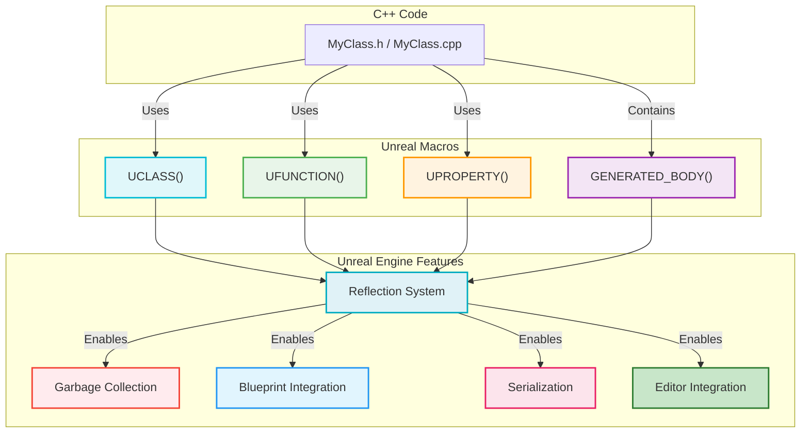
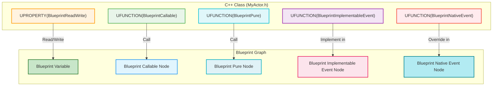

# Programming with C++ in Unreal Engine - Visualized

This document provides a comprehensive, visual summary of programming with C++ in Unreal Engine, focusing on its unique reflection system, core macros, and best practices for integrating C++ with the engine and Blueprint.

## Summary

Unreal Engine leverages C++ as its primary development language, but it extends standard C++ with a powerful reflection system. This system, enabled by specific macros, allows the engine to understand and interact with your C++ code in ways that pure C++ cannot. This integration is crucial for features like garbage collection, serialization, Blueprint interoperability, and editor integration, making C++ a robust and efficient choice for game development in Unreal.

### Unreal's Reflection System and Core Macros

The heart of Unreal Engine's C++ integration lies in its reflection system, which uses a set of macros to generate metadata and boilerplate code during compilation. This metadata allows the engine to query information about your classes, functions, and properties at runtime.

*   **`GENERATED_BODY()`:** This macro is placed at the beginning of any `UCLASS`, `USTRUCT`, or `UENUM` definition. It's responsible for generating all the necessary boilerplate code for Unreal's reflection system, including constructors, property accessors, and other essential functions.

*   **`UCLASS()`:**
    *   **Purpose:** Exposes a C++ class to the Unreal Engine's reflection system, making it recognizable by the editor, garbage collector, and Blueprint.
    *   **Inheritance:** `UCLASS`es typically inherit from `UObject` (for general-purpose objects) or `AActor` (for objects that can be placed in the world). Classes inheriting from `UObject` are prefixed with `U` (e.g., `UGameInstance`), and those from `AActor` are prefixed with `A` (e.g., `APawn`).
    *   **Key Specifiers:**
        *   `Blueprintable`/`BlueprintType`: Allows Blueprints to be based on or store instances of your C++ class.
        *   `Abstract`: Marks a class as abstract, preventing direct instantiation.
        *   `Category`: Organizes classes in the Blueprint editor's context menus.
        *   `MinimalAPI`: Reduces generated code for faster compilation.

*   **`UFUNCTION()`:**
    *   **Purpose:** Exposes a C++ function to the Unreal Engine's reflection system, allowing it to be called from Blueprints, respond to network events, or act as console commands.
    *   **Key Specifiers:**
        *   `BlueprintCallable`: Allows the function to be executed from Blueprints.
        *   `BlueprintPure`: For functions that do not modify the object's state and return a value. They appear as pure nodes in Blueprint (no execution pins).
        *   `BlueprintImplementableEvent`: Defines a function in C++ that is intended to be implemented *only* in Blueprints.
        *   `BlueprintNativeEvent`: Allows for both a native C++ implementation (using `_Implementation` suffix) and an override in Blueprints.
        *   `Category`: Organizes functions in Blueprint context menus.
        *   `Server`/`Client`/`NetMulticast`: Controls network replication behavior.
        *   `CallInEditor`: Allows the function to be executed directly from the Details panel in the editor.
        *   `Exec`: Exposes the function as a console command.

*   **`UPROPERTY()`:**
    *   **Purpose:** Exposes a C++ member variable to the Unreal Engine's reflection system, enabling features like serialization, garbage collection, editor visibility, and Blueprint access.
    *   **Key Specifiers:**
        *   `VisibleAnywhere`/`VisibleDefaultsOnly`: Controls visibility in the editor's Details panel (for all instances or only class defaults).
        *   `EditAnywhere`/`EditDefaultsOnly`: Controls editability in the editor's Details panel.
        *   `BlueprintReadOnly`/`BlueprintReadWrite`: Allows Blueprints to read or read/write the property's value.
        *   `Category`: Organizes properties in the Details panel.
        *   `Config`: Allows the property to be loaded/saved from `.ini` configuration files.
        *   `BlueprintSetter`: Assigns a function to handle setting the property's value in Blueprints, enabling custom logic on change.
        *   `TObjectPtr`: Best practice for `UObject` pointers in `UPROPERTY` definitions, ensuring proper garbage collection management.

*   **`USTRUCT()` / `UENUM()`:**
    *   **Purpose:** Exposes C++ structs and enums to the reflection system, allowing them to be used in Blueprints and benefit from serialization.

### Common Unreal C++ Types

Unreal Engine provides its own set of container classes and string types optimized for engine use:

*   **`TArray<T>`:** Unreal's dynamic array, similar to `std::vector`, but with optimizations for engine memory management and serialization.
*   **`TMap<KeyType, ValueType>`:** Unreal's hash map, similar to `std::map` or `std::unordered_map`.
*   **`FString`:** Mutable, dynamically sized string class, primarily for user-facing text and manipulation.
*   **`FName`:** Immutable, case-insensitive string identifier, optimized for fast comparisons and lookup. Ideal for asset names, bone names, etc.
*   **`FText`:** Localized text class, designed for displaying text to the user in a language-agnostic way.

### Memory Management Basics

Unreal Engine employs a sophisticated memory management system:

*   **Garbage Collection (for `UObject`s):** `UObject` instances are managed by Unreal's garbage collector. As long as a `UObject` is referenced by a `UPROPERTY` or added to a root set, it will not be garbage collected. This simplifies memory management for engine-managed objects.
*   **Smart Pointers (for non-`UObject`s):** For non-`UObject` C++ classes, Unreal provides its own set of smart pointers (`TSharedPtr`, `TWeakPtr`, `TUniquePtr`) to manage memory safely and prevent leaks. (Refer to the "Smart Pointers Visualized" document for more details).

## Visualizations

### 1. Unreal C++ Reflection System Overview

This diagram illustrates how Unreal's macros enable the reflection system to integrate C++ code with various engine features.

### 2. Blueprint Interoperability with C++

This diagram shows how `UFUNCTION` and `UPROPERTY` specifiers control interaction between C++ and Blueprint.

