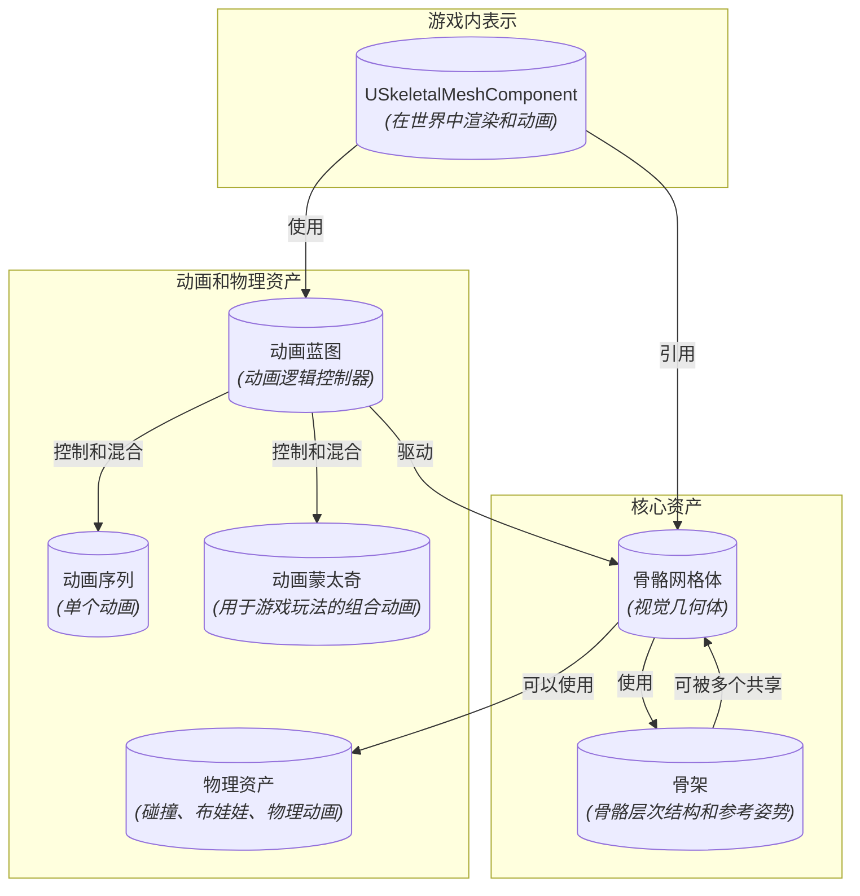
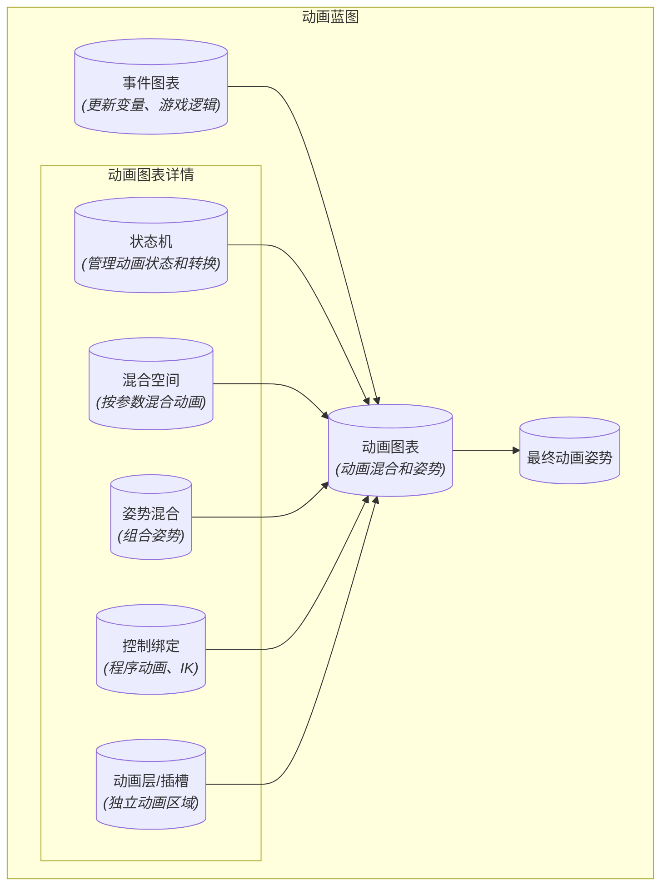
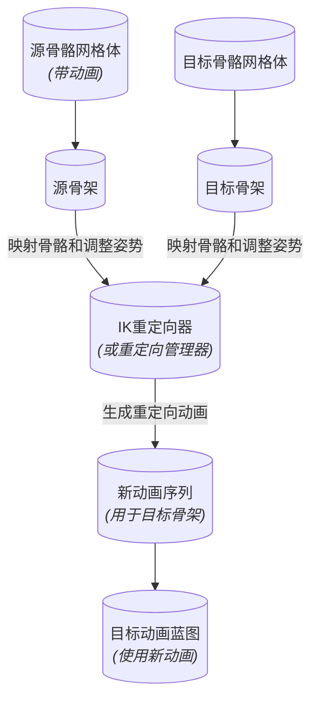

# 骨骼网格体资产 - 可视化

本文档全面概述了虚幻引擎的骨骼网格体动画系统，涵盖了核心概念、组件和工作流程。

## 概述

**骨骼网格体（Skeletal Mesh）**是使用分层“骨架”骨骼绑定的3D模型，能够实现复杂的变形和动画。这些资产对于在虚幻引擎中动画化角色、生物和其他动态对象至关重要。动画系统高度模块化，可以灵活控制这些网格体的移动和交互方式。

### 骨骼网格体生态系统

骨骼网格体的创建和动画涉及几个相互关联的资产：

*   **骨骼网格体：** 这是在游戏世界中渲染的视觉几何体（“皮肤”）。它绑定到特定的骨架资产。
*   **骨架（Skeleton）：** 代表分层骨骼结构的基本资产。单个骨架资产可以被多个骨骼网格体共享，这对于动画重定向和高效资产管理至关重要。它定义了骨骼名称、层次结构和参考姿势。
*   **物理资产（Physics Asset，PhAT）：** 自动生成或手动创建，此资产为骨架中的每根骨骼（或骨骼组）定义了一个简化的碰撞体。它用于：
    *   **布娃娃物理（Ragdoll Physics）：** 在受到撞击或死亡时模拟逼真的松软身体运动。
    *   **物理动画（Physical Animation）：** 根据物理交互驱动动画（例如，角色披风在风中飘动）。
    *   **碰撞：** 为骨骼网格体提供精确的碰撞检测。
*   **动画序列（Animation Sequences）：** 单个的线性动画（例如，“行走”、“奔跑”、“跳跃开始”）。这些通常从DCC应用程序导入。
*   **动画蒙太奇（Animation Montages）：** 一个强大的工具，用于将多个动画序列组合成一个资产，常用于游戏特定的动作，如攻击、施法或反应。它们允许精确控制混合、循环和基于插槽的动画播放。
*   **动画蓝图（Animation Blueprints，AnimBP）：** 控制和混合动画的中心枢纽。它是一个可视化脚本图表，定义了骨骼网格体如何动画的逻辑。

### 动画蓝图：逻辑控制器

动画蓝图对于使骨骼网格体栩栩如生至关重要。它们由几个关键图表组成：

*   **动画图表（AnimGraph）：** 构建动画逻辑的主要图表。它使用节点网络来混合、摆姿势和修改动画。主要功能包括：
    *   **状态机（State Machines）：** 管理复杂的动画状态（例如，空闲、行走、奔跑、跳跃），并根据游戏逻辑（例如，“速度 > 0”从空闲过渡到行走）定义它们之间的转换。
    *   **混合空间（Blend Spaces）：** 允许根据一个或多个输入参数混合多个动画（例如，根据速度和方向混合行走、奔跑和扫射动画）。
    *   **姿势混合（Pose Blending）：** 组合不同的姿势或动画。
    *   **控制绑定（Control Rigs）：** 用于程序动画和逆运动学（IK）。
    *   **动画层/插槽（Animation Layers/Slots）：** 定义骨架的特定区域，动画可以在这些区域独立播放（例如，“全身”插槽用于移动，“上半身”插槽用于瞄准）。
*   **事件图表（EventGraph）：** 类似于标准蓝图事件图表，这是游戏逻辑与AnimBP交互的地方。它用于更新驱动AnimGraph动画逻辑的变量（例如，速度、方向、生命值）。
*   **曲线（Curves）：** 动画曲线可用于根据动画的进度驱动各种参数，例如材质属性、形变目标，甚至游戏逻辑。

### 动画重定向

动画重定向是将为某个骨架创建的动画适配到另一个可能不同的骨架上。这极大地节省了时间，允许开发人员在各种角色之间重用动画资产，即使它们具有不同的比例或骨骼结构。虚幻引擎提供了强大的重定向工具，包括：

*   **IK重定向器（IK Retargeter）：** 一种现代工具，用于在不同骨架之间传输动画，提供对骨骼映射和姿势调整的高级控制。
*   **重定向管理器（Retarget Manager，旧版）：** 一个较旧的重定向系统，仍然可用，但新项目通常已被IK重定向器取代。

### USkeletalMeshComponent

`USkeletalMeshComponent`是附加到游戏世界中Actor的实际组件，负责渲染骨骼网格体并播放其关联的动画蓝图。它充当视觉资产和动画逻辑之间的桥梁。

## 可视化

### 1. 骨骼网格体资产生态系统概述

此图说明了骨骼网格体动画中涉及的核心资产之间的关系。

### 2. 动画蓝图内部结构

此图分解了动画蓝图中的关键组件和流程。

### 3. 动画重定向工作流程

此流程图说明了在不同骨骼网格体之间重用动画的过程。

