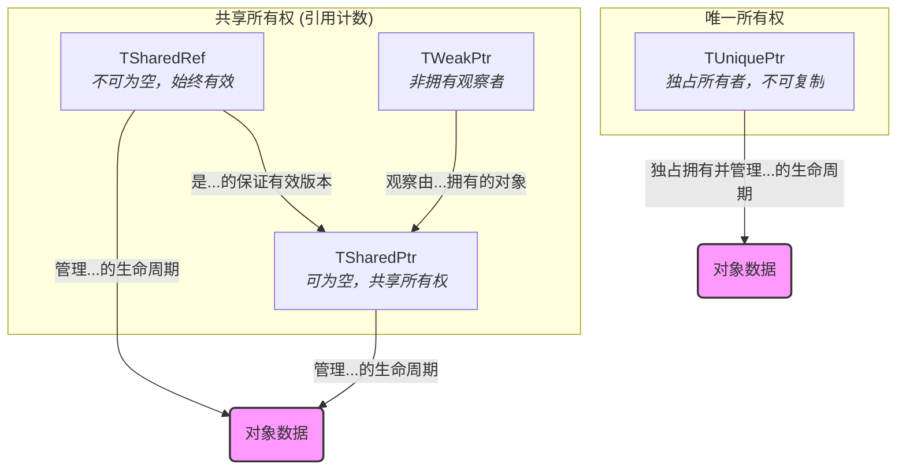
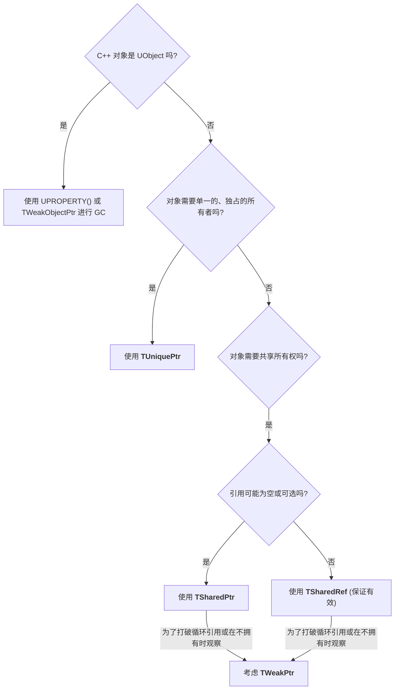
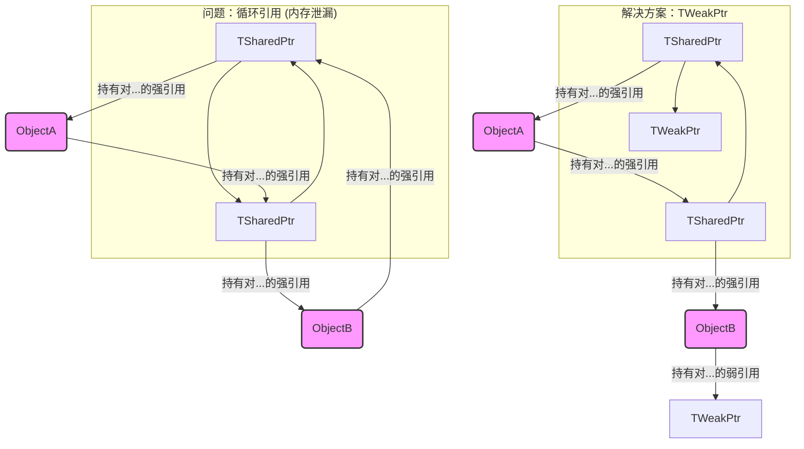

# Unreal 引擎智能指针 - 可视化

本文档深入探讨了虚幻引擎的自定义智能指针，旨在为非 UObject C++ 类型提供强大的内存管理。理解这些智能指针对于在虚幻引擎框架内编写安全、高效和现代的 C++ 代码至关重要。

## 概述

在 C++ 中，手动内存管理可能导致常见的内存泄漏（忘记 `delete` 分配的内存）和悬垂指针（在内存释放后访问内存）问题。虚幻引擎通过提供自己的智能指针套件来解决非 `UObject` 类型的这些挑战，这些智能指针通过所有权语义自动管理对象生命周期。

**关键区别：** 这些智能指针**仅适用于不继承自 `UObject` 的 C++ 对象**。`UObject` 实例由虚幻引擎的垃圾回收 (GC) 系统管理，主要通过 `UPROPERTY()` 声明和 `TWeakObjectPtr` 进行弱引用。

### 为什么选择虚幻引擎的智能指针？

尽管 C++11 引入了 `std::shared_ptr`、`std::unique_ptr` 和 `std::weak_ptr`，但虚幻引擎使用自己的实现（`TSharedPtr`、`TUniquePtr`、`TWeakPtr`）有几个原因：

*   **自定义分配器：** 虚幻引擎使用自己的内存分配器，这些分配器针对游戏开发进行了优化，并且通常与其内存跟踪和调试工具集成。
*   **引擎特定功能：** 引擎的智能指针可以更深入地与其他引擎系统集成（如果需要）。
*   **一致性：** 在引擎的代码库中提供一致的内存管理范例。

### 智能指针类型及其用法

#### 1. 共享指针 (`TSharedPtr` 和 `TSharedRef`)

这些实现了共享的、引用计数的的所有权模型。它们指向的对象在最后一个引用它的 `TSharedPtr` 或 `TSharedRef` 被销毁时会自动销毁。

*   **`TSharedPtr<Type>`：**
    *   **可为空：** 可以是 `nullptr`（空）。当对对象的引用可能不总是存在时使用。
    *   **创建：** 通常使用 `MakeShared<Type>(...)` 创建，以实现高效分配。
    *   **访问：** 使用 `Get()` 获取原始指针，使用 `IsValid()` 检查它是否持有有效对象，或使用 `operator*` 和 `operator->` 进行直接访问。
    *   **示例：**
        ```cpp
        class FMyData { /* ... */ };
        TSharedPtr<FMyData> DataPtr = MakeShared<FMyData>();
        if (DataPtr.IsValid())
        {
            DataPtr->DoSomething();
        }
        ```

*   **`TSharedRef<Type>`：**
    *   **不可为空：** 必须始终引用一个有效对象。不能是 `nullptr`。
    *   **创建：** 也通常使用 `MakeShared<Type>(...)` 创建，然后隐式转换，或从保证有效的 `TSharedPtr` 显式构造。
    *   **用例：** 当您*知道*对象必须存在并且您希望在编译时强制执行该保证时，它是理想的选择。
    *   **访问：** `operator*` 和 `operator->` 始终可以安全使用。
    *   **示例：**
        ```cpp
        TSharedRef<FMyData> DataRef = MakeShared<FMyData>(); // 始终有效
        DataRef->DoSomethingElse();
        ```

#### 2. 弱指针 (`TWeakPtr`)

`TWeakPtr` 是一个非拥有指针，它持有对由 `TSharedPtr` 或 `TSharedRef` 管理的对象的“弱”引用。它不计入对象的引用计数，这意味着它不会阻止对象被删除。

*   **目的：** 主要用于打破 `TSharedPtr` 之间的**循环引用**，否则会导致内存泄漏。
*   **安全性：** 为了安全地访问对象，您必须首先使用 `Pin()` 方法将 `TWeakPtr` 转换为 `TSharedPtr`。如果对象仍然存在，`Pin()` 将返回一个有效的 `TSharedPtr`；如果对象已被销毁，则返回一个空的 `TSharedPtr`。
*   **示例：**
    ```cpp
    TSharedPtr<FMyData> Data = MakeShared<FMyData>();
    TWeakPtr<FMyData> WeakData = Data; // 弱观察 Data

    if (TSharedPtr<FMyData> PinnedData = WeakData.Pin())
    {
        PinnedData->DoSomething(); // 对象仍然存在
    }
    else
    {
        // 对象已被销毁
    }
    ```

#### 3. 唯一指针 (`TUniquePtr`)

`TUniquePtr` 提供对对象的独占、唯一的所有权。任何时候只有一个 `TUniquePtr` 可以指向给定对象。当 `TUniquePtr` 超出作用域时，它拥有的对象会自动删除。

*   **所有权转移：** `TUniquePtr` 不能被复制；所有权只能使用 `MoveTemp`（类似于 `std::move`）进行*移动*。这强制执行了单一所有者策略。
*   **用例：** 非常适合在其生命周期内具有明确、单一所有者的对象。
*   **创建：** 通常使用 `MakeUnique<Type>(...)` 创建。
*   **示例：**
    ```cpp
    TUniquePtr<FMyData> UniqueData = MakeUnique<FMyData>();
    // TUniquePtr<FMyData> AnotherUniqueData = UniqueData; // 编译错误：无法复制
    TUniquePtr<FMyData> MovedData = MoveTemp(UniqueData); // 所有权转移
    // UniqueData 现在为空，MovedData 拥有该对象
    ```

### 常见陷阱和最佳实践

*   **混合原始指针：** 避免长时间存储指向由智能指针管理的对象原始指针，因为如果智能指针释放所有权，原始指针可能会变成悬垂指针。
*   **循环依赖：** 注意 `TSharedPtr` 循环引用。如果对象 A 拥有一个指向对象 B 的 `TSharedPtr`，而对象 B 拥有一个指向对象 A 的 `TSharedPtr`，那么两者都不会被销毁。使用 `TWeakPtr` 作为其中一个引用来打破循环。
*   **性能：** 尽管方便，智能指针会带来少量开销（例如，`TSharedPtr` 的引用计数）。对于性能要求极高、生命周期短的对象，可以考虑使用原始指针，但始终优先考虑安全性和正确性。
*   **`UObject` 与非 `UObject`：** 始终记住基本规则：`UObject` 使用 GC，非 `UObject` 使用智能指针（如果绝对必要且经过仔细管理，则手动 `new`/`delete`）。

## 可视化

### 1. 智能指针所有权模型

此图说明了虚幻引擎智能指针的不同所有权语义。



### 2. 智能指针决策流程图

此流程图指导您为非 UObject C++ 类选择合适的智能指针。



### 3. TWeakPtr 用于打破循环引用

此图显示了 `TWeakPtr` 如何帮助解决 `TSharedPtr` 之间的循环依赖。

