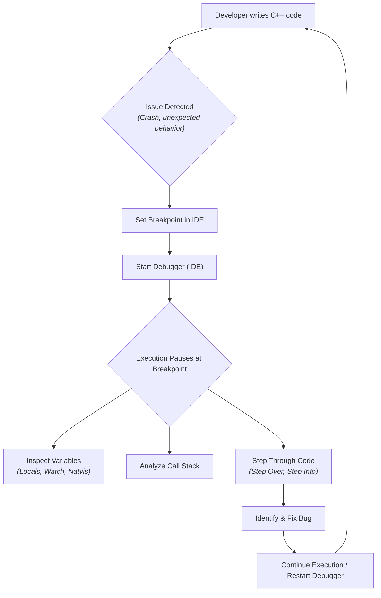
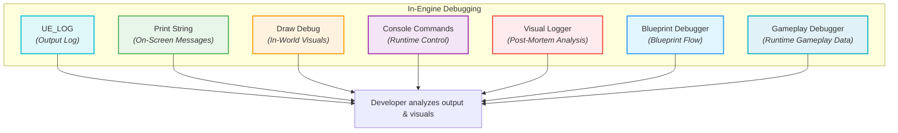

# Debugging C++ in Unreal Engine - Visualized

This document provides a comprehensive, visual summary of techniques and tools for debugging C++ code within Unreal Engine, covering both IDE-based and in-engine approaches.

## Summary

Debugging C++ in Unreal Engine is a critical skill for any developer. Unreal Engine provides a rich ecosystem of tools and features that integrate with standard IDE debuggers (like Visual Studio or Rider) and offer powerful in-engine debugging capabilities. Effective debugging involves understanding call stacks, inspecting variables, logging information, and visualizing runtime data to pinpoint and resolve issues efficiently.

### Core Debugging Principles

*   **Breakpoints:** Pause execution at specific lines of code to inspect the program's state.
*   **Stepping:** Execute code line by line to follow the program flow (`Step Over`, `Step Into`, `Step Out`).
*   **Variable Inspection:** Examine the values of variables, objects, and expressions in real-time.
*   **Call Stack Analysis:** Understand the sequence of function calls that led to the current execution point.
*   **Logging:** Output messages to a console or log file to track program execution.
*   **Visualization:** Render debug information directly in the game world to understand spatial or temporal issues.

### 1. IDE Debuggers (Visual Studio / Rider)

Integrated Development Environments (IDEs) offer the most powerful and granular control over C++ debugging.

*   **Visual Studio Debugger (Windows):** The primary debugger for Unreal Engine on Windows.
    *   **Breakpoints:** Set breakpoints in C++ code. Conditional breakpoints can be configured to trigger only when specific conditions are met.
    *   **Stepping:** Use `F10` (Step Over), `F11` (Step Into), `Shift+F11` (Step Out) to navigate code execution.
    *   **Variable Windows:** Utilize "Locals," "Autos," and "Watch" windows to inspect variable values. Unreal Engine uses `Unreal.natvis` files to provide human-readable views of complex engine types.
    *   **Call Stack Window:** Shows the sequence of function calls, invaluable for tracing the origin of bugs.
    *   **Editor Symbols for Debugging:** Essential for debugging Unreal Engine's source code. These can be installed via the Epic Games Launcher.
    *   **Visual Studio Tools for Unreal Engine:** A plugin that enhances integration, allowing features like debugging C++ code called by Blueprints and viewing Blueprint node pin values.

*   **Rider (Cross-Platform):** A popular alternative IDE that provides similar robust debugging features for Unreal Engine projects.

### 2. In-Engine Debugging Tools

Unreal Engine provides several built-in tools for debugging, especially useful for runtime behavior and visual feedback.

*   **Logging (`UE_LOG`):** The primary method for outputting messages to the Unreal Engine Output Log. Supports categories, verbosity levels (Log, Warning, Error, Display, Verbose, VeryVerbose), and formatted output (`UE_LOGFMT`).
    ```cpp
    UE_LOG(LogTemp, Warning, TEXT("MyActor %s has health %f"), *GetName(), Health);
    ```

*   **Print Statements (`Print String`):** Simple way to display text messages directly on the screen (Blueprint `Print String` node) or in C++ (`GEngine->AddOnScreenDebugMessage`). Ideal for quick visual feedback.

*   **Draw Debug Functions:** Visualize geometric shapes, lines, spheres, boxes, and traces directly in the game world. Extremely useful for debugging physics, collision, line traces, and AI perception.
    ```cpp
    DrawDebugLine(GetWorld(), StartLocation, EndLocation, FColor::Red, false, 5.f, 0, 5.f);
    ```

*   **Unreal Engine Console (`~` key):** A powerful in-game console for executing commands, changing console variables (`cvars`), and viewing logs. Commands like `ShowDebug [Category]` can display real-time debug information for various systems (e.g., `ShowDebug AI`, `ShowDebug Collision`).

*   **Visual Logger:** A specialized tool for recording and reviewing visual representations of gameplay events and states over time within the editor. Excellent for post-mortem analysis of complex sequences.

*   **Blueprint Debugger:** A visual tool within the Unreal Editor for stepping through Blueprint execution, inspecting variables, and understanding Blueprint logic. Crucial when C++ and Blueprint interact.

*   **Gameplay Debugger:** A runtime tool for analyzing real-time gameplay data, particularly useful for complex game logic, AI, and replication issues.

*   **Live Coding:** Allows recompiling and applying C++ code changes at runtime without restarting the Unreal Editor. Significantly speeds up iteration during debugging.

### 3. Advanced Debugging Scenarios

*   **Remote Debugging:** Debugging non-shipping builds or crashes on a separate machine. Often involves attaching a debugger to a running process.
*   **Memory Debugging:** Using flags like `-stompmalloc` or `-ansimalloc` to help detect memory corruption issues.
*   **GPU Debugging:** Analyzing graphics-related bugs by dumping and inspecting a single frame's render passes.
*   **Build Configurations:** Using "DebugGame" or "Debug" build configurations (instead of "Development") reduces optimizations, making debugging easier, though compilation times might be longer.
*   **Unreal Insights:** While primarily a profiling tool, Insights can help identify performance bottlenecks that might be symptoms of underlying bugs.

## Visualizations

### 1. C++ Debugging Workflow with IDE

This diagram illustrates a typical C++ debugging workflow using an IDE like Visual Studio or Rider.



### 2. In-Engine Debugging Tools Overview

This diagram highlights various in-engine tools available for runtime debugging and visualization.

