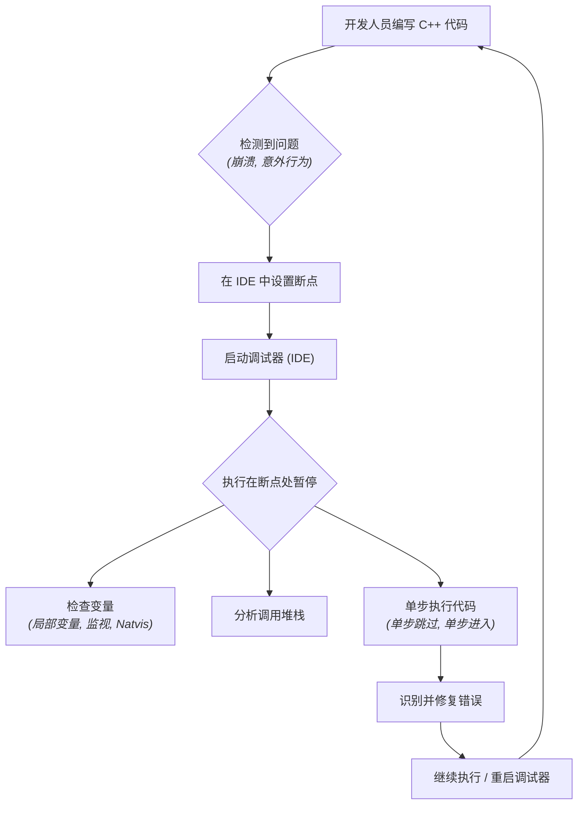
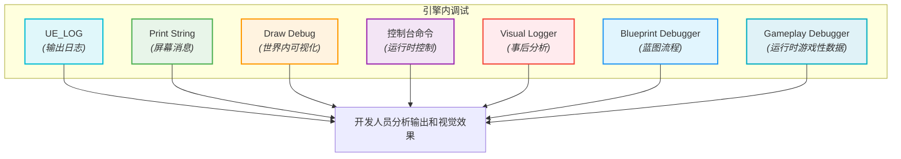

# 虚幻引擎中的 C++ 调试 - 可视化

本文档提供了在虚幻引擎中调试 C++ 代码的技术和工具的全面、可视化摘要，涵盖了基于 IDE 和引擎内的方法。

## 摘要

在虚幻引擎中调试 C++ 是任何开发人员的关键技能。虚幻引擎提供了一个丰富的工具和功能生态系统，这些工具和功能与标准 IDE 调试器（如 Visual Studio 或 Rider）集成，并提供强大的引擎内调试功能。有效的调试涉及理解调用堆栈、检查变量、记录信息以及可视化运行时数据，以高效地查明和解决问题。

### 核心调试原则

*   **断点 (Breakpoints):** 在代码的特定行暂停执行以检查程序状态。
*   **单步执行 (Stepping):** 逐行执行代码以跟踪程序流程（`Step Over`、`Step Into`、`Step Out`）。
*   **变量检查 (Variable Inspection):** 实时检查变量、对象和表达式的值。
*   **调用堆栈分析 (Call Stack Analysis):** 了解导致当前执行点的函数调用序列。
*   **日志记录 (Logging):** 将消息输出到控制台或日志文件以跟踪程序执行。
*   **可视化 (Visualization):** 直接在游戏世界中渲染调试信息以理解空间或时间问题。

### 1. IDE 调试器 (Visual Studio / Rider)

集成开发环境（IDE）提供了对 C++ 调试最强大和最细粒度的控制。

*   **Visual Studio 调试器 (Windows):** 虚幻引擎在 Windows 上的主要调试器。
    *   **断点:** 在 C++ 代码中设置断点。可以配置条件断点，使其仅在满足特定条件时触发。
    *   **单步执行:** 使用 `F10`（单步跳过）、`F11`（单步进入）、`Shift+F11`（单步跳出）来导航代码执行。
    *   **变量窗口:** 利用“局部变量”、“自动变量”和“监视”窗口来检查变量值。虚幻引擎使用 `Unreal.natvis` 文件来提供复杂引擎类型的可读视图。
    *   **调用堆栈窗口:** 显示函数调用序列，对于追溯错误的来源非常宝贵。
    *   **编辑器调试符号:** 对于调试虚幻引擎的源代码至关重要。可以通过 Epic Games Launcher 安装。
    *   **Visual Studio Tools for Unreal Engine:** 一个增强集成的插件，允许调试蓝图调用的 C++ 代码以及查看蓝图节点引脚值等功能。

*   **Rider (跨平台):** 另一个流行的 IDE 替代品，为虚幻引擎项目提供类似的强大调试功能。

### 2. 引擎内调试工具

虚幻引擎提供了几个内置的调试工具，对于运行时行为和视觉反馈特别有用。

*   **日志记录 (`UE_LOG`):** 将消息输出到虚幻引擎输出日志的主要方法。支持类别、详细程度级别（Log、Warning、Error、Display、Verbose、VeryVerbose）和格式化输出（`UE_LOGFMT`）。
    ```cpp
    UE_LOG(LogTemp, Warning, TEXT("MyActor %s has health %f"), *GetName(), Health);
    ```

*   **打印语句 (`Print String`):** 在屏幕上直接显示文本消息的简单方法（蓝图 `Print String` 节点）或在 C++ 中（`GEngine->AddOnScreenDebugMessage`）。非常适合快速视觉反馈。

*   **绘制调试函数 (Draw Debug Functions):** 直接在游戏世界中可视化几何形状、线条、球体、盒子和轨迹。对于调试物理、碰撞、射线检测和 AI 感知非常有用。
    ```cpp
    DrawDebugLine(GetWorld(), StartLocation, EndLocation, FColor::Red, false, 5.f, 0, 5.f);
    ```

*   **虚幻引擎控制台（`~` 键）:** 一个强大的游戏内控制台，用于执行命令、更改控制台变量（`cvars`）和查看日志。像 `ShowDebug [Category]` 这样的命令可以显示各种系统（例如 `ShowDebug AI`、`ShowDebug Collision`）的实时调试信息。

*   **可视化日志 (Visual Logger):** 一个专门的工具，用于在编辑器中记录和查看游戏事件和状态随时间变化的视觉表示。非常适合复杂序列的事后分析。

*   **蓝图调试器 (Blueprint Debugger):** 虚幻编辑器中的一个可视化工具，用于单步执行蓝图、检查变量和理解蓝图逻辑。在 C++ 和蓝图交互时至关重要。

*   **游戏性调试器 (Gameplay Debugger):** 一个运行时工具，用于分析实时游戏性数据，对于复杂的游戏逻辑、AI 和复制问题特别有用。

*   **热重载 (Live Coding):** 此功能允许在运行时重新编译和应用 C++ 代码更改，而无需重新启动虚幻编辑器。显著加快了调试期间的迭代过程。

### 3. 高级调试场景

*   **远程调试 (Remote Debugging):** 调试非发布版本或在单独机器上发生的崩溃。通常涉及将调试器附加到正在运行的进程。
*   **内存调试 (Memory Debugging):** 使用 `-stompmalloc` 或 `-ansimalloc` 等标志来帮助检测内存损坏问题。
*   **GPU 调试 (GPU Debugging):** 通过转储和检查单个帧的渲染通道来分析图形相关错误。
*   **构建配置 (Build Configurations):** 使用“DebugGame”或“Debug”构建配置（而不是“Development”）可以减少优化，使调试更容易，尽管编译时间可能会更长。
*   **虚幻洞察 (Unreal Insights):** 虽然主要是一个性能分析工具，但 Insights 可以帮助识别可能与错误相关的性能瓶颈。

## 可视化

### 1. 使用 IDE 的 C++ 调试工作流程

此图说明了使用 Visual Studio 或 Rider 等 IDE 的典型 C++ 调试工作流程。



### 2. 引擎内调试工具概述

此图突出显示了可用于运行时调试和可视化的各种引擎内工具。

