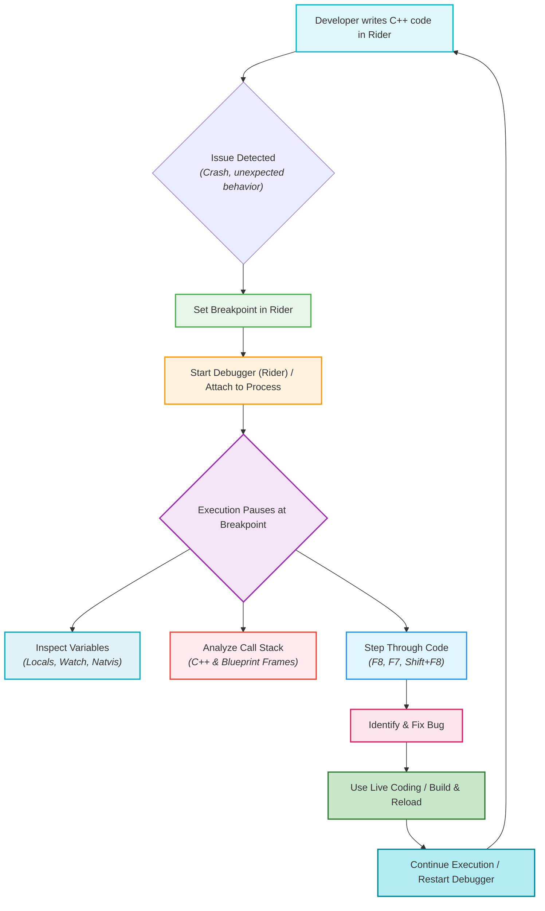
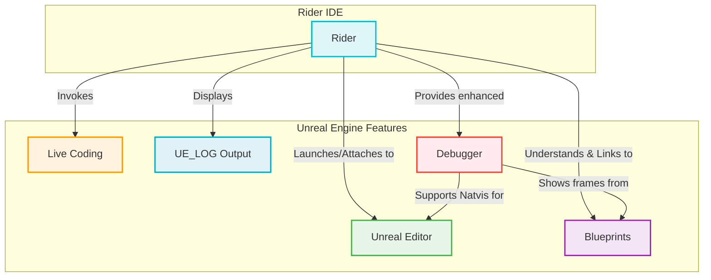

# JetBrains Rider: Debugging Unreal Engine - Visualized

This document provides a comprehensive, visual summary of debugging C++ in Unreal Engine using JetBrains Rider, highlighting its powerful features and integration with the Unreal ecosystem.

## Summary

JetBrains Rider offers a highly integrated and efficient debugging experience for Unreal Engine C++ projects. Leveraging its robust LLDB-based debugger (or a custom debugger for MSVC on Windows), Rider provides a rich set of tools that streamline the debugging workflow, from setting breakpoints and inspecting variables to integrating with Unreal-specific features like Live Coding and Blueprint debugging. Its deep understanding of Unreal Engine projects makes it a powerful alternative to traditional IDEs for game development.

### 1. Setup and Configuration for Debugging

Proper setup is crucial for an optimal debugging experience in Rider:

*   **Choose "DebugGame Editor" Build Configuration:** Always select "DebugGame Editor" over "DevelopmentGame Editor." "Development" configurations often apply compiler optimizations that can cause breakpoints to be skipped or variables to be unavailable for inspection.
*   **Install Debug Symbols:** To debug Unreal Engine's source code, you must download the debug symbols via the Epic Games Launcher. This allows you to step into engine code and understand its internal workings.
*   **RiderLink Plugin:** Rider will prompt you to install the RiderLink plugin into your game project. This plugin is essential for deep integration, enabling features like: 
    *   Directly launching the editor in debug mode from Rider.
    *   Switching to play mode (PIE, Standalone) from Rider.
    *   Showing Unreal Editor logs directly within Rider.
    *   Running tests from Rider.
*   **Running in Debug Mode:** Ensure you select the "DebugGame" configuration in Rider's top-right dropdown and click the green bug icon to start the editor with the debugger attached.
*   **Attach to Process:** If the Unreal Editor or game is already running, you can attach Rider's debugger to the process using `Ctrl + Alt + F5` (or `Ctrl + Alt + A` to search for "Attach to Process").

### 2. Breakpoints and Stepping

Rider provides all standard debugging functionalities:

*   **Types of Breakpoints:**
    *   **Line Breakpoints:** Pause execution at a specific line of code.
    *   **Conditional Breakpoints:** Trigger only when a specified condition is met, useful for debugging loops or specific states.
    *   **Watchpoints:** Pause execution when a variable's value changes.
*   **Adding/Removing Breakpoints:** Click on the gutter next to the line number. Breakpoints can be added or removed dynamically during a debug session.
*   **Stepping through Code:**
    *   `F8`: Step Over (execute the current line and move to the next, stepping over function calls).
    *   `F7`: Step Into (step into the function call on the current line).
    *   `Shift + F8`: Step Out (execute the remainder of the current function and return to the calling function).
*   **Resume Program (`F9`):** Continue execution until the next breakpoint or the end of the program.
*   **Pause Program:** You can manually pause a running program at any time to inspect its state.

### 3. Inspecting and Modifying Data

Rider's debugger offers powerful tools for examining and manipulating program data:

*   **Evaluate Expressions and Set Values:** During a debug session, you can evaluate arbitrary C++ expressions and even modify the values of variables on the fly, allowing for quick testing of hypotheses.
*   **Variable Windows:** "Locals," "Autos," and "Watch" windows display the values of variables in the current scope.
*   **Natvis Support:** Rider's debugger fully supports Natvis files (like Unreal Engine's `UE4.natvis`), which customize how complex data structures are displayed. This provides user-friendly, readable views of Unreal Engine types (e.g., `FVector`, `TArray`). Rider also generates one-line summaries for structures not covered by Natvis.
*   **Raw View:** For Natvis-generated values, Rider allows you to switch to a "Raw View" to see the underlying memory representation.
*   **Built-in Formatters:** Enhanced display for wide/Unicode strings (`wchar_t`, `char16_t`, `char32_t`).
*   **Evaluation Improvements:** Recent Rider versions (e.g., 2024.2) offer significant improvements in evaluating native code, including better handling of optimized code and support for evaluating operators on smart pointers and string types.

### 4. Live Coding and Hot Reload Integration

Rider seamlessly integrates with Unreal Engine's Live Coding and Hot Reload features, drastically speeding up iteration times:

*   **Invoking Live Coding:** Rider supports invoking Live Coding (and Hot Reload) directly from the IDE. This allows you to make C++ code changes, compile them, and see the effects in the running Unreal Editor without restarting.
*   **"Build and Reload" Button:** When Live Coding or Hot Reload is enabled in the Unreal Editor, Rider displays a dedicated "Build and Reload" toolbar button during the debug process.
*   **Keyboard Shortcut:** You can also trigger Live Coding by pressing `Ctrl + Alt + F11`.

### 5. Advanced Debugging Features

*   **Unreal Editor Log:** Rider displays the Unreal Editor's output log directly within its interface, eliminating the need to switch windows to monitor `UE_LOG` messages.
*   **Modules View:** Shows a list of all loaded `.dll` or `.so` files, their paths, and whether debug symbols are loaded, which is useful for diagnosing loading issues.
*   **View Blueprints in Call Stack:** Rider can resolve memory addresses to Blueprint frames in the call stack, showing you which Blueprint is calling your C++ code. This is invaluable for debugging mixed C++/Blueprint projects.
*   **Inline Performance Hints:** During debugging, Rider can show inline hints indicating the execution time between breakpoints or for single lines of code, helping to identify performance bottlenecks.

### 6. General Tips and Unreal-Specific Integrations

*   **Deep Understanding of Unreal Engine:** Rider has a profound understanding of Unreal Engine projects, offering features like instant navigation to engine source, intelligent code completion, and Unreal-specific error inspections without needing to build first.
*   **Blueprint Integration:** Rider understands Unreal Blueprints. It can display information like serialized data and usages of C++ functions within Blueprints. It also provides links to open Blueprint assets directly from C++ code.
*   **Find Usages in Blueprints:** Easily find all Blueprint references to a C++ function or property.
*   **Built-in ReSharper Features:** Rider includes ReSharper's advanced code analysis, refactoring, and navigation capabilities, which are highly beneficial for large C++ codebases.

## Visualizations

### 1. Rider Debugging Workflow Overview

This diagram illustrates a typical C++ debugging workflow in Unreal Engine using JetBrains Rider.

### 2. Rider's Unreal-Specific Integrations

This diagram highlights how Rider integrates with various Unreal Engine features to enhance the development and debugging experience.

