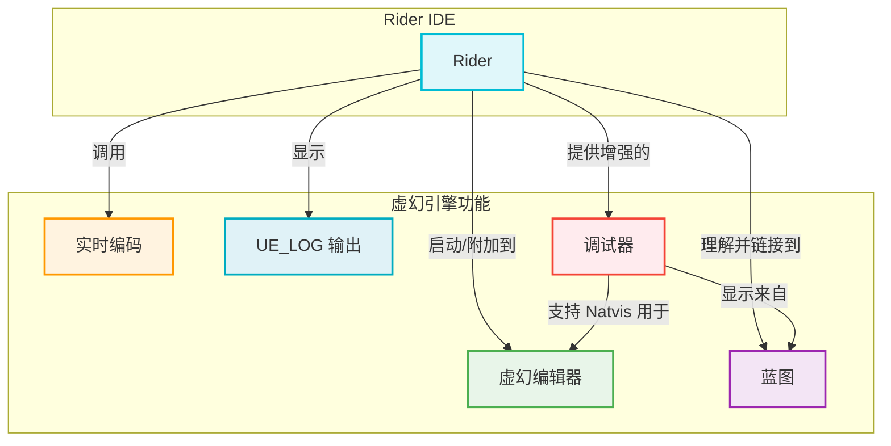

# JetBrains Rider: 调试虚幻引擎 - 可视化

本文档提供了使用 JetBrains Rider 调试虚幻引擎中 C++ 的全面、可视化摘要，重点介绍了其强大的功能以及与虚幻生态系统的集成。

## 摘要

JetBrains Rider 为虚幻引擎 C++ 项目提供了高度集成和高效的调试体验。Rider 利用其强大的基于 LLDB 的调试器（或 Windows 上 MSVC 的自定义调试器），提供了一套丰富的工具，可简化调试工作流程，从设置断点和检查变量到与虚幻特定功能（如实时编码和蓝图调试）集成。它对虚幻引擎项目的深入理解使其成为传统 IDE 的强大替代品，适用于游戏开发。

### 1. 调试设置和配置

正确的设置对于 Rider 中最佳的调试体验至关重要：

*   **选择“DebugGame Editor”构建配置:** 始终选择“DebugGame Editor”而不是“DevelopmentGame Editor”。“Development”配置通常会应用编译器优化，这可能导致断点被跳过或变量无法检查。
*   **安装调试符号:** 要调试虚幻引擎的源代码，您必须通过 Epic Games Launcher 下载调试符号。这允许您单步进入引擎代码并了解其内部工作原理。
*   **RiderLink 插件:** Rider 会提示您将 RiderLink 插件安装到您的游戏项目中。此插件对于深度集成至关重要，可启用以下功能：
    *   直接从 Rider 启动编辑器并进入调试模式。
    *   从 Rider 切换到播放模式（PIE、独立）。
    *   直接在 Rider 中显示虚幻编辑器日志。
    *   从 Rider 运行测试。
*   **在调试模式下运行:** 确保在 Rider 的右上角下拉菜单中选择“DebugGame”配置，然后单击绿色虫子图标以启动编辑器并附加调试器。
*   **附加到进程:** 如果虚幻编辑器或游戏已在运行，您可以使用 `Ctrl + Alt + F5`（或 `Ctrl + Alt + A` 搜索“附加到进程”操作）将 Rider 的调试器附加到该进程，并从列表中选择您的游戏。

### 2. 断点和单步执行

Rider 提供了所有标准的调试功能：

*   **断点类型:**
    *   **行断点:** 在代码的特定行暂停执行。
    *   **条件断点:** 仅在满足指定条件时触发，对于调试循环或特定状态很有用。
    *   **观察点:** 当变量值更改时暂停执行。
*   **添加/删除断点:** 单击行号旁边的边栏。可以在调试会话期间动态添加或删除断点。
*   **单步执行代码:**
    *   `F8`: 单步跳过（执行当前行并移动到下一行，跳过函数调用）。
    *   `F7`: 单步进入（进入当前行上的函数调用）。
    *   `Shift + F8`: 单步跳出（执行当前函数的其余部分并返回到调用函数）。
*   **恢复程序 (`F9`):** 继续执行直到下一个断点或程序结束。
*   **暂停程序:** 您可以随时手动暂停正在运行的程序以检查其状态。

### 3. 检查和修改数据

Rider 的调试器提供了强大的工具来检查和操作程序数据：

*   **评估表达式和设置值:** 在调试会话期间，您可以评估任意 C++ 表达式，甚至可以即时修改变量的值，从而快速测试假设。
*   **变量窗口:** “局部变量”、“自动变量”和“监视”窗口显示当前作用域中变量的值。
*   **Natvis 支持:** Rider 的调试器完全支持 Natvis 文件（例如虚幻引擎的 `UE4.natvis`），这些文件自定义了复杂数据结构的显示方式。这提供了虚幻引擎类型的用户友好、可读视图（例如 `FVector`、`TArray`）。Rider 还为 Natvis 未涵盖的结构生成单行摘要。
*   **原始视图:** 对于 Natvis 生成的值，Rider 允许您切换到“原始视图”以查看底层内存表示。
*   **内置格式化程序:** 增强了宽/Unicode 字符串（`wchar_t`、`char16_t`、`char32_t`）的显示。
*   **评估改进:** 最近的 Rider 版本（例如 2024.2）在评估原生代码方面提供了显著改进，包括更好地处理优化代码以及支持评估智能指针和字符串类型上的运算符。

### 4. 实时编码和热重载集成

Rider 无缝集成了虚幻引擎的实时编码和热重载功能，大大加快了迭代时间：

*   **调用实时编码:** Rider 支持直接从 IDE 调用实时编码（和热重载）。这允许您进行 C++ 代码更改、编译它们，并在运行中的虚幻编辑器中看到效果，而无需重新启动。
*   **“构建并重新加载”按钮:** 当虚幻编辑器中启用实时编码或热重载时，Rider 会在调试过程中显示一个专用的“构建并重新加载”工具栏按钮。
*   **键盘快捷键:** 您还可以通过按 `Ctrl + Alt + F11` 触发实时编码。

### 5. 高级调试功能

*   **虚幻编辑器日志:** Rider 在其界面中直接显示虚幻编辑器的输出日志，无需切换窗口即可监视 `UE_LOG` 消息。
*   **模块视图:** 显示所有加载的 `.dll` 或 `.so` 文件、它们的路径以及是否加载了符号的列表，这对于诊断加载问题很有用。
*   **在调用堆栈中查看蓝图:** Rider 可以将内存地址解析为调用堆栈中的蓝图帧，显示哪个蓝图正在调用您的 C++ 代码。这对于调试混合 C++/蓝图项目非常宝贵。
*   **内联性能提示:** 在调试期间，Rider 可以显示内联提示，指示断点之间或单行代码的执行时间，这有助于识别性能瓶颈。

### 6. 一般提示和虚幻特定集成

*   **对虚幻引擎的深入理解:** Rider 对虚幻引擎项目有深入的理解，提供即时导航到引擎源、智能代码完成和虚幻特定错误检查等功能，而无需先构建。
*   **蓝图集成:** Rider 理解虚幻蓝图。它可以直接在编辑器中显示序列化数据和 C++ 函数在蓝图中的用法等信息。它还提供链接以直接从 C++ 代码打开蓝图资产。
*   **在蓝图中查找用法:** 轻松查找 C++ 函数或属性的所有蓝图引用。
*   **内置 ReSharper 功能:** Rider 包含 ReSharper 的高级代码分析、重构和导航功能，这对于像虚幻引擎这样的大型 C++ 代码库非常有益。

## 可视化

### 1. Rider 调试工作流程概述

此图说明了使用 JetBrains Rider 在虚幻引擎中进行 C++ 调试的典型工作流程。

### 2. Rider 的虚幻特定集成

此图突出显示了 Rider 如何与各种虚幻引擎功能集成，以增强开发和调试体验。

