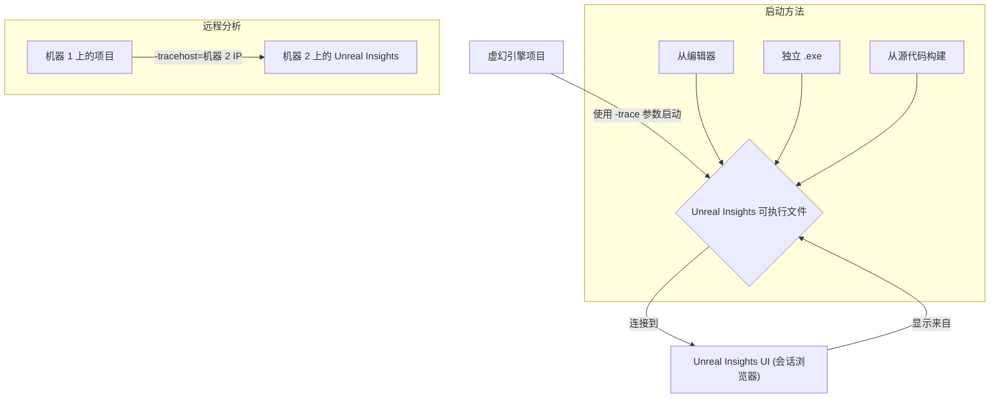
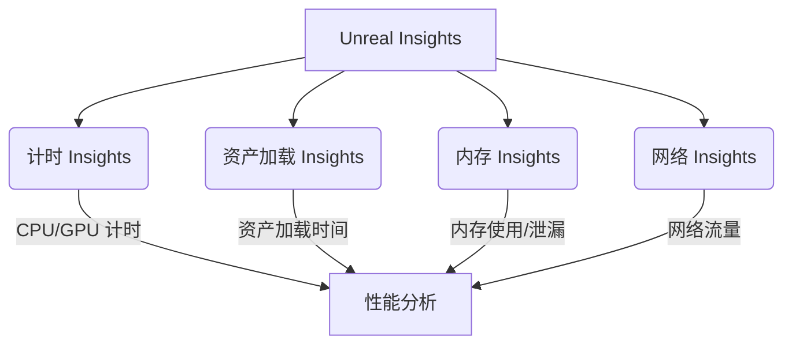
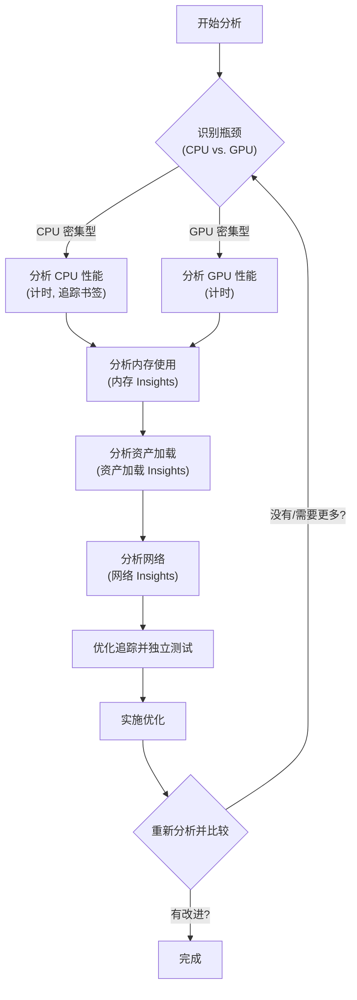

# Unreal Insights - 可视化

Unreal Insights 是一个功能强大的独立分析系统，与虚幻引擎集成。它旨在收集、分析和可视化引擎发出的遥测数据，帮助开发人员识别性能瓶颈并优化其项目。

## 概述

Unreal Insights 提供了一套全面的工具，用于理解虚幻引擎应用程序的性能特征。它允许深入检查 CPU 和 GPU 时间、内存使用、资产加载行为和网络流量等。通过可视化这些数据，开发人员可以找出效率低下的地方，并做出明智的决策以提高游戏性能。

### 1. 设置和启动

Unreal Insights 随虚幻引擎一起提供，可以在 `Engine/Binaries/Win64`（或其他平台的等效目录）中找到。它可以通过多种方式启动：

*   **从虚幻编辑器：** 导航到底部工具栏中的 Trace/Insights 状态栏小部件，然后选择“Unreal Insights (Session Browser)”。
*   **独立可执行文件：** 直接从其二进制位置运行 `UnrealInsights.exe`。
*   **从源代码构建：** 如果从源代码编译虚幻引擎，则直接构建“UnrealInsights”项目。

为了进行准确的性能分析，建议在与被监控项目不同的机器上运行 Unreal Insights，以最大程度地减少对应用程序执行的影响。远程运行时，使用 `-tracehost=X` 命令行参数指定 Insights 主机 IP。

### 2. 核心模块及其用法

Unreal Insights 具有几个专门的窗口或模块，用于不同类型的分析：

*   **计时 Insights 窗口：**
    *   **目的：** 用于查看每帧 CPU 和 GPU 性能数据的主要模块。
    *   **功能：** 显示单个追踪事件、线程活动和日志输出。主要面板包括帧面板（时间线视图）、计时面板（详细事件可视化）、日志面板以及计时器/计数器选项卡。
    *   **详细信息：** 事件垂直堆叠以指示范围，并为不同的线程使用单独的轨道，从而实现亚微秒级的精确分析。

*   **资产加载 Insights 窗口：**
    *   **目的：** 用于分析和优化资产加载性能的专用视图。
    *   **用法：** 通常需要使用 `-loadtimetrace` 命令行选项启动项目。

*   **内存 Insights 窗口：**
    *   **目的：** 提供应用程序如何使用内存的可见性，有助于理解内存分配模式，识别内存泄漏或过度内存消耗。
    *   **功能：** 包括内存图和 LLM（低级内存）标签等面板。
    *   **用法：** 要追踪内存使用情况，请使用 `-trace=memory` 命令行参数。

*   **网络 Insights：**
    *   **目的：** 用于分析、优化和调试项目中的网络流量。

### 3. 追踪和数据收集

要收集数据，需要在虚幻引擎项目中启用追踪，通常通过命令行参数：

*   **启用追踪：** 使用 `-trace=[channel0[,channel1...]]` 指定数据通道。常用通道：`log`、`counters`、`cpu`、`frame`、`bookmark`、`file`、`loadtime`、`gpu`、`rhicommands`、`rendercommands`、`object`。
*   **最小追踪：** 一个有用的最小命令行：`-trace=counters,cpu,frame,bookmark,gpu`。
*   **实时追踪：** 将启动的应用程序连接到打开的 Unreal Insights 实例以获取实时数据。
*   **追踪记录到文件：** 使用 `-tracefile=PathToSaveTraceTo.utrace` 将追踪数据保存到文件以供以后分析。
*   **追踪书签：** 在 C++ 和蓝图中添加自定义书签以标记特定的代码段。这些书签将出现在 Insights 中，有助于查明与这些段相关的性能峰值。

### 4. 性能优化工作流程

Unreal Insights 对于性能优化至关重要：

1.  **识别瓶颈：** 使用计时 Insights 确定问题是 CPU 密集型还是 GPU 密集型。帧面板用于概述，计时面板用于深入分析。
2.  **分析特定区域：**
    *   **CPU 性能：** 在计时面板中查找昂贵的 tick/函数。追踪书签有助于快速定位代码路径的影响。
    *   **内存使用：** 使用内存 Insights 分析分配模式、泄漏或过度消耗。
    *   **资产加载：** 使用资产加载 Insights 优化游戏的资产加载时间。
    *   **网络：** 使用网络 Insights 优化网络性能。
3.  **优化追踪：** 仅启用必要的通道以管理追踪文件大小并最大程度地减少分析本身的开销。
4.  **在代表性环境中测试：** 为了获得最准确的性能数据，请分析打包的构建或独立游戏实例，而不是直接在编辑器中运行，因为编辑器会引入额外的开销。
5.  **迭代和比较：** 对代码或资产进行更改，然后重新分析以衡量优化效果。

## 可视化

### 1. Unreal Insights 启动和连接流程

### 2. 核心 Insights 模块概述

### 3. 性能优化工作流程

