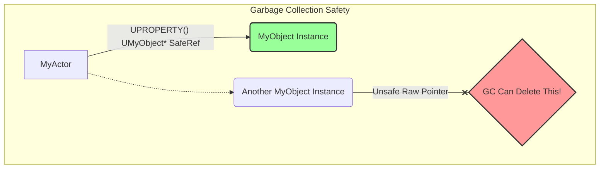
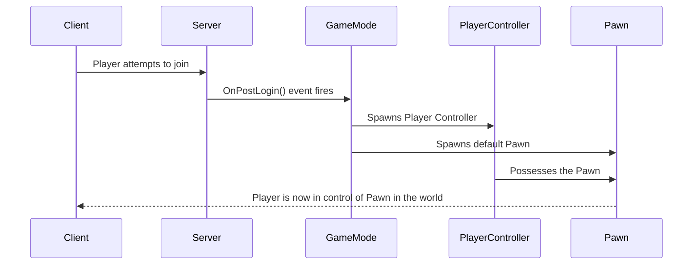
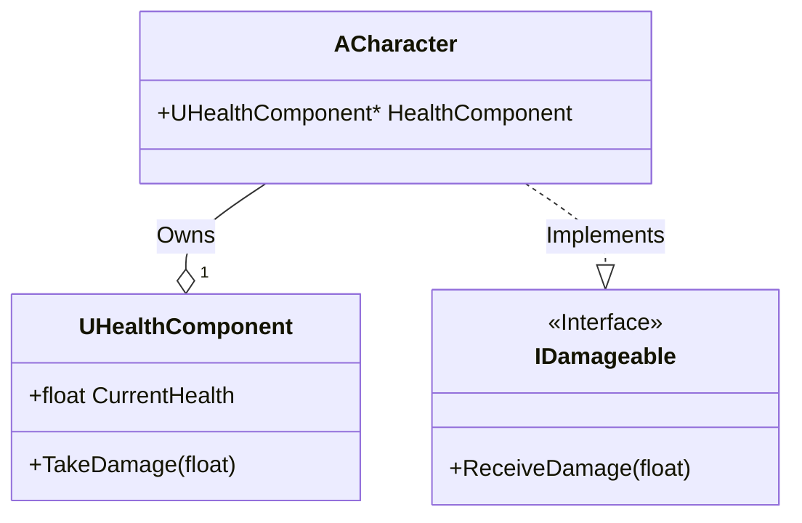
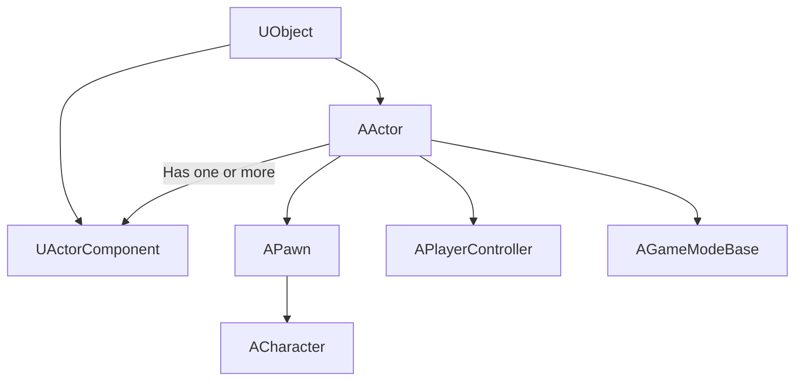
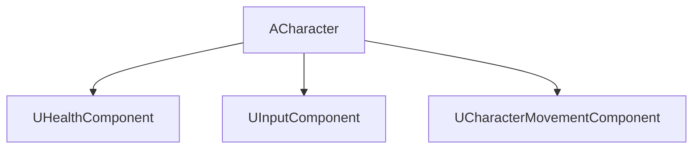
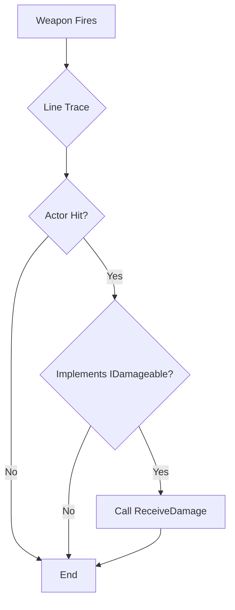
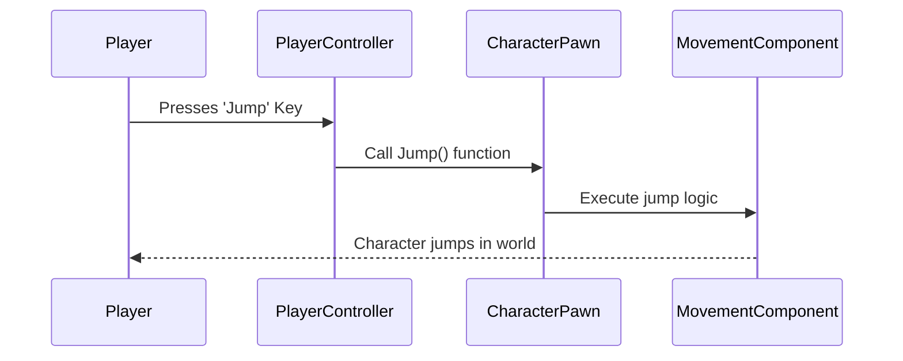

# UE4 Learning Guide for the Modern C++ Programmer

This guide is for a programmer with a solid C++11 foundation who is new to the Unreal Engine ecosystem. It uses the PDCA (Plan-Do-Check-Act) cycle and SOLID principles as a framework for mastering UE4's C++ paradigm.

---

## Phase 1: Plan - Building the Foundation

This phase focuses on building a mental model of how UE4 works, moving from general C++ knowledge to the engine's specific framework. The goal is to understand *why* UE4 is designed the way it is.

### Key Concepts Roadmap

#### The UObject System
This is the foundation of C++ in Unreal. `UCLASS()`, `UPROPERTY()`, and `UFUNCTION()` are macros that expose your standard C++ code to the Unreal Engine's reflection system. This system is what powers automatic garbage collection, serialization (saving/loading), network replication, and the ability for Blueprint visual scripting to interact with your C++ code. For a C++ programmer, this is the most critical concept to grasp, as it's the "magic" that integrates your code into the rest of the engine.

#### Memory Management
Forget `new` and `delete`. `UObject`s are managed by an automatic garbage collection (GC) system. Any `UObject*` member variable must be marked as a `UPROPERTY()` to inform the GC that it's being referenced, preventing it from being prematurely destroyed. For non-UObject data, Unreal provides its own smart pointers like `TSharedPtr` and `TUniquePtr`, which function similarly to the standard library but are integrated into the engine's ecosystem. Understanding this is vital to prevent memory leaks and dangling pointer crashes.



#### The Actor-Component Model
This is Unreal's answer to the composition over inheritance principle. An `AActor` is any object that can be placed in the world (a character, a lamp, a trigger volume). A `UActorComponent` is a piece of functionality that can be attached to an Actor (e.g., health, movement, an inventory). Instead of creating a massive inheritance tree, you build Actors by composing them from smaller, reusable components. This is a direct embodiment of the Single Responsibility and Open/Closed principles.

#### Game Framework
This is the set of classes that provides structure to your game. It's essential for multiplayer and clean architecture.
*   **GameMode:** The rules of the game (server-side only).
*   **GameState:** The state of the game, replicated to all clients (e.g., score, match time).
*   **PlayerController:** The "will" of the player, taking input and directing a Pawn.
*   **PlayerState:** The state of a specific player, replicated to all clients (e.g., name, score).
*   **Pawn/Character:** The physical representation of a player or AI in the world. A `Character` is a special `Pawn` with built-in movement logic.



#### UE4 Interfaces (`UInterface`)
An interface is a contract of behavior that a class can promise to implement. In Unreal, this is done with `UInterface`. This is how you achieve true decoupling. For example, you can create an `IDamageable` interface. Now, a projectile doesn't need to know if it hit an `AEnemy` or a `BreakableBarrel`; it only needs to know if the object it hit implements `IDamageable`. This is the Dependency Inversion Principle in action and is key to writing scalable, maintainable code.

#### Build System
Unreal uses its own Unreal Build Tool (UBT). Every code module in your project has a `[ModuleName].Build.cs` file. This C# file is where you define your module's dependencies. If you want to use the Slate UI framework, you must add "Slate" and "SlateCore" to your list of public or private dependency modules. Forgetting to do this is one of the most common sources of compiler/linker errors for newcomers.

### Recommended Resources

*   **Official Documentation:**
    *   [Unreal Engine C++ API Reference](https://docs.unrealengine.com/en-US/API/index.html)
    *   [Actors and Components](https://docs.unrealengine.com/en-US/ProgrammingAndScripting/ProgrammingWithCPP/ActorsAndComponents/index.html)
    *   [Gameplay Framework](https://docs.unrealengine.com/en-US/ProgrammingAndScripting/GameplayArchitecture/index.html)
*   **Community Tutorials:**
    *   **Tom Looman:** [Unreal Engine C++ Tutorials](https://www.tomlooman.com/unreal-engine-cpp-tutorials/)
    *   **Stephen Ulibarri (Udemy):** Comprehensive courses that are highly regarded.
*   **Books:**
    *   "Game Development with C++ and Unreal Engine" by Stephen Whittle.

---

## Phase 2: Do - Implementation and Practice

Apply the planned knowledge by building a small, polished "vertical slice."

### Project: Simple Third-Person Action Game

#### Milestones

1.  **Character Setup:** Create a C++ `ACharacter` that can move and jump.
2.  **Component Creation:** Build a `UHealthComponent` in C++ and add it to the character. Display the health value on screen using a simple `UE_LOG`.
3.  **Interface Implementation:** Define an `IDamageable` C++ interface with a `ReceiveDamage` function. Have the player character and a simple "dummy" `AActor` implement it.
4.  **Interaction:** Create a weapon or projectile that, on overlap, checks if the other actor implements `IDamageable` and calls the interface function.
5.  **Blueprint Integration:** Create a Blueprint version of your C++ character to easily tweak variables like movement speed or health.

#### Practical Code Snippets

Here are more complete examples for the `UHealthComponent` and `IDamageable` interface.

**IDamageable.h**
```cpp
#pragma once

#include "CoreMinimal.h"
#include "UObject/Interface.h"
#include "Damageable.generated.h"

UINTERFACE(MinimalAPI)
class UDamageable : public UInterface
{
    GENERATED_BODY()
};

class IDamageable
{
    GENERATED_BODY()

public:
    // Classes that implement this interface must define this function.
    UFUNCTION(BlueprintNativeEvent, BlueprintCallable, Category = "Damage")
    void ReceiveDamage(float Amount);
};
```

**UHealthComponent.h**
```cpp
#pragma once

#include "CoreMinimal.h"
#include "Components/ActorComponent.h"
#include "HealthComponent.generated.h"

UCLASS( ClassGroup=(Custom), meta=(BlueprintSpawnableComponent) )
class YOURPROJECT_API UHealthComponent : public UActorComponent
{
    GENERATED_BODY()

public:
    UHealthComponent();

protected:
    virtual void BeginPlay() override;

    UPROPERTY(EditAnywhere, BlueprintReadWrite, Category = "Health")
    float MaxHealth = 100.0f;

    UPROPERTY(VisibleAnywhere, BlueprintReadOnly, Category = "Health")
    float CurrentHealth;

public:
    UFUNCTION(BlueprintCallable, Category = "Health")
    void TakeDamage(float DamageAmount);
};
```

**UHealthComponent.cpp**
```cpp
#include "HealthComponent.h"

UHealthComponent::UHealthComponent()
{
    PrimaryComponentTick.bCanEverTick = false;
}

void UHealthComponent::BeginPlay()
{
    Super::BeginPlay();
    CurrentHealth = MaxHealth;
}

void UHealthComponent::TakeDamage(float DamageAmount)
{
    CurrentHealth = FMath::Clamp(CurrentHealth - DamageAmount, 0.0f, MaxHealth);
    if (CurrentHealth <= 0)
    {
        UE_LOG(LogTemp, Warning, TEXT("%s has been defeated!"), *GetOwner()->GetName());
    }
}
```

#### Code Structure Visualized

This diagram shows how an `ACharacter` can own a `UHealthComponent` and also implement the `IDamageable` interface.



### Bridging C++ and the Unreal Editor

*   **`UPROPERTY()` Specifiers:** The `EditAnywhere` specifier on `MaxHealth` in `UHealthComponent.h` allows you to change its value directly in the Details panel of any actor that has this component. `VisibleAnywhere` makes `CurrentHealth` visible but not editable.
*   **Blueprint from C++:** Right-click your C++ Character class in the Content Browser and select "Create Blueprint class based on...". This creates a new Blueprint asset that inherits all the C++ logic, but allows designers to change properties or add visual components without touching code.
*   **Attaching Components:** In a Blueprint of an Actor, you can click "+ Add Component" and search for your `HealthComponent` to add it directly.

---

## Phase 3: Check - Verification and Debugging

Continuously evaluate your work against the principles you're learning.

### SOLID Self-Check

*   **SRP:** "Does this class have more than one reason to change?" (e.g., Is my Character class also managing its inventory and quest log?)
*   **OCP:** "Can I add a new type of weapon without changing the Character class?"
*   **LSP:** "If I make a `SuperEnemy` that inherits from `BaseEnemy`, can I use it everywhere a `Base-Enemy` is expected without breaking things?"
*   **ISP:** "Are my interfaces small and focused (`IDamageable`, `IInteractable`) rather than one giant `IGameplayActions` interface?"
*   **DIP:** "Does my high-level weapon logic depend on a low-level `AMonster` class, or an abstraction like `IDamageable`?"

### Essential Debugging & Profiling

*   **Logging:** Use `UE_LOG(LogTemp, Warning, TEXT("My value is %f"), MyFloatVariable);` to print messages to the Output Log.
*   **Debugger:** Set breakpoints in Visual Studio/Rider and use the "Attach to Editor" function to debug your C++ code live.
*   **Unreal Insights:** A powerful tool for analyzing performance. Use it to find out what's slowing down your game.

---

## Phase 4: Act - Refinement and Improvement

Based on the "Check" phase, take concrete steps to improve.

### Common Pitfalls for C++ Developers

*   **Forgetting `Super::`:** When overriding an engine function like `BeginPlay()` or `Tick()`, always call `Super::BeginPlay();` at the start to ensure the parent class's logic runs.
*   **Garbage Collection:** Any `UObject*` pointer stored as a member variable **must** be a `UPROPERTY()` to be visible to the garbage collector. If not, it can be unexpectedly deleted, causing crashes.
*   **Build Errors:** If you add a new `#include` for a different module (e.g., `GameplayAbilities`), you must add that module's name to your project's `YourProject.Build.cs` file.

### Stretch Goals

*   Refactor a piece of Blueprint logic into a clean, reusable C++ `UActorComponent`.
*   Create a second weapon type that applies damage over time, using the same `IDamageable` interface.
*   Study the Gameplay Ability System (GAS) and implement one ability.

---

## Appendix: UE4 Architecture Diagrams

#### UE4 C++ Framework Architecture


#### Use Case for SRP and OCP


#### Data Flow for a Decoupled Damage System (DIP/ISP)


#### Input to Action Data Flow
