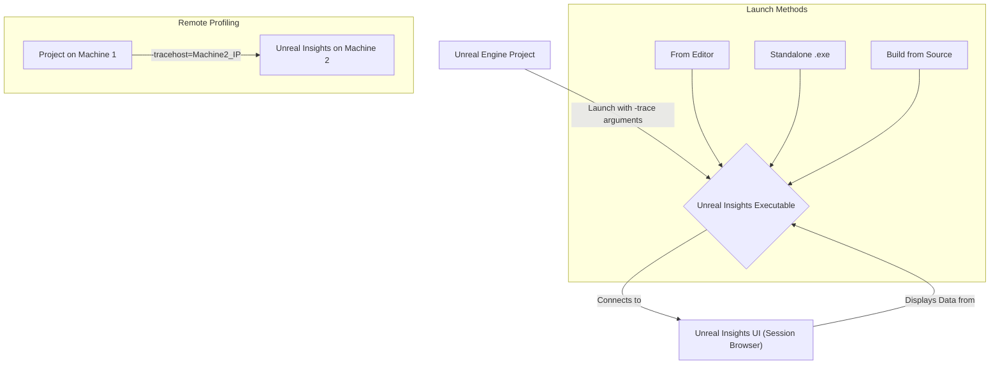
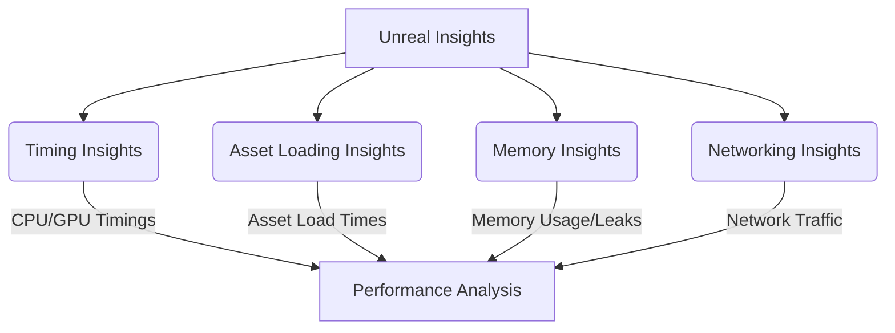
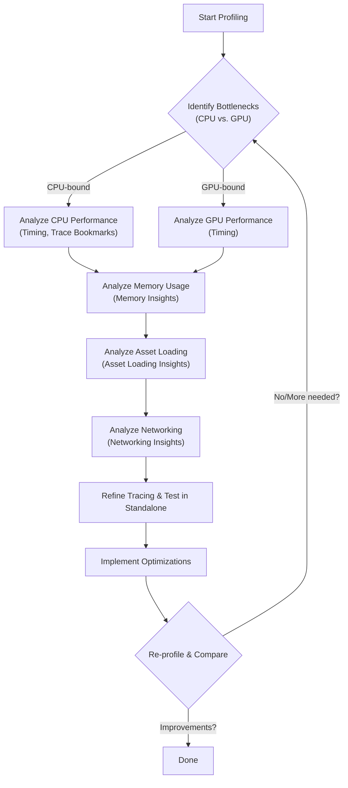

# Unreal Insights - Visualized

Unreal Insights is a powerful, standalone profiling and analysis system integrated with Unreal Engine. It's designed to collect, analyze, and visualize telemetry data emitted by the engine, helping developers identify performance bottlenecks and optimize their projects.

## Summary

Unreal Insights provides a comprehensive suite of tools for understanding the performance characteristics of an Unreal Engine application. It allows for deep inspection of CPU and GPU timings, memory usage, asset loading behavior, and network traffic, among other things. By visualizing this data, developers can pinpoint inefficiencies and make informed decisions to improve game performance.

### 1. Setup and Launching

Unreal Insights is included with Unreal Engine and can be found in the `Engine/Binaries/Win64` (or equivalent for other platforms) directory. It can be launched in several ways:

*   **From Unreal Editor:** Navigate to the Trace/Insights Status Bar Widget in the bottom toolbar and select "Unreal Insights (Session Browser)".
*   **Standalone Executable:** Run `UnrealInsights.exe` directly from its binary location.
*   **Building from Source:** If compiling Unreal Engine from source, build the "UnrealInsights" project.

For accurate profiling, it's recommended to run Unreal Insights on a different machine than the project being monitored to minimize impact. When running remotely, specify the Insights host IP using the `-tracehost=X` command-line argument.

### 2. Core Modules and Their Usage

Unreal Insights features several specialized windows, or modules, for different types of analysis:

*   **Timing Insights Window:**
    *   **Purpose:** Primary module for viewing per-frame CPU and GPU performance data.
    *   **Features:** Displays individual trace events, thread activity, and log output. Key panels include the Frames panel (timeline view), Timing panel (detailed event visualization), Log panel, and Timers/Counters tabs.
    *   **Detail:** Events are stacked vertically to indicate scope and use separate tracks for different threads, allowing for sub-microsecond precision analysis.

*   **Asset Loading Insights Window:**
    *   **Purpose:** Specialized view for analyzing and optimizing asset loading performance.
    *   **Usage:** Often requires launching the project with the `-loadtimetrace` command-line option.

*   **Memory Insights Window:**
    *   **Purpose:** Provides visibility into how the application uses memory, helping to understand memory allocation patterns, identify leaks, or excessive memory consumption.
    *   **Features:** Includes panels like the Memory Graph and LLM (Low-Level Memory) Tags.
    *   **Usage:** To trace memory usage, use the `-trace=memory` command-line argument.

*   **Networking Insights:**
    *   **Purpose:** Used to analyze, optimize, and debug network traffic within your project.

### 3. Tracing and Data Collection

To collect data, tracing needs to be enabled in your Unreal Engine project, typically via command-line arguments:

*   **Enabling Tracing:** Use `-trace=[channel0[,channel1...]]` to specify data channels. Common channels: `log`, `counters`, `cpu`, `frame`, `bookmark`, `file`, `loadtime`, `gpu`, `rhicommands`, `rendercommands`, `object`.
*   **Minimal Tracing:** A useful minimal command line: `-trace=counters,cpu,frame,bookmark,gpu`.
*   **Live Tracing:** Connects the launched application to an open Unreal Insights instance for real-time data.
*   **Trace Recording to File:** Use `-tracefile=PathToSaveTraceTo.utrace` to save trace data for later analysis.
*   **Trace Bookmarks:** Add custom bookmarks in C++ and Blueprints to mark specific code sections. These appear in Insights, helping pinpoint performance spikes.

### 4. Performance Optimization Workflow

Unreal Insights is crucial for performance optimization:

1.  **Identify Bottlenecks:** Use Timing Insights to determine if issues are CPU-bound or GPU-bound. Frames panel for overview, Timing panel for drill-down.
2.  **Analyze Specific Areas:**
    *   **CPU Performance:** Look for expensive ticks/functions. Trace bookmarks help locate code path impacts.
    *   **Memory Usage:** Use Memory Insights for allocation patterns, leaks, or excessive consumption.
    *   **Asset Loading:** Use Asset Loading Insights to optimize loading times.
    *   **Networking:** Employ Networking Insights for network performance.
3.  **Refine Tracing:** Enable only necessary channels to manage trace file sizes and minimize profiling overhead.
4.  **Test in Representative Environments:** Profile packaged builds or standalone game instances, not directly in the editor, for accurate data.
5.  **Iterate and Compare:** Make changes, then re-profile to measure optimization impact.

## Visualizations

### 1. Unreal Insights Launch and Connection Flow

### 2. Core Insights Modules Overview

### 3. Performance Optimization Workflow

