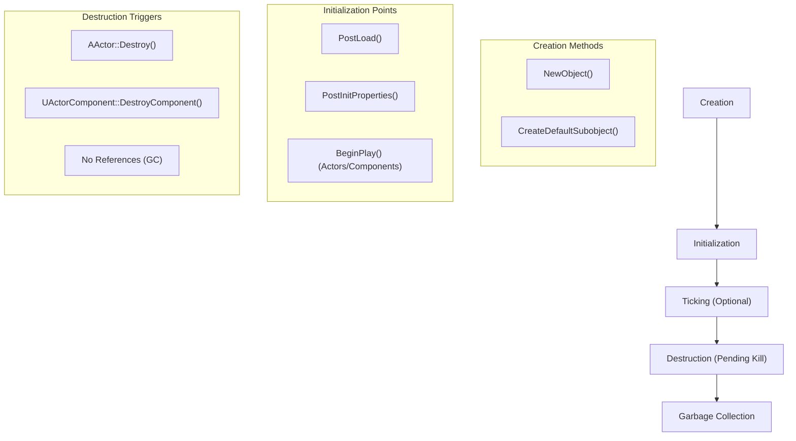
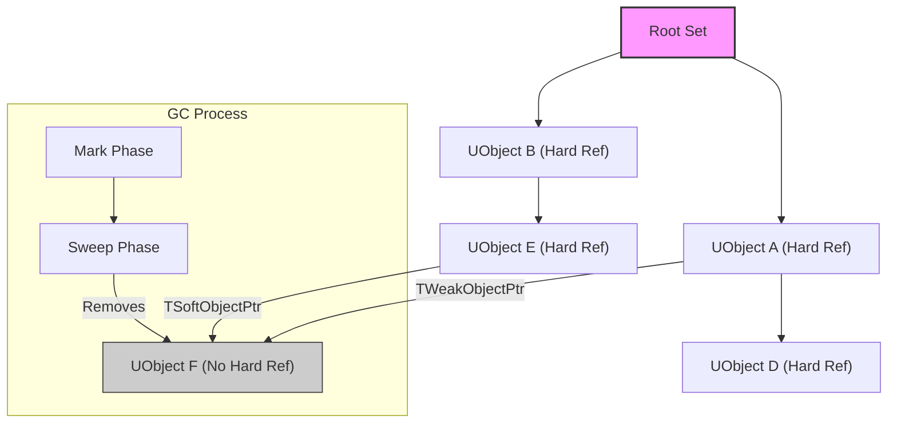
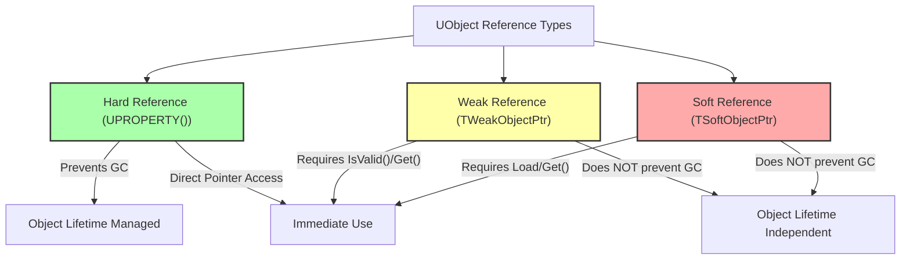

# Unreal Object Handling - Visualized

Unreal Engine's `UObject` system is a fundamental framework for managing game objects, their lifecycles, and memory through a robust garbage collection (GC) mechanism. Understanding this system is crucial for efficient and stable Unreal Engine development.

## Summary

The `UObject` system provides core functionalities like reflection, serialization, networking, and automatic memory management for objects derived from `UObject`. It ensures that objects are properly initialized, updated, and eventually cleaned up when no longer needed, preventing memory leaks and dangling pointers.

### 1. UObject Lifecycle

The lifecycle of a `UObject` involves several key stages:

*   **Creation:**
    *   **`NewObject<T>()`:** Used at runtime to create new `UObject` instances.
    *   **`CreateDefaultSubobject<T>()`:** Used within a `UObject`'s constructor to create subobjects that are part of the object's default state. These subobjects are automatically managed.
    *   **Constructors:** `UObject` constructors should be lightweight, primarily for setting default values and creating subobjects. Complex initialization should occur in `BeginPlay()` for `AActor`s and `UActorComponent`s.
*   **Initialization:**
    *   **`PostLoad()`:** Called after an object has been loaded from disk.
    *   **`PostInitProperties()`:** Called after properties have been initialized.
    *   **`BeginPlay()`:** (For `AActor`s and `UActorComponent`s) A key initialization point for gameplay logic, called when the game starts or when the Actor is spawned into the world.
*   **Updating (Ticking):**
    *   `AActor`s and `UActorComponent`s have built-in `Tick()` functions that are called every frame if enabled.
    *   Generic `UObject`s do not tick by default. To enable per-frame updates, a `UObject` must inherit from `FTickableGameObject`.
*   **Destruction:**
    *   Objects can be explicitly marked for destruction (e.g., `AActor::Destroy()`, `UActorComponent::DestroyComponent()`).
    *   Once marked, they enter a pending kill state and are eventually removed from memory by the garbage collector.
    *   The destruction process involves calls to `BeginDestroy()`, `IsReadyForFinishDestroy()`, and `FinishDestroy()`.

### 2. Garbage Collection (GC)

Unreal Engine employs a mark-and-sweep garbage collection scheme for `UObject`s to automatically clean up objects that are no longer referenced.

*   **How it Works:**
    1.  The engine builds a reference graph starting from a "root set" of `UObject`s (e.g., `UGameInstance`, `UWorld`, objects explicitly added to the root). 
    2.  Any `UObject` directly or indirectly referenced by the root set is considered "in use" and will not be garbage collected.
    3.  Objects not reachable from the root set are eligible for cleanup.
*   **What Prevents GC:**
    *   **`UPROPERTY()` References:** Declaring a `UObject` pointer with `UPROPERTY()` creates a "hard reference" that prevents the referenced object from being garbage collected. These pointers are automatically nulled if the referenced object is destroyed.
    *   **Adding to Root Set:** An object can be explicitly added to the root set using `AddToRoot()`, ensuring it remains in memory for its lifetime.
*   **Limitations:**
    *   GC only works with `UObject`s. For other types (structs, non-`UObject` classes), use standard C++ memory management or Unreal's smart pointers (`TSharedPtr`, `TUniquePtr`).
    *   **Raw Pointers:** Raw C++ pointers to `UObject`s are *not* tracked by the garbage collector. If a `UObject` is destroyed, a raw pointer to it will become a dangling pointer and will not be automatically nulled, leading to crashes.
*   **GC Clustering:** Unreal Engine groups related objects into clusters for garbage collection, improving performance by reducing individual object check overhead.

### 3. References and Ownership

Unreal Engine defines various types of references and ownership relationships for `UObject`s:

*   **Hard References (`UPROPERTY()`):** These are the primary way to maintain references to `UObject`s and prevent their garbage collection. They signify ownership or a strong dependency.
*   **`Outer` Relationship:** Every `UObject` has an `Outer` object. If an object's `Outer` is garbage collected, the object itself will also be collected. For `AActor`s, their `Outer` is typically the `ULevel` they reside in.
*   **`Owner` Relationship (for `AActor`s):** A specific relationship between `AActor`s. If an `AActor`'s `Owner` is destroyed, the owned `AActor` is also destroyed. This is also significant for network replication.

### 4. TWeakObjectPtr

`TWeakObjectPtr` is a "weak" pointer designed to reference `UObject`s without preventing their garbage collection.

*   **Purpose:** Used when you need to refer to a `UObject` but do not want to extend its lifetime (e.g., an observer object that doesn't own the observed object).
*   **Behavior:** If the referenced `UObject` is destroyed or garbage collected, the `TWeakObjectPtr` automatically becomes null.
*   **Usage:** Always check its validity using `IsValid()` or by calling `Get()` and checking for `nullptr` before accessing the underlying object.

### 5. TSoftObjectPtr

`TSoftObjectPtr` is a "soft" pointer used for referencing assets that may or may not be loaded into memory.

*   **Purpose:** Stores a path to an asset and provides functionality to load that asset asynchronously at runtime. Ideal for managing references to large assets that shouldn't be loaded until needed, preventing unnecessary memory usage.
*   **Behavior:** Like `TWeakObjectPtr`, it does *not* prevent the referenced object from being garbage collected once loaded.
*   **Usage:**
    *   `IsPending()`: Checks if the asset path is valid but the object instance is not yet loaded.
    *   `Get()`: Returns `nullptr` if the object is not loaded.
    *   `TSoftClassPtr`: A similar type for referencing class or blueprint types.

### 6. Best Practices

*   **`UPROPERTY()` for Ownership:** Always use `UPROPERTY()` for `UObject` references where you intend to own the object or prevent its GC.
*   **`TWeakObjectPtr` for Non-Ownership:** Employ `TWeakObjectPtr` when referencing a `UObject` without affecting its lifetime.
*   **`TSoftObjectPtr` for Asynchronous Loading:** Use `TSoftObjectPtr` for assets that might not be loaded, enabling efficient asynchronous loading.
*   **Avoid Raw Pointers for `UObject`s:** Unless meticulously managed, raw C++ pointers to `UObject`s are not GC-tracked and can lead to dangling pointers.
*   **Component-Based Design:** Leverage Unreal's component system for reusability and modularity.
*   **Constructor vs. `BeginPlay`:** Use constructors for lightweight initialization; `BeginPlay()` for complex setup logic in `AActor`s and `UActorComponent`s.
*   **Minimize Circular Dependencies:** Avoid complex chains of objects with circular references to prevent increased memory usage.
*   **Override `AddReferencedObjects()` (Rarely):** For custom `UObject`s holding references not recognized by `UPROPERTY()`, override `AddReferencedObjects()` to explicitly inform the GC.
*   **Profiling:** Regularly profile `UObject`s for optimal memory usage and execution speed.

## Visualizations

### 1. UObject Lifecycle Flow

### 2. Garbage Collection Reference Graph

### 3. UObject Reference Types

