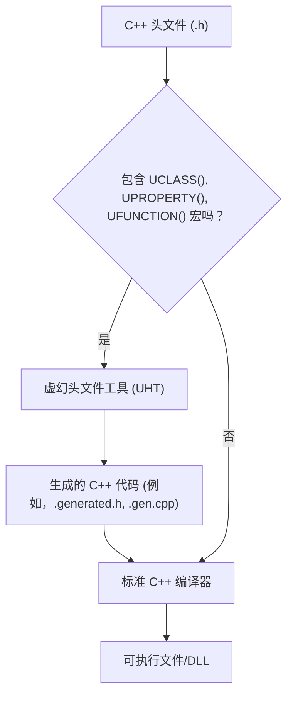
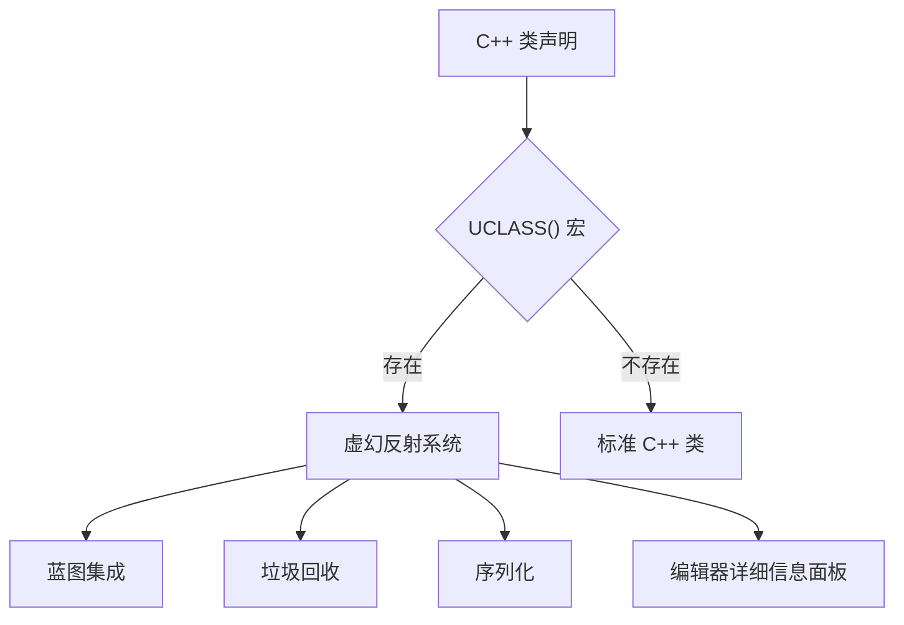
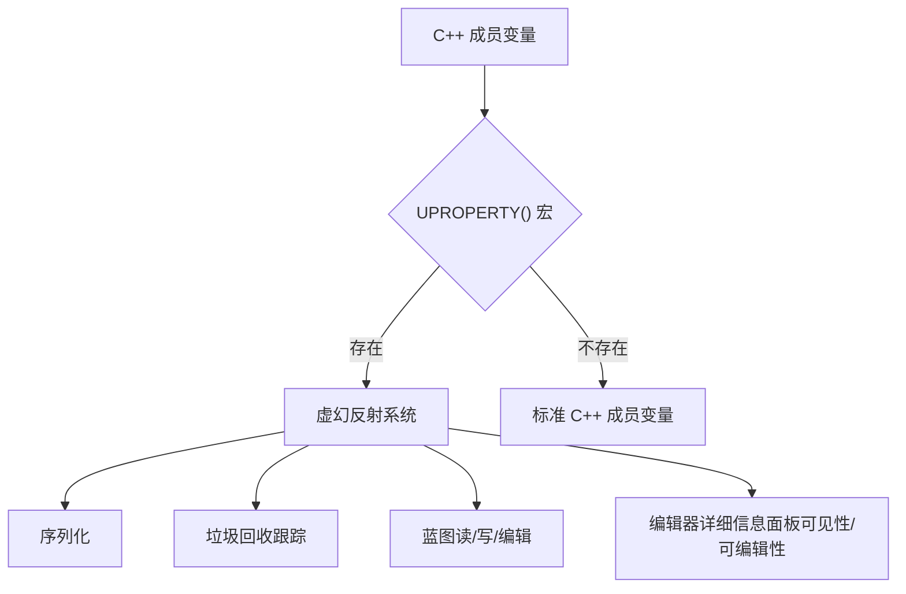
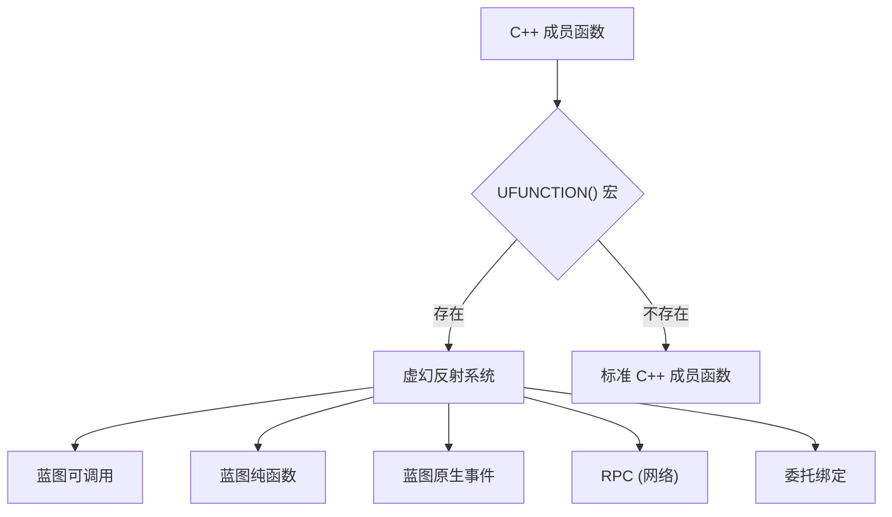

# 虚幻属性系统：反射

虚幻引擎的属性系统，通常被称为反射，是引擎架构的基石。它允许引擎在运行时理解和操作 C++ 类、属性和函数，从而实现蓝图集成、序列化、垃圾回收和编辑器工具等强大功能。

## 什么是反射？

在编程中，反射是指程序在运行时检查或修改自身结构和行为的能力。虚幻引擎通过其自身的反射系统扩展了标准 C++，这至关重要，因为标准 C++ 缺乏内置的反射功能。

## 虚幻引擎如何实现反射

虚幻引擎使用涉及虚幻头文件工具 (UHT) 的自定义构建步骤来实现反射。当你编译虚幻 C++ 代码时，UHT 会解析你的头文件，查找 `UCLASS()`、`UPROPERTY()` 和 `UFUNCTION()` 等特定宏。

**图 1：虚幻头文件工具 (UHT) 流程**

UHT 生成额外的 C++ 代码（例如，`.generated.h` 和 `.gen.cpp` 文件），其中包含有关你的类、属性和函数的元数据。然后，这些元数据与你的常规 C++ 代码一起编译。在运行时，引擎可以查询这些元数据以理解 C++ 对象的结构。

## 关键反射宏

### `UCLASS()`

`UCLASS()` 宏放置在类声明上方，将其标记为虚幻引擎类。这使得该类能够进行反射，从而可以将其集成到蓝图、参与垃圾回收并由编辑器工具使用。

**图 2：UCLASS() 宏及其影响**

`UCLASS()` 的常见说明符包括 `Blueprintable`、`Abstract`、`EditInlineNew` 等。

### `UPROPERTY()`

`UPROPERTY()` 宏用于将成员变量暴露给虚幻反射系统。这对于以下方面至关重要：

*   **序列化：** 保存和加载属性值。
*   **垃圾回收：** 允许垃圾回收器跟踪对 `UObject` 的引用。
*   **蓝图集成：** 使属性在蓝图中可访问和可编辑。
*   **编辑器详细信息面板：** 在虚幻编辑器中显示和允许编辑属性。

**图 3：UPROPERTY() 宏及其功能**

`UPROPERTY()` 的常见说明符包括 `EditAnywhere`、`VisibleAnywhere`、`BlueprintReadWrite`、`BlueprintReadOnly`、`Category` 等。

### `UFUNCTION()`

`UFUNCTION()` 宏将成员函数暴露给虚幻反射系统。这允许函数：

*   **可从蓝图调用：** 直接从蓝图图表执行。
*   **可在蓝图中重写：** 在蓝图子类中实现或扩展。
*   **用于 RPC（远程过程调用）：** 用于网络复制。
*   **绑定到委托：** 用于事件处理。

**图 4：UFUNCTION() 宏及其功能**

`UFUNCTION()` 的常见说明符包括 `BlueprintCallable`、`BlueprintPure`、`BlueprintNativeEvent`、`Server`、`Client`、`Category` 等。

## 反射系统的好处

虚幻属性系统提供了许多好处：

*   **蓝图集成：** 无缝连接 C++ 和蓝图，允许设计人员在不编写代码的情况下扩展 C++ 功能。
*   **序列化和持久化：** 自动保存和加载游戏状态，包括复杂的对象图。
*   **垃圾回收：** 有效管理 `UObject` 的内存，防止内存泄漏和悬空指针。
*   **编辑器工具：** 驱动详细信息面板、属性编辑器和其他编辑器功能，使开发更快、更直观。
*   **网络：** 促进属性和函数调用在网络上的复制。
*   **模块化和可扩展性：** 促进更模块化的代码库，其中组件可以相互交互而无需紧密耦合，这得益于运行时类型信息。

## 结论

虚幻属性系统及其反射功能是虚幻引擎如此强大和灵活的核心。通过理解 `UCLASS()`、`UPROPERTY()` 和 `UFUNCTION()` 宏的工作原理，开发人员可以充分利用引擎的潜力，创建健壮、可扩展且高性能的游戏和应用程序。