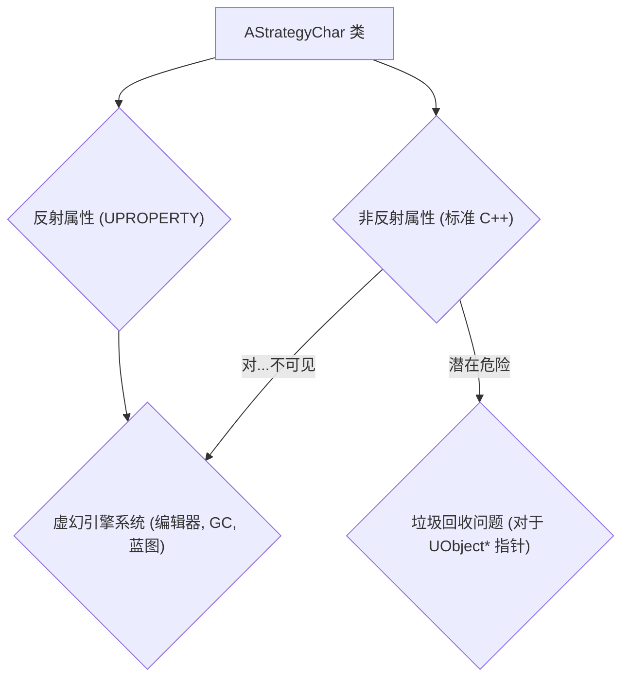
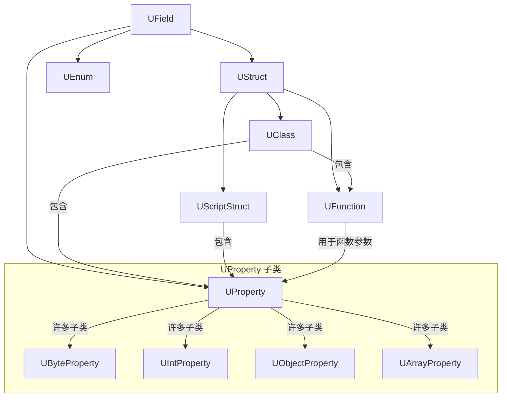
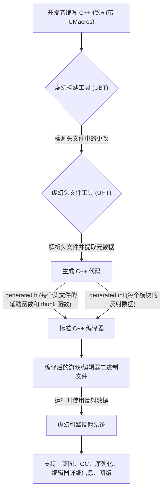

# 虚幻属性系统（反射）

**2014年3月28日**
**作者：Michael Noland**

反射是程序在运行时检查自身的能力。这非常有用，是虚幻引擎的基础技术，为许多系统提供支持，例如编辑器中的详细信息面板、序列化、垃圾回收、网络复制以及蓝图/C++ 通信。然而，C++ 本身不支持任何形式的反射，因此虚幻拥有自己的系统来收集、查询和操作有关 C++ 类、结构体、函数、成员变量和枚举的信息。我们通常将反射称为属性系统，因为反射也是一个图形术语。

反射系统是可选的。你需要注释任何你希望对反射系统可见的类型或属性，虚幻头文件工具 (UHT) 将在你编译项目时收集这些信息。

## 标记

要将头文件标记为包含反射类型，请在文件顶部添加一个特殊的 include。这让 UHT 知道它应该考虑此文件，并且系统实现也需要它（有关更多信息，请参阅“幕后一瞥”部分）。

```cpp
#include "FileName.generated.h"
```

你现在可以使用 `UENUM()`、`UCLASS()`、`USTRUCT()`、`UFUNCTION()` 和 `UPROPERTY()` 来注释头文件中的不同类型和成员变量。这些宏中的每一个都放在类型或成员声明之前，并且可以包含额外的说明符关键字。让我们看一个实际的例子（来自 StrategyGame）：

```cpp
//////////////////////////////////////////////////////////////////////////
// 移动单位（士兵）的基类

#include "StrategyTypes.h"
#include "StrategyChar.generated.h"

UCLASS(Abstract)

class AStrategyChar : public ACharacter, public IStrategyTeamInterface
{

GENERATED_UCLASS_BODY()

/** 该 Pawn 死亡时值多少资源。 */
UPROPERTY(EditAnywhere, Category=Pawn)
int32 ResourcesToGather;

/** 设置武器槽的附件 */
UFUNCTION(BlueprintCallable, Category=Attachment)
void SetWeaponAttachment(class UStrategyAttachment* Weapon);

UFUNCTION(BlueprintCallable, Category=Attachment)
bool IsWeaponAttached();

protected:

/** 近战动画 */
UPROPERTY(EditDefaultsOnly, Category=Pawn)
UAnimMontage* MeleeAnim;

/** 护甲附件槽 */
UPROPERTY()
UStrategyAttachment* ArmorSlot;

/** 队伍编号 */
uint8 MyTeamNum;

[省略更多代码]
};
```

此头文件声明了一个名为 `AStrategyChar` 的新类，它派生自 `ACharacter`。它使用 `UCLASS()` 来指示它是反射的，并且在 C++ 定义内部还与宏 `GENERATED_UCLASS_BODY()` 配对。`GENERATED_UCLASS_BODY()` / `GENERATED_USTRUCT_BODY()` 宏在反射类或结构体中是必需的，因为它们将额外的函数和 typedef 注入到类体中。

显示的第一个属性是 `ResourcesToGather`，它用 `EditAnywhere` 和 `Category=Pawn` 注释。这意味着该属性可以在编辑器中的任何详细信息面板中编辑，并将显示在 `Pawn` 类别中。有几个用 `BlueprintCallable` 和类别标记的注释函数，这意味着它们将可从蓝图调用。

正如 `MyTeamNum` 声明所示，在同一个类中混合反射和非反射属性是没问题的，但请注意，非反射属性对所有依赖反射的系统都是不可见的（例如，存储原始的非反射 `UObject` 指针通常是危险的，因为垃圾回收器无法看到你的引用）。

**图 1：混合反射和非反射属性**



每个说明符关键字（例如 `EditAnywhere` 或 `BlueprintCallable`）都在 `ObjectBase.h` 中镜像，并附有关于含义或用法的简短注释。如果你不确定某个关键字的作用，Alt+G 通常会带你到 `ObjectBase.h` 中的定义（它们不是真正的 C++ 关键字，但 Intellisense 或 VAX 似乎不介意/不理解这种差异）。

查看游戏编程参考以获取更多信息。

## 限制

UHT 不是一个真正的 C++ 解析器。它理解语言的一个不错的子集，并积极尝试跳过它可以跳过的任何文本；只关注反射类型、函数和属性。但是，有些事情仍然会混淆它，因此在将反射类型添加到现有头文件时，你可能需要重新措辞或将其包装在 `#if CPP / #endif` 对中。你还应该避免在任何注释属性或函数周围使用 `#if/#ifdef`（`WITH_EDITOR` 和 `WITH_EDITORONLY_DATA` 除外），因为生成的代码会引用它们，并会在任何定义不为真的配置中导致编译错误。

大多数常见类型都按预期工作，但属性系统无法表示所有可能的 C++ 类型（值得注意的是，只支持少数模板类型，例如 `TArray` 和 `TSubclassOf`，并且它们的模板参数不能是嵌套类型）。如果你注释的类型无法在运行时表示，UHT 将会给出描述性错误消息。

## 使用反射数据

大多数游戏代码可以在运行时忽略属性系统，享受它所支持的系统带来的好处，但你可能会发现在编写工具代码或构建游戏系统时它很有用。

属性系统的类型层次结构如下所示：

**图 2：反射类型层次结构**



`UStruct` 是聚合结构的基本类型（任何包含其他成员的类型，例如 C++ 类、结构体或函数），不应与 C++ 结构体混淆（那是 `UScriptStruct`）。`UClass` 可以包含函数或属性作为其子项，而 `UFunction` 和 `UScriptStruct` 仅限于属性。

你可以通过编写 `UTypeName::StaticClass()` 或 `FTypeName::StaticStruct()` 来获取反射 C++ 类型的 `UClass` 或 `UScriptStruct`，并且可以使用 `Instance->GetClass()` 来获取 `UObject` 实例的类型（无法获取结构体实例的类型，因为没有共同的基类或必需的存储）。

要遍历 `UStruct` 的所有成员，请使用 `TFieldIterator`：

```cpp
for (TFieldIterator<UProperty> PropIt(GetClass()); PropIt; ++PropIt)
{
UProperty* Property = *PropIt;
// 对属性执行操作
}
```

`TFieldIterator` 的模板参数用作过滤器（因此你可以使用 `UField` 查看属性和函数，或只查看其中一个）。迭代器构造函数的第二个参数指示你是否只希望在指定类/结构体中引入的字段，或者也希望父类/结构体中的字段（默认）；它对函数没有影响。

每种类型都有一组唯一的标志（`EClassFlags` + `HasAnyClassFlags` 等），以及从 `UField` 继承的通用元数据存储系统。关键字说明符通常存储为标志或元数据，具体取决于它们是在运行时游戏中需要，还是仅用于编辑器功能。这允许剥离仅限编辑器的元数据以节省内存，而运行时标志始终可用。

你可以使用反射数据做很多不同的事情（枚举属性、以数据驱动的方式获取或设置值、调用反射函数，甚至构造新对象）；与其在这里深入探讨任何一个案例，不如查看 `UnrealType.h` 和 `Class.h`，并找到一个与你想要完成的任务类似的代码示例。

## 幕后一瞥

**图 3：虚幻头文件工具 (UHT) 和虚幻构建工具 (UBT) 工作流程**



虚幻构建工具 (UBT) 和虚幻头文件工具 (UHT) 协同工作，生成为运行时反射提供支持所需的数据。UBT 必须扫描头文件才能完成其工作，并且它会记住任何包含至少一个反射类型的头文件的模块。如果这些头文件自上次编译以来发生更改，则会调用 UHT 来收集和更新反射数据。UHT 解析头文件，构建一组反射数据，然后生成包含反射数据的 C++ 代码（贡献给每个模块的 `.generated.inl`），以及各种辅助函数和 thunk 函数（每个头文件的 `.generated.h`）。

将反射数据存储为生成的 C++ 代码的主要好处之一是，它保证与二进制文件同步。你永远不会加载过时或旧的反射数据，因为它与引擎代码的其余部分一起编译，并且它在启动时使用 C++ 表达式计算成员偏移量等，而不是试图逆向工程特定平台/编译器/优化组合的打包行为。UHT 也作为一个独立的程序构建，不使用任何生成的头文件，因此它避免了 UE3 中脚本编译器常见的“鸡生蛋，蛋生鸡”问题。

生成的函数包括 `StaticClass()` / `StaticStruct()` 等，它们可以轻松获取类型的反射数据，以及用于从蓝图或网络复制调用 C++ 函数的 thunk 函数。这些必须声明为类或结构体的一部分，这解释了为什么 `GENERATED_UCLASS_BODY()` 或 `GENERATED_USTRUCT_BODY()` 宏包含在你的反射类型中，以及定义这些宏的 `#include "TypeName.generated.h"`。
