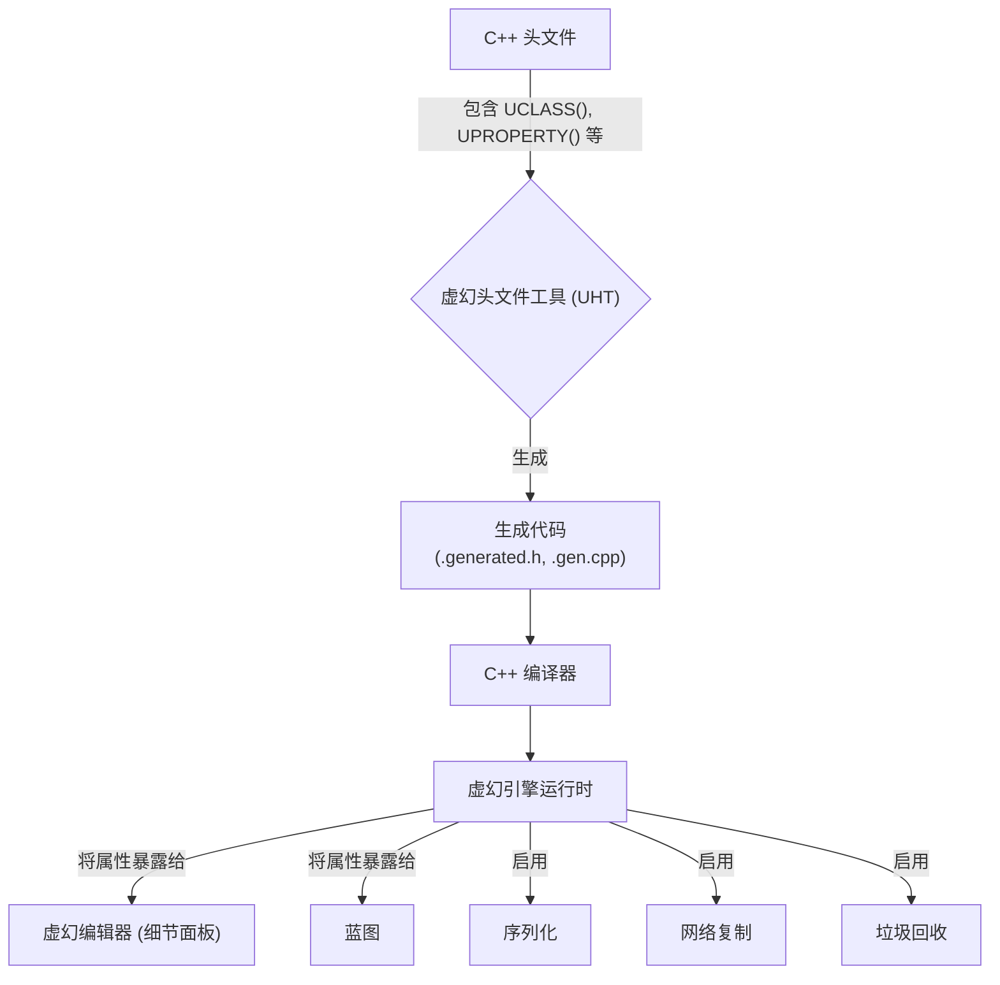
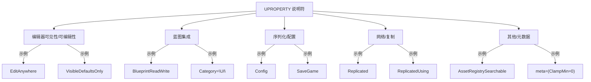
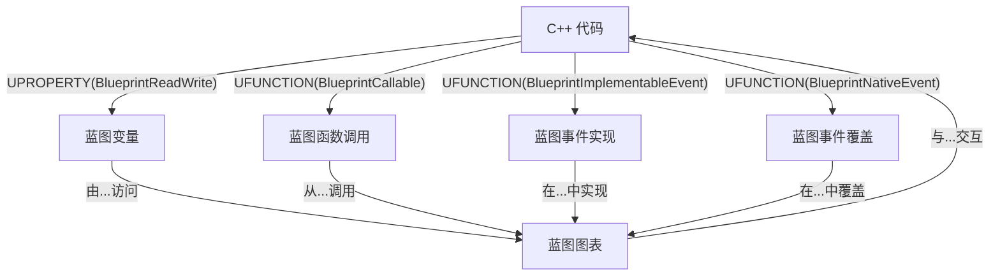

# 虚幻属性系统 - 可视化

虚幻引擎的属性系统，由 `UPROPERTY` 宏和虚幻头文件工具 (UHT) 驱动，是 C++ 代码与引擎强大功能（包括编辑器、蓝图、序列化和网络）集成的基石。

## 概述

属性系统使 C++ 变量能够被虚幻引擎运行时暴露和管理。这允许自动处理内存、保存/加载数据、跨网络同步值，并为设计师提供一个无缝接口，通过虚幻编辑器和蓝图与 C++ 代码进行交互。

### 1. UPROPERTY 宏和说明符

`UPROPERTY` 是一个宏，用于将 C++ 成员变量暴露给虚幻引擎。它允许您使用各种说明符定义属性在引擎中的行为方式。

*   **编辑器中的可见性/可编辑性：**
    *   `VisibleAnywhere`：在实例和蓝图的细节面板中可见，但不可编辑。
    *   `VisibleDefaultsOnly`：仅在实例和蓝图的类默认值中可见。
    *   `EditAnywhere`：在实例和蓝图的细节面板中可见且可编辑。
    *   `EditDefaultsOnly`：仅在实例和蓝图的类默认值中可见且可编辑。
    *   `AdvancedDisplay`：将属性放置在高级（可折叠）部分。
*   **蓝图集成：**
    *   `BlueprintReadOnly`：蓝图可读，不可修改。与 `BlueprintReadWrite` 不兼容。
    *   `BlueprintReadWrite`：蓝图可读写。
    *   `Category="MyCategory"`：在细节面板和蓝图节点中按指定类别组织属性。嵌套类别使用 `|`（例如，`Category="MyCategory|SubCategory"`）。
*   **序列化和配置：**
    *   `Config`：属性值可以保存/加载到 `.ini` 文件中，用于外部配置。
    *   `GlobalConfig`：类似于 `Config`，但从基类的配置加载。
    *   `SaveGame`：标记属性以包含在保存游戏数据中。
*   **网络/复制：**
    *   `Replicated`：属性值将从服务器同步到所有连接的客户端。
    *   `ReplicatedUsing=FunctionName`：属性被复制，当值更改时，在客户端上调用 `FunctionName`（一个 `OnRep_` 函数）。
    *   `NotReplicated`：阻止属性被复制。
*   **其他：**
    *   `AssetRegistrySearchable`：属性及其值添加到资产注册表。
    *   `meta=(key=value)`：提供额外的元数据以控制编辑器行为（例如，`ClampMin`、`ClampMax`、`UIMin`、`UIMax`、`AllowPrivateAccess`）。

### 2. 虚幻头文件工具 (UHT)

虚幻头文件工具 (UHT) 是一个自定义解析和代码生成工具，对于虚幻引擎的 `UObject` 系统不可或缺。

*   **UHT 的作用：**
    *   **反射：** UHT 处理带有 `UCLASS`、`USTRUCT`、`UENUM`、`UFUNCTION` 和 `UPROPERTY` 宏的 C++ 头文件。它生成样板代码（`.generated.h`、`.gen.cpp` 文件），使引擎能够在运行时理解 C++ 类、属性和函数的结构。
    *   **垃圾回收：** 有助于管理 `UObject` 实例的生命周期。
    *   **序列化：** 生成用于保存和加载 `UObject` 数据的代码，处理属性到各种存档的序列化。
    *   **网络复制：** 生成网络上属性和函数复制所需的样板代码。
    *   **编辑器集成：** 使属性和函数能够在虚幻编辑器中暴露和操作。

### 3. 序列化

虚幻引擎使用 `FArchive` 对象进行序列化。在保存或加载数据时，引擎会遍历 `UPROPERTY`。`SaveGame` 说明符对于标记要包含在保存游戏数据中的属性至关重要，通常与 `FMemoryWriter` 及其 `ArIsSaveGame` 标志一起使用。

### 4. 复制最佳实践

复制确保多人游戏中服务器和客户端之间的游戏状态同步。

*   **服务器权威：** 复制主要是服务器到客户端。客户端不直接向服务器或其他客户端发送属性更新。
*   **`Replicated` 和 `ReplicatedUsing`：**
    *   `UPROPERTY(Replicated)`：用于简单的值同步。
    *   `UPROPERTY(ReplicatedUsing=OnRep_MyProperty)`：当复制属性的值更改时，用于自定义客户端逻辑。`OnRep_` 函数在客户端上调用。如果服务器更改 `ReplicatedUsing` 属性并需要 `OnRep_` 函数在本地执行，则必须在调整变量后手动调用它。
*   **`GetLifetimeReplicatedProps`：** 在 `AActor` 或 `UActorComponent` 派生类中覆盖此函数，以使用 `DOREPLIFETIME` 或 `DOREPLIFETIME_CONDITION` 宏指定复制的属性。
*   **条件复制：** 使用 `DOREPLIFETIME_CONDITION` 和 `COND_` 标志（例如，`COND_SimulatedOnly`）或自定义条件来控制何时以及向谁复制属性，从而优化网络带宽。
*   **推送模型复制：** 一种更高效的复制模型，其中属性被显式标记为“脏”以触发复制（例如，`MARK_PROPERTY_DIRTY_FROM_NAME`）。
*   **避免在 RPC/复制事件中直接传递 Actor：** 传递唯一标识符（例如 `FNetworkGUID`）并在接收端解析它们，以避免对象生命周期和网络开销的潜在问题。
*   **`bReplicates = true`：** 确保 `AActor` 或 `UActorComponent` 在其构造函数中设置为复制。

### 5. 蓝图集成最佳实践

将 C++ 与蓝图集成结合了 C++ 的性能和蓝图的快速原型设计能力。

*   **C++ 用于性能关键逻辑：** 在 C++ 中实现高频更新、复杂算法和核心游戏逻辑。
*   **明智地将 C++ 暴露给蓝图：**
    *   `BlueprintCallable`：允许蓝图调用 C++ 函数。对于不修改对象状态并返回值的函数，请使用 `BlueprintPure`。
    *   `BlueprintImplementableEvent`：旨在由蓝图实现的 C++ 函数。
    *   `BlueprintNativeEvent`：具有默认 C++ 实现的 C++ 函数，但可以在蓝图中覆盖。
    *   `BlueprintReadOnly` / `BlueprintReadWrite`：控制蓝图对 C++ 变量的访问。
*   **按类别组织：** 使用 `Category` 说明符为 `UPROPERTY` 和 `UFUNCTION` 保持蓝图编辑器整洁。
*   **使用组件实现共享行为：** 将功能封装在 `UActorComponent` 中，以实现模块化和可重用性。
*   **接口优于类型转换：** 在不同 Actor 类型之间交互时，优先使用 C++ 接口（`UInterface`），以实现健壮、松散耦合的交互。
*   **数据结构：** 在 C++ 中管理复杂数据（例如 `TArray`、`TMap`、`USTRUCT`），并根据需要将其暴露给蓝图。`USTRUCT(BlueprintType)` 允许在蓝图中使用 C++ 结构体。
*   **性能分析和优化：** 定期使用 Unreal Insights 等工具识别和解决性能瓶颈。

## 可视化

### 1. UHT 工作流程和属性系统

### 2. UPROPERTY 说明符类别

### 3. C++ 到蓝图集成流程

